<a id="top"></a>

<div align="center">

<h1>CodeFix AI</h1>
<h3>Intelligent Code Reviewer &amp; Explainer</h3>

<p>
  Evidence-grounded code review, validated corrections, clean-code verification, and structured explanation in one private engineering workspace.
</p>

<p>
  <a href="#getting-started"></a>
  <a href="#product-experience"></a>
  <a href="#system-architecture"></a>
</p>

<p>
  
  
  
  
  
  
</p>

<p><sub><strong>DecodeLabs Generative AI Internship · Project 4</strong><br/>Designed and developed by Muhammad Saad Jadoon</sub></p>

<p>
  <a href="#project-overview">Overview</a> ·
  <a href="#version-40-engineering-upgrade">Engineering Upgrade</a> ·
  <a href="#product-experience">Product Experience</a> ·
  <a href="#intelligence-and-validation-pipeline">Review Pipeline</a> ·
  <a href="#api-reference">API</a> ·
  <a href="#getting-started">Installation</a>
</p>
</div>

---

<a href="./docs/screenshots/01-dark-workspace.png">
  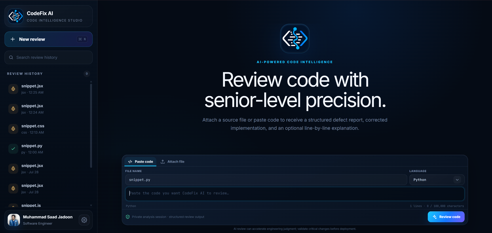
</a>

<p align="center"><sub><strong>CodeFix AI Workspace:</strong> source submission, review history, findings, corrected code, quality evidence, and explanations in one focused interface.</sub></p>

---

## Table of Contents

- [Project Overview](#project-overview)
- [Version 4.0 Engineering Upgrade](#version-40-engineering-upgrade)
- [Why CodeFix AI Stands Out](#why-codefix-ai-stands-out)
- [Product Experience](#product-experience)
- [Core Capabilities](#core-capabilities)
- [Supported Languages](#supported-languages)
- [Intelligence and Validation Pipeline](#intelligence-and-validation-pipeline)
- [Large-Source Review Architecture](#large-source-review-architecture)
- [System Architecture](#system-architecture)
- [Data Persistence and Privacy](#data-persistence-and-privacy)
- [API Reference](#api-reference)
- [Database Model](#database-model)
- [Project Structure](#project-structure)
- [Getting Started](#getting-started)
- [Environment Configuration](#environment-configuration)
- [Using CodeFix AI](#using-codefix-ai)
- [Professional Error Handling](#professional-error-handling)
- [Engineering Decisions](#engineering-decisions)
- [Evaluation Highlights](#evaluation-highlights)
- [Limitations and Responsible Use](#limitations-and-responsible-use)
- [Future Enhancements](#future-enhancements)
- [Author](#author)

---

## Project Overview

**CodeFix AI** is a full-stack AI-assisted code review platform built as an advanced implementation of an intelligent code reviewer and explainer. It accepts source code through direct paste or file upload, identifies the programming language, validates syntax using deterministic tooling, performs a multi-stage AI audit, returns evidence-grounded findings, produces complete corrected source code, and can generate a structured line-by-line walkthrough.

The platform is intentionally designed as a **code intelligence studio**, not a simple prompt box. It combines:

- a polished chatbot-style review workspace;
- content-first language detection;
- deterministic syntax and structure validation;
- multi-stage Gemini review and verification;
- complete corrected-file generation;
- repeat-review consistency safeguards;
- searchable server-backed review history;
- backend-persisted profile and workspace preferences;
- premium dark and light interfaces;
- large-source handling up to **100,000 characters**.

### At a Glance

| Area | Implementation |
|---|---|
| **Submission** | Paste code or upload UTF-8 source files |
| **Language intelligence** | Content-first detection, filename extension synchronization, language-family checks |
| **Validation** | Tree-sitter, built-in validators, AST checks, and optional compiler/parser integrations |
| **AI review** | Google Gemini with audit, verification, challenge, grounding, repair, and explanation stages |
| **Output** | Verified findings, complete corrected source, syntax highlighting, copy, download, explanation |
| **Persistence** | SQLite-backed workspaces, review history, preferences, profile details, and profile images |
| **Session isolation** | Anonymous HTTP-only workspace cookie; no review content stored in browser local storage |
| **UI** | React 18, Vite, responsive sidebar, premium selectors, dark/light themes |
| **Scale** | Compact review path for normal submissions and dedicated large-source review path |

---

## Version 4.0 Engineering Upgrade

The current release moves CodeFix AI beyond a polished AI interface into an **auditable engineering review platform**. Every new review now produces a traceable quality profile rather than only a model-generated answer.

| Production capability | What it adds |
|---|---|
| **Evidence quality gate** | A confidence score derived from language detection, deterministic source validation, correction validation, verification status, and repeat-source stability |
| **Risk classification** | Verified, low, medium, high, or critical risk classification based on confirmed issue severity and parser/compiler evidence |
| **Unified change intelligence** | A dedicated diff workspace with additions, removals, change blocks, and a readable original-versus-corrected view |
| **Auditable review metadata** | Source hash, integrity signature, validation engines, diagnostics, issue breakdown, processing time, line count, character count, and verification state |
| **Professional report export** | Downloadable Markdown or JSON engineering reports containing findings, quality-gate evidence, corrected code, diff, and explanation |
| **Repeat-review integrity** | SHA-256 indexed source fingerprints make byte-identical verified code stable and efficiently reusable |
| **Production observability** | Request IDs, processing-time headers, structured server logs, and detailed health reporting |
| **Security baseline** | Browser security headers, privacy-preserving logging, strict file handling, and server-side workspace isolation |
| **Continuous integration** | GitHub Actions validates Python compilation, deterministic tests, Ruff checks, and the production frontend build |
| **Container delivery** | Dockerfiles, Nginx production serving, persistent backend storage, and one-command Docker Compose startup |

This quality layer is intentionally visible in the product. Reviewers can inspect **why** a result is trusted, which engines validated it, what changed, and how the corrected output passed the final gate.

---

## Why CodeFix AI Stands Out

| Evidence over guesses | Correction over commentary | Stability over randomness | Product over prototype |
|---|---|---|---|
| Findings must be tied to concrete source evidence, deterministic diagnostics, exact lines, symbols, or execution paths. | The platform returns the **complete corrected source file**, not only suggestions or a partial diff. | Previously verified byte-identical code is recognized to reduce contradictory repeat-review results. | The project includes history, profiles, themes, preferences, file handling, validation, persistence, and polished result workflows. |

### Key Differentiators

1. **Polyglot review pipeline**: every supported language enters the same evidence-focused review architecture.
2. **Deterministic validation before AI judgment**: parser and compiler evidence is treated as authoritative.
3. **Independent verification**: a second review pass validates the first pass instead of trusting it blindly.
4. **Grounded findings**: unsupported line references and source claims are filtered before presentation.
5. **Final correction validation**: proposed corrected code is parsed again before it is returned.
6. **Clean-code preservation**: valid code is preserved unchanged rather than unnecessarily rewritten.
7. **Large-file strategy**: long submissions use compact findings, verification, and targeted repair to avoid fragile oversized responses.
8. **Backend-first persistence**: review history and preferences remain available without storing sensitive source content in browser storage.

---

## Product Experience

> Every preview is clickable and opens the original screenshot at full resolution. Key screens are shown at full width, while related views are paired only where both remain easy to read.

### 1. Dark and light engineering workspaces

The complete workspace is available in both themes without changing the review flow or reducing information density.

<table>
  <tr>
    <td width="50%" align="center" valign="top">
      <a href="./docs/screenshots/01-dark-workspace.png">
        
      </a>
      <br /><sub><strong>Dark workspace</strong></sub>
    </td>
    <td width="50%" align="center" valign="top">
      <a href="./docs/screenshots/03-light-workspace.png">
        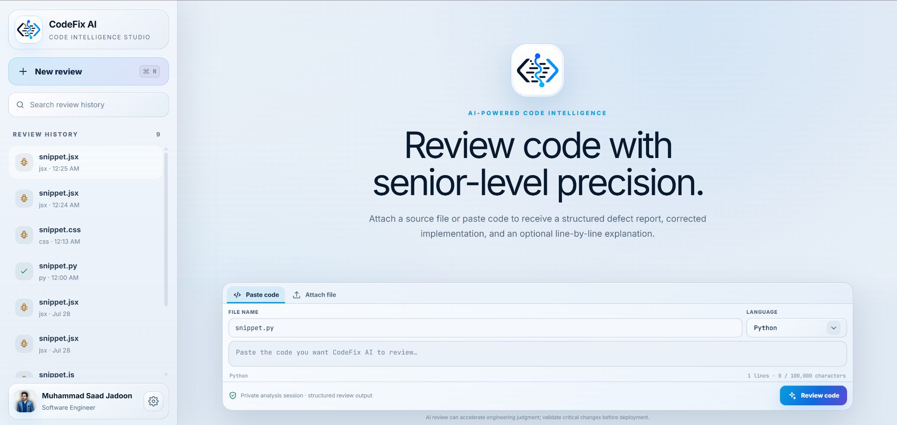
      </a>
      <br /><sub><strong>Light workspace</strong></sub>
    </td>
  </tr>
</table>

### 2. Review conversation

Submitted source and AI output are presented as an engineering conversation with filename, detected language, line count, developer identity, review state, and a structured result workspace.

<a href="./docs/screenshots/04-review-conversation.png">
  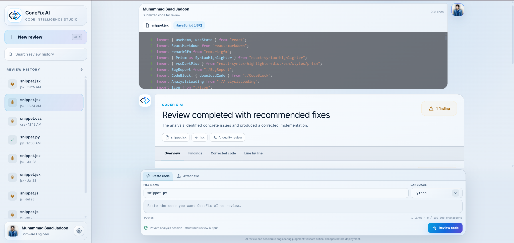
</a>

<p align="center"><sub><strong>Review Conversation:</strong> source context and the completed analysis stay connected in one thread.</sub></p>

### 3. Findings and corrected implementation

The overview summarizes the result, while detailed findings explain the evidence, severity, impact, and correction behind each confirmed issue.

<table>
  <tr>
    <td width="50%" align="center" valign="top">
      <a href="./docs/screenshots/05-overview-corrected-output.png">
        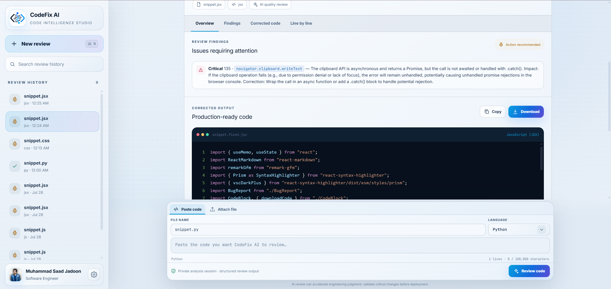
      </a>
      <br /><sub><strong>Review overview and corrected implementation</strong></sub>
    </td>
    <td width="50%" align="center" valign="top">
      <a href="./docs/screenshots/06-evidence-grounded-finding.png">
        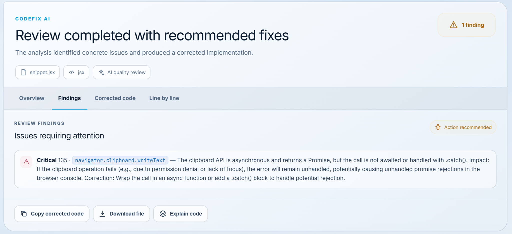
      </a>
      <br /><sub><strong>Evidence-grounded defect detail</strong></sub>
    </td>
  </tr>
</table>

### 4. Complete corrected code and walkthrough

CodeFix AI returns the complete corrected file, then provides a structured explanation of how the source works and why the changes were required.

<table>
  <tr>
    <td width="50%" align="center" valign="top">
      <a href="./docs/screenshots/07-corrected-code.png">
        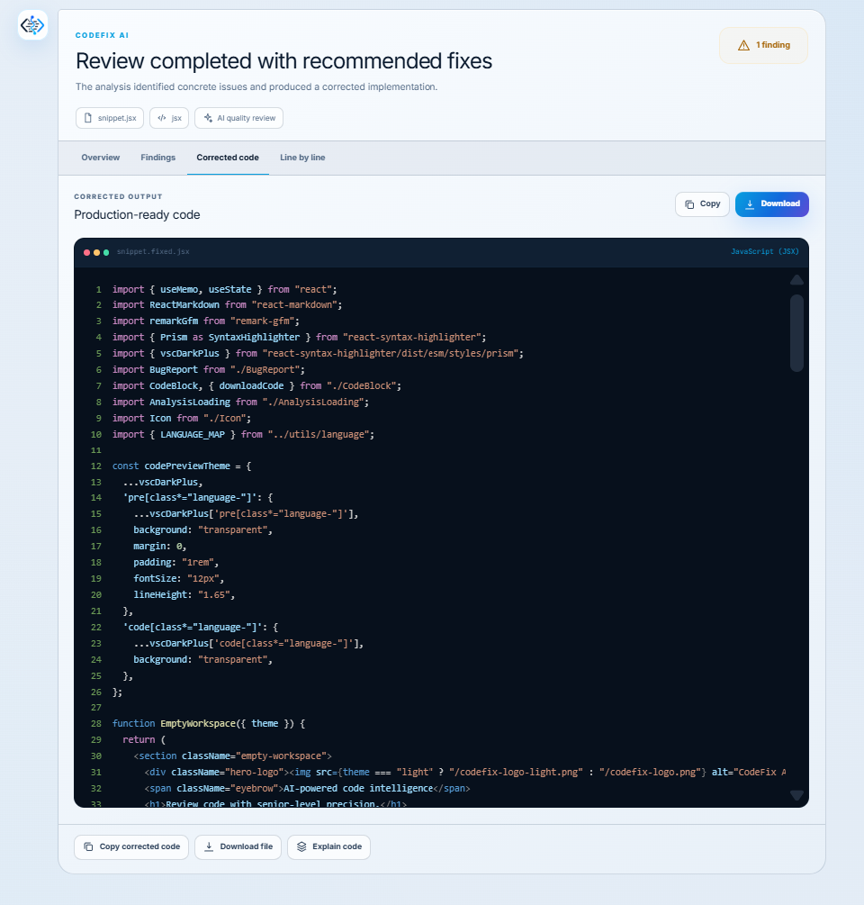
      </a>
      <br /><sub><strong>Complete corrected source</strong></sub>
    </td>
    <td width="50%" align="center" valign="top">
      <a href="./docs/screenshots/08-line-by-line-explanation.png">
        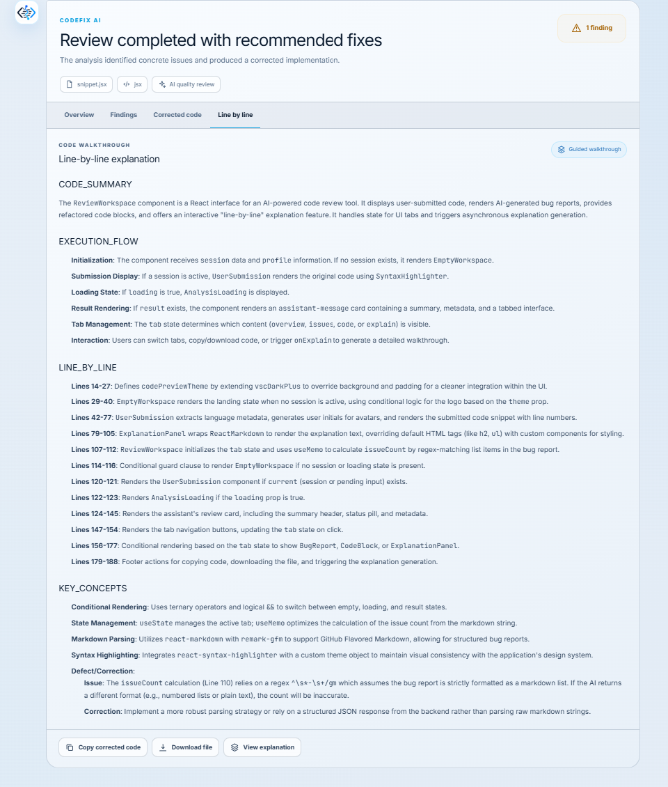
      </a>
      <br /><sub><strong>Structured line-by-line walkthrough</strong></sub>
    </td>
  </tr>
</table>

### 5. Clean-code verification

When no confirmed defect exists, the platform shows a clear verified state and preserves the submitted source instead of creating an unnecessary rewrite.

<table>
  <tr>
    <td width="50%" align="center" valign="top">
      <a href="./docs/screenshots/09-clean-code-verification.png">
        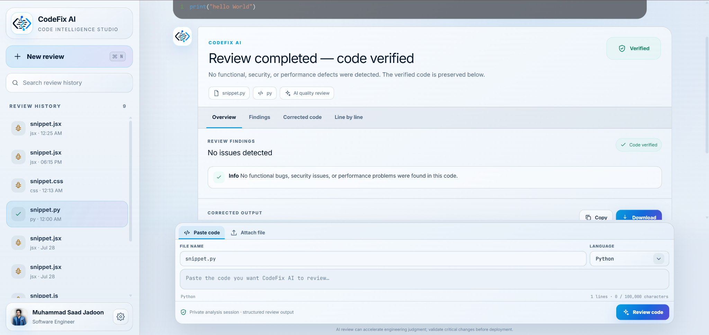
      </a>
      <br /><sub><strong>Verified clean result in light theme</strong></sub>
    </td>
    <td width="50%" align="center" valign="top">
      <a href="./docs/screenshots/11-dark-clean-review.png">
        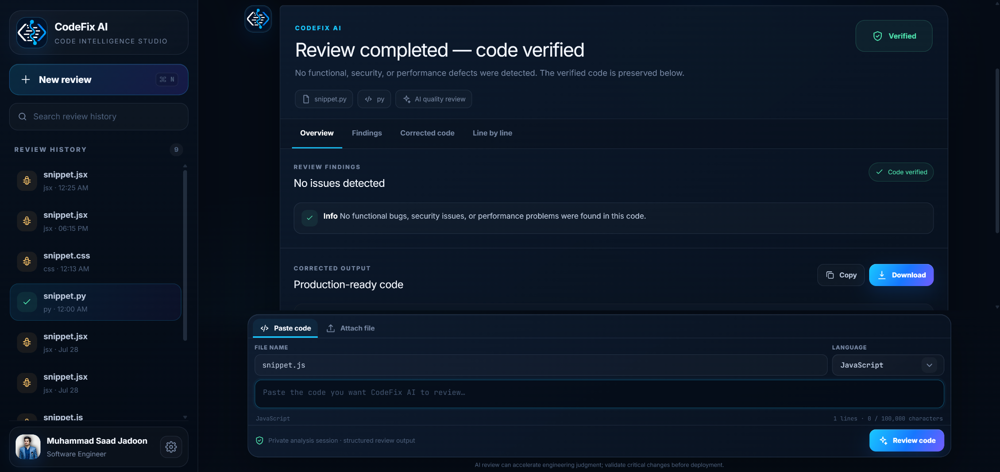
      </a>
      <br /><sub><strong>Verified clean result in dark theme</strong></sub>
    </td>
  </tr>
</table>

### 6. Language intelligence

Language resolution uses source content, filename information, and the selected option. The interface keeps the detected language and filename extension synchronized.

<table>
  <tr>
    <td width="50%" align="center" valign="top">
      <a href="./docs/screenshots/10-language-auto-detection.png">
        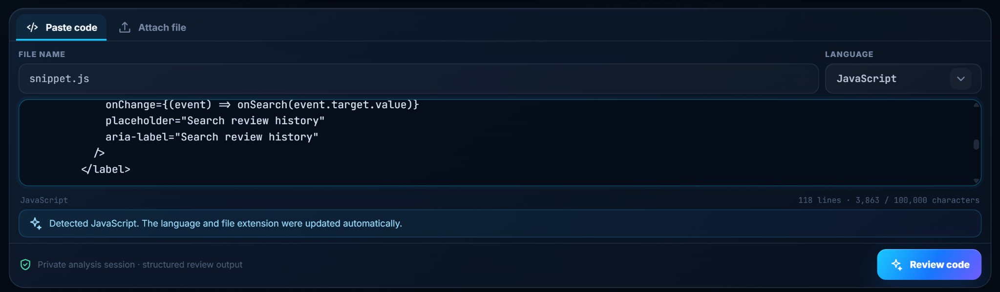
      </a>
      <br /><sub><strong>Content-first automatic detection</strong></sub>
    </td>
    <td width="50%" align="center" valign="top">
      <a href="./docs/screenshots/12-premium-language-selector.png">
        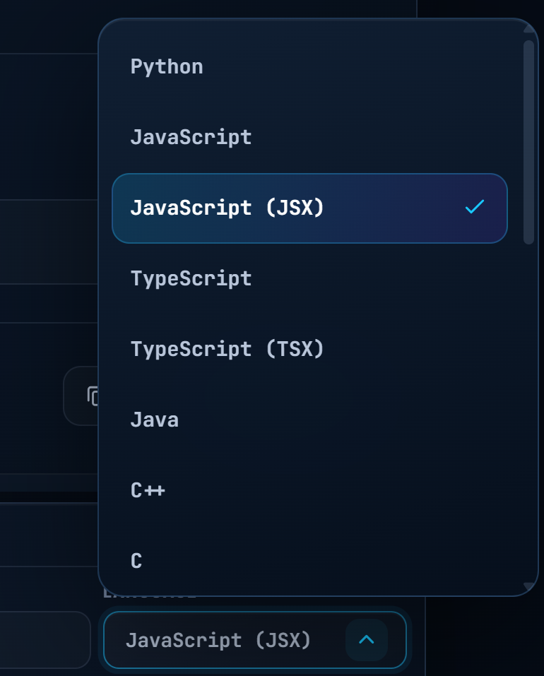
      </a>
      <br /><sub><strong>Programming-language selector</strong></sub>
    </td>
  </tr>
</table>

### 7. Preferences and source-file upload

Workspace identity, appearance, review behavior, and explanation preferences are persisted on the backend. Source files can be added through a dedicated drag-and-drop flow.

<table>
  <tr>
    <td width="50%" align="center" valign="top">
      <a href="./docs/screenshots/13-workspace-preferences.png">
        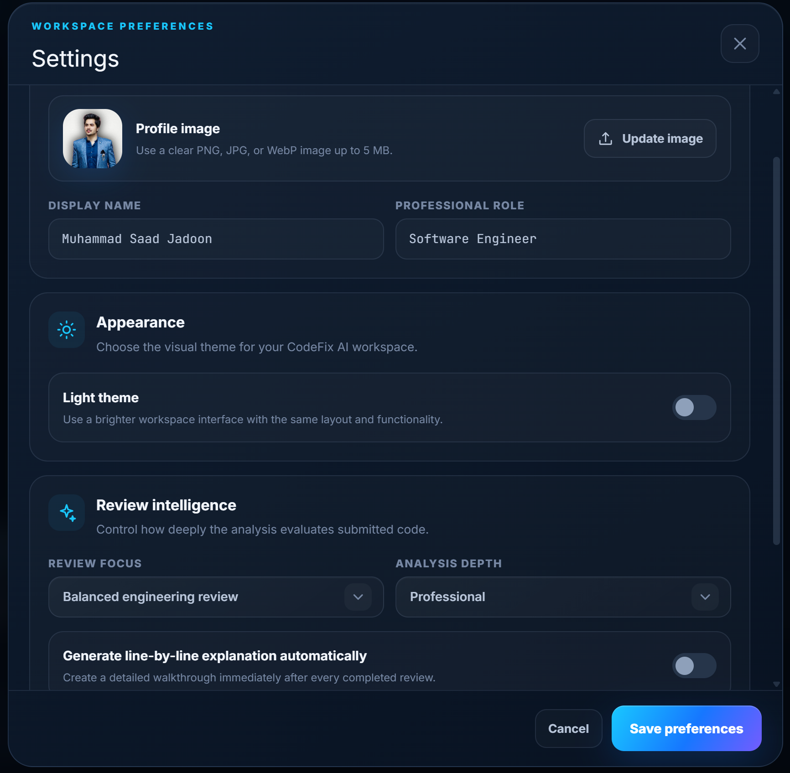
      </a>
      <br /><sub><strong>Profile, appearance, and review intelligence</strong></sub>
    </td>
    <td width="50%" align="center" valign="top">
      <a href="./docs/screenshots/14-file-upload.png">
        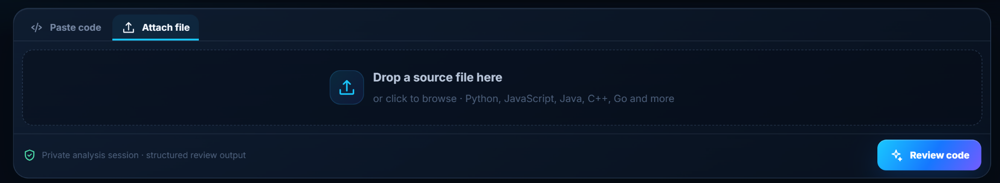
      </a>
      <br /><sub><strong>Drag-and-drop source upload</strong></sub>
    </td>
  </tr>
</table>

### 8. Settings interface

The full settings surface keeps profile controls, workspace appearance, and review-intelligence preferences in one focused panel.

<p align="center">
  <a href="./docs/screenshots/02-settings-dark.png">
    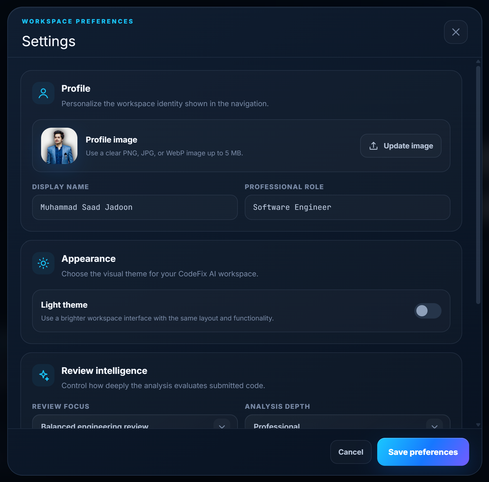
  </a>
</p>

<p align="center"><sub><strong>Settings:</strong> profile, theme, review focus, analysis depth, and automatic explanation controls.</sub></p>

<p align="right"><a href="#top">Back to top ↑</a></p>

---

## Core Capabilities

### Source Input

- Paste source code directly into an auto-growing editor.
- Upload source files through click-to-browse or drag-and-drop.
- Decode uploaded source as UTF-8 text.
- Sanitize submitted filenames before persistence.
- Enforce configurable source-size limits.
- Clear and compact the composer after review submission while preserving the submitted source in the conversation.

### Language Detection

- Detect language from source content rather than trusting only the selected option.
- Use high-confidence hard matches for structures such as JSX, TSX, HTML documents, PHP tags, and shell shebangs.
- Score language-specific syntax signatures across the complete submission.
- Synchronize the filename extension with the detected language.
- Validate uploaded-file extension against detected content.
- Prevent unsupported language selections from reaching the review engine.

### Review Intelligence

- Balanced engineering review.
- Correctness and reliability focus.
- Security and defensive-coding focus.
- Performance and efficiency focus.
- Concise, professional, or deep technical analysis.
- Concrete severity classification using **Critical**, **Warning**, and **Info**.
- Exact source references where available.
- Cause, impact, and correction guidance for confirmed findings.

### Corrected Output

- Complete corrected source rather than a partial patch in the UI.
- Syntax-highlighted code rendering.
- Filename-aware download.
- Copy-to-clipboard action.
- Preservation of valid source when no changes are required.
- Additional repair passes when a model-generated correction fails deterministic validation.

### Explanation

- Code summary.
- Numbered execution flow.
- Line-by-line or block-by-block explanation.
- Key language concepts, APIs, edge cases, and engineering decisions.
- Optional automatic explanation after each completed review.
- Persistence of generated explanations in the selected review session.

### Workspace Experience

- New review action with keyboard shortcut support.
- Searchable review history.
- Filename-based session titles.
- Active-session restoration.
- User profile with name, professional role, and profile image.
- Premium dark and light themes.
- Responsive desktop, tablet, and mobile layouts.
- Professional success, clean, loading, and failure states.

---

## Supported Languages

| Category | Languages / File Types |
|---|---|
| **Python** | Python (`.py`) |
| **JavaScript ecosystem** | JavaScript (`.js`), JSX (`.jsx`), TypeScript (`.ts`), TSX (`.tsx`) |
| **JVM** | Java (`.java`), Kotlin (`.kt`) |
| **C family** | C (`.c`), C++ (`.cpp`, `.cc`), C/C++ headers (`.h`, `.hpp`), C# (`.cs`) |
| **Systems and compiled** | Go (`.go`), Rust (`.rs`), Swift (`.swift`) |
| **Scripting** | Ruby (`.rb`), PHP (`.php`), Shell/Bash (`.sh`) |
| **Web and data** | HTML (`.html`), CSS (`.css`), SQL (`.sql`) |
| **Fallback** | Plain text (`.txt`) |

> Deterministic compiler/parser depth depends on which optional language toolchains are installed on the backend host. Tree-sitter and built-in structural validators provide a consistent baseline across supported languages.

---

## Intelligence and Validation Pipeline

CodeFix AI does not send raw code directly to a model and blindly display the answer. The review route uses a layered quality pipeline.

### Review Lifecycle

1. **Input ingestion**  
   Accept pasted code or a source file and enforce UTF-8 and size requirements.

2. **Language resolution**  
   Compare the selected language, filename extension, and content-based detection evidence.

3. **Deterministic validation**  
   Run Tree-sitter, built-in language validators, delimiter scanning, AST parsing, or available compiler/parser tools.

4. **Primary AI audit**  
   Generate compact, structured, evidence-bound findings without mixing large corrected code into the same structured payload.

5. **Source grounding**  
   Remove unsupported findings whose symbols, tokens, or line references cannot be tied to the submitted source.

6. **Independent verification**  
   Reinspect the full source and validate the candidate findings.

7. **Disagreement resolution**  
   Run a correctness-focused tie-break audit when the primary and verification stages disagree.

8. **Deterministic evidence injection**  
   Preserve parser/compiler diagnostics even if an AI response attempts to classify the source as clean.

9. **Targeted repair**  
   Generate the complete corrected source only after findings have been verified.

10. **Correction validation**  
    Parse the proposed corrected source again. Up to two focused repair passes can be attempted if deterministic validation still fails.

11. **Safe result persistence**  
    Store the original source, verified report, corrected source, status, model metadata, and explanation in SQLite.

### Deterministic Validation Matrix

| Language / Family | Validation engines used by the backend |
|---|---|
| **All supported grammars** | Tree-sitter language pack where available |
| **Python** | Python `ast.parse` |
| **JavaScript** | Node.js `--check` when installed |
| **JSX / TypeScript / TSX** | TypeScript compiler parser when installed |
| **C / C++ / headers** | `clang`, `clang++`, `gcc`, or `g++` syntax-only checks when installed |
| **Go** | `gofmt -e` when installed |
| **Ruby** | `ruby -c` when installed |
| **PHP** | `php -l` when installed |
| **Shell** | `bash -n` when installed |
| **Swift** | `swiftc -parse` when installed |
| **Java** | `javac` syntax-focused checks when installed |
| **Kotlin** | `kotlinc` syntax checks when installed |
| **Rust** | `rustc` metadata compilation when installed |
| **C#** | `csc` or `mcs` when installed |
| **CSS** | Built-in declaration and rule validator |
| **HTML** | Built-in tag and nesting validator |
| **SQL** | Built-in statement and delimiter validator |

### Strict Review Contracts

The AI service is constrained through dedicated system instructions for:

- audit;
- independent verification;
- clean-result challenge;
- correction repair;
- large-source analysis;
- patch-based large-source repair;
- structured explanation.

The backend parses and validates every response before exposing it to the frontend. Malformed or unverified responses are not silently treated as clean results.

---

## Large-Source Review Architecture

CodeFix AI supports submissions up to **100,000 characters** by using a dedicated path for long source files.

| Control | Default |
|---|---:|
| Maximum source size | `100000` characters |
| Large-source threshold | `24000` characters |
| Maximum Gemini output tokens | `65536` |

### Large-Source Strategy

- Analyze the complete source with a compact findings-only schema.
- Independently verify the findings.
- Split the source into overlapping chunks when a complete analysis response cannot be validated.
- Shift chunk-level line references back to original source coordinates.
- Deduplicate confirmed findings.
- Request line-based repair edits instead of repeatedly returning the whole file in structured JSON.
- Apply non-overlapping edits to the original source on the backend.
- Preserve unrelated lines.
- Validate the final source before presenting it.

This architecture reduces failures caused by oversized model responses while keeping the final downloadable code complete.

---

## System Architecture

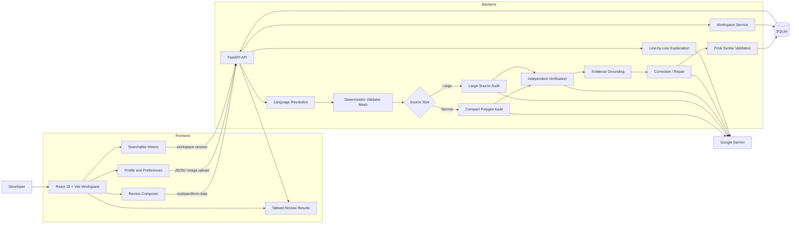

### Review Request Sequence

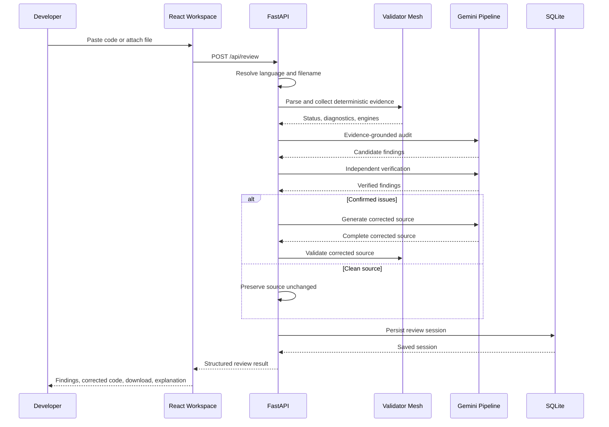

---

## Data Persistence and Privacy

CodeFix AI uses a backend-managed workspace model.

### What is stored in SQLite

- anonymous workspace identifier;
- display name;
- professional role;
- profile image bytes and MIME type;
- review focus;
- analysis depth;
- automatic explanation preference;
- dark/light theme preference;
- review sessions;
- original source code;
- verified bug report;
- corrected source code;
- explanation;
- timestamps and model metadata.

### Session Isolation

- Each browser/device receives an anonymous UUID workspace identifier.
- The identifier is stored in an **HTTP-only**, `SameSite=Lax` cookie.
- Secure-cookie mode can be enabled for HTTPS deployments.
- Review content is not persisted through `localStorage`, `sessionStorage`, or IndexedDB.
- Workspace data remains separated by the backend-issued client identifier.

### File and Profile Controls

- Source filenames are sanitized.
- Uploaded source must be readable UTF-8 text.
- Profile images are restricted to PNG, JPG, or WebP.
- Profile images are limited to 5 MB.
- Secrets are loaded from environment files excluded through `.gitignore`.

---

## API Reference

| Method | Endpoint | Purpose |
|---|---|---|
| `GET` | `/api/health` | Return service readiness and capability metadata |
| `GET` | `/api/workspace` | Load settings and the latest saved review sessions |
| `PUT` | `/api/settings` | Save profile, review intelligence, explanation, and theme preferences |
| `POST` | `/api/profile/avatar` | Upload a profile image |
| `GET` | `/api/profile/avatar` | Read the workspace profile image |
| `DELETE` | `/api/reviews` | Clear review history for the current workspace |
| `POST` | `/api/review` | Review pasted code or an uploaded source file and return quality-gate metadata plus a unified diff |
| `GET` | `/api/reviews/{review_id}/report?format=markdown` | Export a complete engineering review report as Markdown |
| `GET` | `/api/reviews/{review_id}/report?format=json` | Export the auditable review session as JSON |
| `POST` | `/api/explain` | Generate and optionally persist a structured code walkthrough |

### Example Review Request

```bash
curl -X POST "http://localhost:8000/api/review" \
  -F "code=def divide(a, b): return a / b" \
  -F "language=py" \
  -F "filename=calculator.py" \
  -F "focus=balanced" \
  -F "detail=standard" \
  -c codefix-cookie.txt \
  -b codefix-cookie.txt
```

### Example Explanation Request

```bash
curl -X POST "http://localhost:8000/api/explain" \
  -H "Content-Type: application/json" \
  -d '{
    "code": "def greet(name):\n    return f\"Hello, {name}\"",
    "language": "py",
    "filename": "greeting.py",
    "detail": "standard"
  }' \
  -c codefix-cookie.txt \
  -b codefix-cookie.txt
```

---

## Database Model

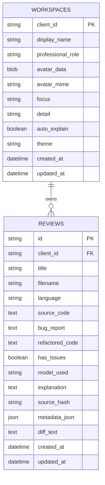

The workspace endpoint returns a configurable history window (default **100** review sessions) ordered by most recent update.

---

## Project Structure

```text
DecodeLab-Intelligent Code Reviewer and Explainer/
├── backend/
│   ├── app/
│   │   ├── config.py              # Environment-backed runtime configuration
│   │   ├── gemini_service.py      # Audit, verification, grounding, repair, large-source, explanation
│   │   ├── prompts.py             # Strict model instructions and prompt builders
│   │   ├── schemas.py             # Pydantic request and response contracts
│   │   └── __init__.py
│   ├── main.py                    # FastAPI routes, SQLite, language detection, validators
│   ├── tests/
│   │   └── test_review_quality.py # Language, diff, metadata, and report tests
│   ├── Dockerfile
│   ├── requirements.txt
│   ├── requirements-dev.txt
│   └── .env.example
├── frontend/
│   ├── public/
│   │   ├── codefix-logo.png
│   │   ├── codefix-logo-light.png
│   │   └── codefix-favicon.png
│   ├── src/
│   │   ├── components/
│   │   │   ├── AnalysisLoading.jsx
│   │   │   ├── BugReport.jsx
│   │   │   ├── CodeBlock.jsx
│   │   │   ├── DiffViewer.jsx
│   │   │   ├── PremiumSelect.jsx
│   │   │   ├── QualityGatePanel.jsx
│   │   │   ├── ReviewComposer.jsx
│   │   │   ├── ReviewWorkspace.jsx
│   │   │   ├── SettingsModal.jsx
│   │   │   ├── Sidebar.jsx
│   │   │   └── ...
│   │   ├── utils/
│   │   │   ├── api.js             # Backend API client and professional error mapping
│   │   │   └── language.js        # Frontend language metadata and detection
│   │   ├── App.jsx
│   │   ├── index.css
│   │   └── main.jsx
│   ├── Dockerfile
│   ├── nginx.conf
│   ├── package.json
│   ├── vite.config.js
│   └── .env.example
├── .github/workflows/ci.yml       # Backend and frontend continuous integration
├── docs/
│   ├── ARCHITECTURE.md
│   ├── REVIEW_GUARANTEES.md
│   └── screenshots/               # Repository-relative README visuals
├── docker-compose.yml
├── Makefile
├── CHANGELOG.md
├── CONTRIBUTING.md
├── SECURITY.md
├── .gitignore
├── IMPLEMENTATION_NOTES.md
└── README.md
```

---

## Getting Started

### Fastest production-style start: Docker Compose

```bash
# 1. Clone the repository
git clone <your-repository-url>
cd <repository-directory>

# 2. Provide the model key
export GEMINI_API_KEY=your_real_key

# 3. Build and launch the complete stack
docker compose up --build
```

Open:

- Frontend: `http://localhost:8080`
- Backend API: `http://localhost:8000`
- Interactive API documentation: `http://localhost:8000/docs`

The SQLite workspace database is stored in the named Docker volume `codefix_storage`, so review history survives container restarts.

### Local Development

#### Prerequisites

- Python 3.10 or newer recommended
- Node.js 18 or newer recommended
- npm
- A Google Gemini API key
- Optional local parser/compiler toolchains for deeper deterministic validation

### 1. Clone the Repository

```bash
git clone <your-repository-url>
cd "DecodeLab-Intelligent Code Reviewer and Explainer"
```

### 2. Configure and Run the Backend

```bash
cd backend
python -m venv .venv
```

#### Windows PowerShell

```powershell
.\.venv\Scripts\Activate.ps1
pip install -r requirements.txt
Copy-Item .env.example .env
uvicorn main:app --reload --port 8000
```

#### macOS / Linux

```bash
source .venv/bin/activate
pip install -r requirements.txt
cp .env.example .env
uvicorn main:app --reload --port 8000
```

Open `backend/.env` and replace the placeholder API key before starting the server.

### 3. Configure and Run the Frontend

Open a second terminal:

```bash
cd frontend
npm install
```

#### Windows PowerShell

```powershell
Copy-Item .env.example .env
npm run dev
```

#### macOS / Linux

```bash
cp .env.example .env
npm run dev
```

### 4. Open the Application

```text
http://localhost:5173
```

The FastAPI service runs by default at:

```text
http://localhost:8000
```

### Production Frontend Build

```bash
cd frontend
npm run build
npm run preview
```

### Production-Style Backend Start

```bash
cd backend
uvicorn main:app --host 0.0.0.0 --port 8000
```

---

## Environment Configuration

### Backend: `backend/.env`

| Variable | Required | Default / Example | Purpose |
|---|---|---|---|
| `GEMINI_API_KEY` | Yes | `your_gemini_api_key_here` | Authenticates Gemini requests |
| `GEMINI_MODEL` | Recommended | Set to a model available to your account | Selects the Gemini model used for review and explanation |
| `MAX_CODE_CHARS` | No | `100000` | Maximum accepted source length |
| `LARGE_SOURCE_THRESHOLD` | No | `24000` | Routes long source into the large-source pipeline |
| `GEMINI_MAX_OUTPUT_TOKENS` | No | `65536` | Maximum configured model output capacity |
| `FRONTEND_ORIGIN` | No | `http://localhost:5173` | CORS origin allowed by FastAPI |
| `COOKIE_SECURE` | No | `false` | Set to `true` when served over HTTPS |

> The sample `.env.example` includes a model value. Use a Gemini model that is enabled for your Google AI Studio account.

### Frontend: `frontend/.env`

| Variable | Required | Default | Purpose |
|---|---|---|---|
| `VITE_API_BASE_URL` | No | `http://localhost:8000` | Base URL for FastAPI requests and profile assets |

---

## Using CodeFix AI

### Paste-Code Workflow

1. Select **Paste code**.
2. Enter or paste source code.
3. CodeFix AI detects the language and updates the filename extension when confidence is sufficient.
4. Optionally select a language manually.
5. Select review preferences from **Settings**.
6. Click **Review code**.
7. Inspect the structured result through:
   - **Overview**
   - **Findings**
   - **Corrected code**
   - **Line by line**
8. Copy or download the corrected source.

### File-Upload Workflow

1. Select **Attach file**.
2. Drop a supported UTF-8 source file into the upload area or browse for a file.
3. The backend checks the extension and source content.
4. Run the review.
5. Open the saved session later from searchable history.

### Clean-Code Workflow

When the source passes deterministic validation and the evidence-grounded review finds no confirmed issue:

- the result is marked **Verified**;
- the original source is returned unchanged;
- the review is stored in history;
- submitting the identical previously verified source can use the trusted repeat-review path.

### Explanation Workflow

- Open **Line by line** and click **Explain line by line**; or
- enable **Generate line-by-line explanation automatically** in Settings.

The explanation contains:

1. code summary;
2. execution flow;
3. line-by-line or block-by-block walkthrough;
4. key concepts.

---

## Professional Error Handling

The frontend converts API failures into user-facing engineering messages rather than exposing raw service traces.

| Status | Typical Meaning |
|---:|---|
| `400` | Review request could not be processed |
| `401` | Workspace session is no longer valid |
| `403` | Workspace is not authorized for the action |
| `404` | Workspace resource does not exist |
| `413` | Source or profile image exceeds the supported limit |
| `422` | Source, file type, language, settings, or payload validation failed |
| `429` | Analysis service quota or capacity limit |
| `500` | Unexpected backend error |
| `502` | AI output or walkthrough could not be verified |
| `503` | Analysis engine is temporarily unavailable |

The backend also translates quota, timeout, API-key, network, and large-source failures into professional retry guidance.

---

## Engineering Decisions

### Why separate findings from corrected source?

Code containing braces, quotes, Markdown-like tokens, JSX, CSS, or very long text can corrupt a single oversized structured response. CodeFix AI first requests compact findings, verifies them, and only then requests corrected source.

### Why deterministic validation before AI?

Models can miss syntax errors or invent issues. Parser/compiler diagnostics provide concrete evidence that cannot be erased by a clean AI verdict.

### Why verify corrected code again?

A correct finding does not guarantee a correct model-generated repair. The backend re-runs validation and can request focused repair passes.

### Why preserve clean source unchanged?

A code reviewer should not create unnecessary diffs. The strict prompts and repeat-review path protect already-correct code from speculative rewriting.

### Why store sessions on the backend?

Server-backed persistence gives the application durable history, preferences, profile identity, and device-specific isolation without keeping review source in browser local storage.

---

## Evaluation Highlights

This project demonstrates work across multiple software-engineering and AI disciplines:

- **Generative AI integration**: structured Gemini audit, verification, repair, and explanation.
- **Prompt engineering**: specialized system contracts for normal and large-source workflows.
- **Full-stack development**: React/Vite frontend and FastAPI backend.
- **Programming-language intelligence**: content detection, extension synchronization, language families.
- **Compiler and parser integration**: AST, Tree-sitter, and optional language toolchains.
- **Reliability engineering**: grounding, retries, independent verification, repair validation, repeat-source consistency.
- **Database architecture**: workspace and review persistence in SQLite.
- **Security and privacy design**: environment secrets, HTTP-only cookies, input limits, filename sanitization.
- **UI/UX engineering**: responsive review conversation, themes, premium selectors, history, profile, settings.
- **Large-input design**: chunked analysis and line-edit repair for source near 100,000 characters.

### Suggested Demonstration Flow for Reviewers

1. Open the application in dark theme.
2. Paste a short valid Python program and show **Verified** output.
3. Resubmit the same code to demonstrate stable repeat verification.
4. Paste malformed CSS, JavaScript, or HTML and show deterministic findings.
5. Open **Corrected code**, copy it, and download the fixed file.
6. Open **Line by line** and generate the walkthrough.
7. Upload a source file and show automatic language resolution.
8. Switch to light theme from Settings.
9. Search and reopen the saved review from history.
10. Show backend persistence by refreshing the application.

---

## Limitations and Responsible Use

- AI-assisted review should complement, not replace, human engineering judgment.
- Critical corrections should be tested before deployment.
- Compiler-level validation is deepest when the relevant language toolchain is installed on the backend machine.
- The current persistence layer is SQLite, which is ideal for local and internship-scale deployment; a managed relational database would be more appropriate for high-concurrency production deployment.
- Anonymous workspace isolation is device/browser based and is not a replacement for a complete authenticated multi-user account system.
- The project does not execute submitted source code; deterministic checks are syntax- and structure-focused.

---

## Future Enhancements

- Authenticated accounts and cross-device workspace synchronization.
- PostgreSQL migration for production-scale concurrency.
- Repository-level multi-file review with dependency context.
- GitHub pull-request integration.
- Inline diff viewer and one-click patch application.
- Test generation and regression validation.
- Static-analysis integrations such as ESLint, Ruff, Bandit, Semgrep, and language-specific linters.
- Streaming review progress through Server-Sent Events or WebSockets.
- Organization accounts, authenticated cross-device workspace synchronization, and team review sharing.
- Review analytics, quality trends, and team workspaces.

---

## Author

<div align="center">
  

  ### Muhammad Saad Jadoon

  **Developer of CodeFix AI: Intelligent Code Reviewer & Explainer**

  Built as an advanced DecodeLabs Generative AI internship project with a focus on reliable AI engineering, full-stack product development, language intelligence, and premium user experience.
</div>

---

<div align="center">
  <strong>CodeFix AI</strong><br />
  Review code with senior-level precision.
</div>
