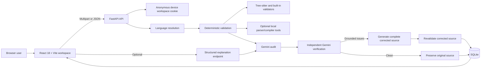

## Product Gallery

### Dark Workspace — Primary Review Experience

A polished dark-mode workspace with review history, profile controls, source input, language selection, and the main AI review action.

<p align="center">
  <a href="https://github.com/YOUR_GITHUB_USERNAME/YOUR_REPOSITORY_NAME/blob/main/docs/screenshots/01-dark-workspace.png" target="_blank">
    
  </a>
</p>

<br />

### Light Workspace — Complete Visual Parity

The light theme preserves the full information hierarchy, review controls, history navigation, and source-composer experience.

<p align="center">
  <a href="https://github.com/YOUR_GITHUB_USERNAME/YOUR_REPOSITORY_NAME/blob/main/docs/screenshots/03-light-workspace.png" target="_blank">
    
  </a>
</p>

<br />

### Workspace Preferences and Review Intelligence

The settings experience manages profile identity, avatar upload, theme selection, review focus, analysis depth, and automatic line-by-line explanation.

<p align="center">
  <a href="https://github.com/YOUR_GITHUB_USERNAME/YOUR_REPOSITORY_NAME/blob/main/docs/screenshots/02-settings-panel.png" target="_blank">
    
  </a>
</p>

<br />

### Structured Review Conversation

Each review is presented as a developer-to-assistant conversation containing the submitted source, filename, language, line count, user identity, and AI-generated result.

<p align="center">
  <a href="https://github.com/YOUR_GITHUB_USERNAME/YOUR_REPOSITORY_NAME/blob/main/docs/screenshots/04-review-conversation.png" target="_blank">
    
  </a>
</p>

<br />

### Findings, Status, and Corrected Output

The review workspace clearly separates the overview, findings, corrected code, and line-by-line explanation while keeping a new review composer available below the result.

<p align="center">
  <a href="https://github.com/YOUR_GITHUB_USERNAME/YOUR_REPOSITORY_NAME/blob/main/docs/screenshots/05-findings-and-correction.png" target="_blank">
    
  </a>
</p>

<br />

### Evidence-Grounded Finding Detail

Confirmed defects include severity, exact source location, affected symbol, technical cause, concrete impact, and a correction recommendation.

<p align="center">
  <a href="https://github.com/YOUR_GITHUB_USERNAME/YOUR_REPOSITORY_NAME/blob/main/docs/screenshots/06-findings-detail.png" target="_blank">
    
  </a>
</p>

<br />

### Corrected Source and Guided Explanation

<table align="center">
  <tr>
    <td width="50%" align="center">
      <strong>Complete Corrected Source</strong>
    </td>
    <td width="50%" align="center">
      <strong>Line-by-Line Walkthrough</strong>
    </td>
  </tr>
  <tr>
    <td valign="top" align="center">
      <a href="https://github.com/YOUR_GITHUB_USERNAME/YOUR_REPOSITORY_NAME/blob/main/docs/screenshots/07-corrected-code.png" target="_blank">
        
      </a>
    </td>
    <td valign="top" align="center">
      <a href="https://github.com/YOUR_GITHUB_USERNAME/YOUR_REPOSITORY_NAME/blob/main/docs/screenshots/08-line-by-line-explanation.png" target="_blank">
        
      </a>
    </td>
  </tr>
</table>

<br />

### Verified Clean-Code State — Light Theme

When no evidence-backed functional, security, or performance issue is confirmed, CodeFix AI displays a verified result and preserves the submitted source unchanged.

<p align="center">
  <a href="https://github.com/YOUR_GITHUB_USERNAME/YOUR_REPOSITORY_NAME/blob/main/docs/screenshots/09-clean-code-verification-light.png" target="_blank">
    
  </a>
</p>

<br />

### Automatic Language and Extension Detection

For pasted source, CodeFix AI can detect the programming language from content and synchronize the selected language and filename extension automatically.

<p align="center">
  <a href="https://github.com/YOUR_GITHUB_USERNAME/YOUR_REPOSITORY_NAME/blob/main/docs/screenshots/10-language-auto-detection.png" target="_blank">
    
  </a>
</p>

<br />

### Verified Clean-Code State — Dark Theme

The verified review experience remains fully consistent in dark mode, including metadata, findings status, output controls, history, and continued code input.

<p align="center">
  <a href="https://github.com/YOUR_GITHUB_USERNAME/YOUR_REPOSITORY_NAME/blob/main/docs/screenshots/11-clean-code-verification-dark.png" target="_blank">
    
  </a>
</p>

<br />

### Language Selection and File Upload

<table align="center">
  <tr>
    <td width="36%" align="center">
      <strong>Premium Language Selector</strong>
    </td>
    <td width="64%" align="center">
      <strong>Drag-and-Drop Source Upload</strong>
    </td>
  </tr>
  <tr>
    <td valign="top" align="center">
      <a href="https://github.com/YOUR_GITHUB_USERNAME/YOUR_REPOSITORY_NAME/blob/main/docs/screenshots/12-language-selector.png" target="_blank">
        
      </a>
    </td>
    <td valign="top" align="center">
      <a href="https://github.com/YOUR_GITHUB_USERNAME/YOUR_REPOSITORY_NAME/blob/main/docs/screenshots/13-file-upload.png" target="_blank">
        
      </a>
    </td>
  </tr>
</table>
<div align="center">
  

# CodeFix AI

### Code Intelligence Studio

**A premium full-stack workspace for AI-assisted code review, evidence-grounded defect detection, validated corrections, and structured code walkthroughs.**

<p>
  
  
  
  
</p>

<p>
  
  
  
  
</p>

[Overview](#overview) · [Product Gallery](#product-gallery) · [Features](#feature-set) · [Architecture](#architecture) · [Installation](#installation) · [API](#api-reference) · [Deployment](#production-build-and-deployment)

</div>

---

## Overview

CodeFix AI is a browser-based code intelligence workspace that accepts pasted source code or uploaded source files, identifies the submitted programming language, performs deterministic syntax validation where tooling is available, runs a multi-stage Gemini review pipeline, and returns:

- A structured, evidence-grounded findings report.
- A complete corrected implementation when confirmed issues exist.
- The original source unchanged when no confirmed defect is found.
- An optional structured line-by-line explanation.
- A persistent review session stored in a server-side SQLite workspace.

The interface is designed as a modern review conversation rather than a single-use form. Completed reviews appear in searchable history, each session retains the original submission and generated result, and workspace preferences are synchronized through the backend.

> [!IMPORTANT]
> Submitted source code is sent from the browser to the FastAPI backend and then to the configured Gemini model for analysis. Do not submit credentials, private keys, production secrets, or code that you are not authorized to process through an external AI service.

---

## Product Gallery

> [!NOTE]
> Every screenshot below is stored inside this repository under `docs/screenshots/`. Keep that folder and the exact filenames unchanged so GitHub can render the images correctly.

### Premium Dark Code-Review Workspace

The default dark workspace combines a fixed review-history sidebar, profile controls, source submission, language selection, file upload, and a focused AI-review canvas.

<p align="center">
  
</p>

<br />

### Premium Light Workspace

The light appearance preserves the complete layout and functionality while providing a brighter, professional visual system.

<p align="center">
  
</p>

<br />

### Workspace Preferences

The settings panel manages the profile image, display name, professional role, theme, review focus, analysis depth, and automatic line-by-line explanation preference.

<p align="center">
  
</p>

<br />

### Review Conversation

Each review is displayed as a structured conversation containing the submitted source, filename, language, line count, developer identity, and the AI-generated review response.

<p align="center">
  
</p>

<br />

### Findings and Corrected Implementation

The review result provides a clear status, metadata, four dedicated tabs, confirmed findings, and the generated production-ready correction.

<p align="center">
  
</p>

<br />

### Evidence-Grounded Finding Detail

Confirmed issues are presented with severity, exact source location, affected symbol, technical cause, impact, and correction guidance.

<p align="center">
  
</p>

<br />

### Complete Corrected Source

The corrected-code tab returns the complete source file with syntax highlighting, line numbers, internal scrolling, copy controls, and file download.

<p align="center">
  
</p>

<br />

### Structured Line-by-Line Walkthrough

The explanation tab can document the code summary, execution flow, meaningful line ranges, key concepts, and the relationship between a defect and its correction.

<p align="center">
  
</p>

<br />

### Verified Clean-Code Result in Light Mode

When no evidence-backed functional, security, or performance issue is confirmed, CodeFix AI presents a verified result and preserves the submitted source.

<p align="center">
  
</p>

<br />

### Intelligent Language and Extension Detection

For pasted code, the workspace can detect the programming language from source content and automatically synchronize the language selector and filename extension.

<p align="center">
  
</p>

<br />

### Verified Clean-Code Result in Dark Mode

The verified result experience remains consistent in the dark theme, including review history, source metadata, output controls, and continued review input.

<p align="center">
  
</p>

<br />

### Premium Programming-Language Selector

The custom selector provides a scrollable language list, selected-state indication, keyboard interaction, and theme-aware presentation.

<p align="center">
  
</p>

<br />

### Drag-and-Drop Source-File Upload

The file workflow supports click-to-browse and drag-and-drop submission for supported source-code formats.

<p align="center">
  
</p>

---

## Feature Set

### Source Submission

| Capability | Implementation |
|---|---|
| Paste code | Resizable code editor with filename input, language selector, live line count, and character count. |
| Attach file | Click-to-browse and drag-and-drop source-file workflow. |
| Source limit | `100,000` characters by default, controlled by `MAX_CODE_CHARS`. |
| Encoding | Uploaded files must be readable UTF-8 source text; UTF-8 BOM is accepted. |
| Empty-source protection | Blank pasted input and empty uploaded files are rejected before analysis. |
| Filename alignment | Pasted snippets are renamed automatically to the selected or detected extension. |
| Extension mismatch protection | Uploaded files are rejected when strong content detection conflicts with the file extension. |
| Input reset | Successful submission clears the composer and starts a clean input state. |

### Code Intelligence

| Capability | Implementation |
|---|---|
| Content-first language detection | Weighted source signatures plus hard matches identify the submitted language from the code itself. |
| Deterministic validation | Tree-sitter, built-in validators, Python AST, and optional local parser/compiler tools provide source-grounded diagnostics. |
| Multi-stage AI review | A primary audit is independently verified before a defect is accepted. |
| Evidence grounding | Findings are filtered against actual line ranges, symbols, inline tokens, and deterministic diagnostics. |
| Clean-verdict protection | A clean result is preserved only when the verification pipeline finds no grounded issue. |
| Full corrected source | Confirmed issues produce a complete corrected file rather than a partial excerpt or diff. |
| Correction revalidation | Proposed corrected code is validated again; failed corrections receive up to two focused repair attempts. |
| Safe correction fallback | If corrected output still fails deterministic validation, the original source is preserved and the verified finding remains visible. |
| Repeat-source verification | Previously trusted byte-identical clean source can be recognized without repeating the full AI review, provided deterministic validation does not fail. |
| Large-source workflow | Source at or above `LARGE_SOURCE_THRESHOLD` uses a dedicated findings-first and repair workflow. |
| Optional explanation | A separate explanation request returns summary, execution flow, line-by-line coverage, and key concepts. |

### Review Experience

- Chat-style display of the original submission and assistant response.
- Original source preview with syntax highlighting and line numbers.
- Four result tabs: **Overview**, **Findings**, **Corrected code**, and **Line by line**.
- Finding-severity presentation for critical, warning, and informational results.
- Corrected-code copy and download actions.
- Automatic output filename generation using the `.fixed` suffix.
- Progress steps while analysis is running.
- Professional success, clean-code, warning, loading, and service-error states.
- Responsive sidebar and mobile navigation.
- Keyboard shortcut: `Ctrl/Cmd + N` starts a new review.
- Reduced-motion support through `prefers-reduced-motion`.

### Workspace and Personalization

- Server-backed review history, ordered by the most recently updated session.
- Newest `60` sessions returned by the workspace endpoint.
- Client-side history search by title, filename, and language.
- Review title permanently derived from the first submitted filename.
- Profile display name and professional role.
- PNG, JPG, or WebP profile image upload up to `5 MB`.
- Dark and light themes synchronized with the backend.
- Review-focus options: balanced, correctness, security, and performance.
- Analysis-depth options: concise, professional/standard, and deep.
- Optional automatic line-by-line explanation after each review.
- Clear-all review-history action with confirmation.

---

## Supported Languages

The current selector exposes the following language modes:

| Language | Extension | Syntax highlighting | Deterministic validation path |
|---|---:|---|---|
| Python | `.py` | Python | Tree-sitter, Python AST, delimiter validation |
| JavaScript | `.js` | JavaScript | Tree-sitter, delimiter validation, optional `node --check` |
| JavaScript JSX | `.jsx` | JSX | Tree-sitter JavaScript, delimiter validation, optional TypeScript parser |
| TypeScript | `.ts` | TypeScript | Tree-sitter, delimiter validation, optional `tsc --noEmit` |
| TypeScript TSX | `.tsx` | TSX | Tree-sitter TSX, delimiter validation, optional `tsc --noEmit` |
| Java | `.java` | Java | Tree-sitter, delimiter validation, optional `javac` syntax compilation |
| C++ | `.cpp` | C++ | Tree-sitter, delimiter validation, optional Clang/GCC syntax-only compilation |
| C | `.c` | C | Tree-sitter, delimiter validation, optional Clang/GCC syntax-only compilation |
| C/C++ Header | `.h` | C++ | Tree-sitter C++, delimiter validation, optional compiler syntax check |
| C++ Header | `.hpp` | C++ | Tree-sitter C++, delimiter validation, optional compiler syntax check |
| Go | `.go` | Go | Tree-sitter, delimiter validation, optional `gofmt -e` |
| Ruby | `.rb` | Ruby | Tree-sitter, delimiter validation, optional `ruby -c` |
| PHP | `.php` | PHP | Tree-sitter, delimiter validation, optional `php -l` |
| C# | `.cs` | C# | Tree-sitter, delimiter validation, optional `csc` or `mcs` |
| Rust | `.rs` | Rust | Tree-sitter, delimiter validation, optional `rustc` metadata build |
| Swift | `.swift` | Swift | Tree-sitter, delimiter validation, optional `swiftc -parse` |
| Kotlin | `.kt` | Kotlin | Tree-sitter, delimiter validation, optional `kotlinc` compilation |
| SQL | `.sql` | SQL | Tree-sitter, delimiter validation, custom SQL statement validation |
| Shell | `.sh` | Bash | Tree-sitter Bash, delimiter validation, optional `bash -n` |
| HTML | `.html` | HTML | Tree-sitter and custom HTML structure validation |
| CSS | `.css` | CSS | Tree-sitter and custom CSS declaration validation |

> [!NOTE]
> External parser/compiler checks are opportunistic. CodeFix AI detects a tool through the operating-system `PATH` and uses it when available. Missing optional tools do not stop the AI review.

---

## Architecture



### Frontend

- **React 18** application mounted through `src/main.jsx`.
- **Vite 5** development and production build tool.
- **React Markdown + remark-gfm** for findings and walkthrough rendering.
- **React Syntax Highlighter / Prism** for source previews and corrected output.
- Custom CSS design system in `frontend/src/index.css`.
- Custom portal-based `PremiumSelect` with keyboard navigation and viewport-aware positioning.
- Credentialed API calls so the anonymous workspace cookie is included.

### Backend

- **FastAPI 3.0.0 application metadata** with CORS middleware.
- **Pydantic** request and response contracts.
- **Google Gen AI SDK** for Gemini generation.
- **SQLite** for workspaces, preferences, avatars, sessions, findings, corrected code, and explanations.
- **Tree-sitter language pack** for grammar-aware syntax checks.
- Optional local language tools discovered at runtime.

### Data Flow

1. The browser reads pasted code or a selected UTF-8 source file.
2. The frontend performs an initial content-based language-detection pass.
3. The backend independently resolves the language and validates filename/content consistency.
4. Deterministic validators collect parser/compiler evidence without intentionally executing the submitted program.
5. Gemini produces a compact findings-only audit.
6. A second Gemini pass independently verifies the proposed findings.
7. Findings without source evidence are removed.
8. Clean source is returned unchanged; confirmed findings trigger complete-source repair.
9. Corrected source is revalidated, with focused repair attempts when required.
10. The completed session is stored in SQLite and returned to the workspace.
11. A separate endpoint can generate and persist a structured walkthrough.

---

## Review Pipeline in Detail

### 1. Input Validation

The backend accepts either:

- `file`: an uploaded source file, or
- `code`: pasted source text submitted as a form field.

It rejects missing input, empty source, unsupported language values, unreadable binary/non-UTF-8 files, and source above the configured character limit.

### 2. Language Resolution

Language resolution combines:

- Explicit language selection.
- Filename extension.
- Hard source signatures such as PHP opening tags, React/JSX structure, HTML document markers, and shell shebangs.
- Weighted language-specific patterns.
- Confidence and runner-up score checks.
- Language-family compatibility rules.

For pasted source, strong content detection can automatically change both the language and filename extension. For uploaded files, strong mismatch detection returns a professional validation error instead of silently reviewing the source as the wrong language.

### 3. Deterministic Validation

The application builds a `SyntaxValidation` result with one of three states:

- `passed`
- `failed`
- `not_available`

Diagnostics are deduplicated and limited to a concise set. Depending on the language and installed tools, validation can include:

- Tree-sitter grammar traversal.
- Language-aware delimiter scanning.
- Python AST parsing.
- CSS declaration checks.
- HTML structure and nesting checks.
- SQL statement checks.
- Syntax-only parser/compiler invocations.

### 4. Findings-Only AI Audit

The compact audit prompt requests a strict JSON object containing a verdict and grounded finding records. Each finding must contain:

- Severity.
- Exact line or line range.
- Exact source symbol or token.
- Directly provable cause.
- Concrete impact.
- Precise correction.

Style-only advice, speculative risks, and unsupported requirements are explicitly excluded by the prompt contract.

### 5. Independent Verification

A second model pass receives the original source, deterministic validation context, and candidate findings. It can keep, remove, or add only evidence-backed findings.

When the primary and verifier disagree, the pipeline can perform a deeper correctness-focused tie-break audit.

### 6. Source Grounding

Before findings are displayed, backend logic verifies that each item is grounded through one or more of the following:

- A valid source line or range.
- A symbol that exists in the submitted source.
- An exact inline token from the cause or correction.
- A deterministic parser or compiler diagnostic.

### 7. Repair and Post-Validation

Confirmed findings are sent to a correction stage that must return the complete corrected file between strict source markers.

The backend then validates the result again. If validation fails, it runs up to two focused repair passes using the new deterministic diagnostics.

When a safe correction cannot be validated, CodeFix AI does not pretend the output is production-ready. It preserves the original source in the corrected-code panel and adds a warning to the findings report.

### 8. Large-Source Path

When source length reaches `LARGE_SOURCE_THRESHOLD`—`24,000` characters in the included example configuration—the backend uses a dedicated large-source workflow.

The workflow separates compact findings from full-source repair to reduce structured-output corruption and support source approaching the configured `100,000` character limit.

---

## Persistence Model

CodeFix AI does not use browser `localStorage`, `sessionStorage`, or IndexedDB for workspace data.

The backend assigns an anonymous device identifier in an HttpOnly cookie and stores workspace content in SQLite.

### Workspace Cookie

| Property | Current behavior |
|---|---|
| Name | `codefix_device_id` |
| Identifier | UUID |
| HttpOnly | Yes |
| SameSite | `lax` |
| Path | `/` |
| Maximum age | Three years |
| Secure flag | Controlled by `COOKIE_SECURE` |

This is anonymous device separation, not user-account authentication. Clearing or replacing the cookie creates a different workspace identity.

### SQLite Tables

#### `workspaces`

Stores:

- Anonymous client ID.
- Display name.
- Professional role.
- Avatar data.
- Avatar MIME type.
- Review focus.
- Analysis depth.
- Automatic-explanation preference.
- Theme.
- Creation and update timestamps.

#### `reviews`

Stores:

- Session ID.
- Client ID.
- Review title.
- Filename.
- Language.
- Original source.
- Findings report.
- Corrected source.
- Issue status.
- Model name.
- Generated explanation.
- Creation and update timestamps.

The database is created automatically at:

```text
backend/storage/codefix.db
```

The `backend/storage/` directory is ignored by Git.

---

## Technology Stack

| Layer | Technology | Role |
|---|---|---|
| UI | React `18.3.1` | Component-based workspace and state management |
| Build tool | Vite `5.4.8` | Development server and production bundling |
| Markdown | react-markdown `9.0.1` | Findings and explanation rendering |
| Markdown extensions | remark-gfm `4.0.0` | GitHub-flavored Markdown support |
| Code rendering | react-syntax-highlighter `15.5.0` | Syntax-highlighted original and corrected code |
| API | FastAPI `0.115.0` | HTTP API, file upload, validation, and workspace orchestration |
| Server | Uvicorn `0.30.6` | ASGI runtime |
| Contracts | Pydantic `2.13.4` | Strict request and response models |
| AI SDK | google-genai `1.2.0` | Gemini model access |
| Upload parsing | python-multipart `0.0.9` | Multipart form processing |
| Grammar parsing | tree-sitter-language-pack | Cross-language syntax trees |
| Persistence | SQLite | Local server-side workspace database |

---

## Project Structure

```text
CodeFix AI/
├── README.md
├── IMPLEMENTATION_NOTES.md
├── .gitignore
│
├── docs/
│   └── screenshots/
│       ├── 01-dark-workspace.png
│       ├── 02-settings-panel.png
│       ├── 03-light-workspace.png
│       ├── 04-review-conversation.png
│       ├── 05-findings-and-correction.png
│       ├── 06-findings-detail.png
│       ├── 07-corrected-code.png
│       ├── 08-line-by-line-explanation.png
│       ├── 09-clean-code-verification-light.png
│       ├── 10-language-auto-detection.png
│       ├── 11-clean-code-verification-dark.png
│       ├── 12-language-selector.png
│       └── 13-file-upload.png
│
├── backend/
│   ├── main.py
│   ├── requirements.txt
│   ├── .env.example
│   │
│   └── app/
│       ├── __init__.py
│       ├── config.py
│       ├── schemas.py
│       ├── prompts.py
│       └── gemini_service.py
│
└── frontend/
    ├── index.html
    ├── package.json
    ├── package-lock.json
    ├── vite.config.js
    ├── postcss.config.js
    ├── tailwind.config.js
    ├── .env.example
    │
    ├── public/
    │   ├── codefix-logo.png
    │   ├── codefix-logo-light.png
    │   └── codefix-favicon.png
    │
    └── src/
        ├── App.jsx
        ├── main.jsx
        ├── index.css
        │
        ├── components/
        │   ├── AnalysisLoading.jsx
        │   ├── BugReport.jsx
        │   ├── CodeBlock.jsx
        │   ├── Footer.jsx
        │   ├── Header.jsx
        │   ├── Hero.jsx
        │   ├── Icon.jsx
        │   ├── LoadingState.jsx
        │   ├── PremiumSelect.jsx
        │   ├── ResultsPanel.jsx
        │   ├── ReviewComposer.jsx
        │   ├── ReviewWorkspace.jsx
        │   ├── SettingsModal.jsx
        │   ├── Sidebar.jsx
        │   └── UploadPanel.jsx
        │
        └── utils/
            ├── api.js
            └── language.js
```

Generated and private directories such as the following must not be committed:

```text
frontend/node_modules/
frontend/dist/
frontend/.env

backend/.venv/
backend/venv/
backend/.env
backend/storage/
backend/__pycache__/
backend/app/__pycache__/

*.pyc
```

---

## Prerequisites

Install the following before running the project:

- Python `3.10` or newer.
- Node.js `18` or newer with npm.
- A valid Gemini API key.
- Git when cloning from GitHub.

Optional local language tools improve deterministic validation for their corresponding languages, but they are not required to start the application.

---

## Installation

### 1. Clone and Enter the Repository

Replace `YOUR_GITHUB_USERNAME` with the actual GitHub username or organization.

```bash
git clone https://github.com/YOUR_GITHUB_USERNAME/CodeFix-AI.git
cd CodeFix-AI
```

Alternatively, download the repository ZIP from GitHub, extract it, and open the extracted project directory.

---

### 2. Configure and Start the Backend

#### Windows PowerShell

```powershell
cd backend

py -3.10 -m venv .venv

.\.venv\Scripts\Activate.ps1

python -m pip install --upgrade pip

pip install -r requirements.txt

Copy-Item .env.example .env
```

When PowerShell blocks environment activation, run:

```powershell
Set-ExecutionPolicy -Scope Process -ExecutionPolicy Bypass
```

Activate the environment again:

```powershell
.\.venv\Scripts\Activate.ps1
```

Open:

```text
backend/.env
```

Replace the placeholder API key:

```dotenv
GEMINI_API_KEY=your_real_gemini_api_key
```

Start the API:

```powershell
python -m uvicorn main:app --reload --host 127.0.0.1 --port 8000
```

#### Windows Command Prompt

```bat
cd backend

py -3.10 -m venv .venv

.venv\Scripts\activate.bat

python -m pip install --upgrade pip

pip install -r requirements.txt

copy .env.example .env
```

Edit:

```text
backend\.env
```

Start the API:

```bat
python -m uvicorn main:app --reload --host 127.0.0.1 --port 8000
```

#### macOS

```bash
cd backend

python3 -m venv .venv

source .venv/bin/activate

python -m pip install --upgrade pip

pip install -r requirements.txt

cp .env.example .env
```

Edit:

```text
backend/.env
```

Start the API:

```bash
python -m uvicorn main:app --reload --host 127.0.0.1 --port 8000
```

#### Linux

```bash
cd backend

python3 -m venv .venv

source .venv/bin/activate

python -m pip install --upgrade pip

pip install -r requirements.txt

cp .env.example .env
```

Edit:

```text
backend/.env
```

Start the API:

```bash
python -m uvicorn main:app --reload --host 127.0.0.1 --port 8000
```

The API is available at:

```text
http://localhost:8000
```

Interactive FastAPI documentation is available at:

```text
http://localhost:8000/docs
```

Alternative ReDoc documentation is available at:

```text
http://localhost:8000/redoc
```

---

### 3. Configure and Start the Frontend

Open a second terminal from the repository root:

```bash
cd frontend
```

Install the exact lock-file dependency tree:

```bash
npm ci
```

When `npm ci` cannot be used because the lock file was intentionally modified, run:

```bash
npm install
```

Create the frontend environment file.

#### Windows PowerShell

```powershell
Copy-Item .env.example .env
```

#### Windows Command Prompt

```bat
copy .env.example .env
```

#### macOS or Linux

```bash
cp .env.example .env
```

Start Vite:

```bash
npm run dev
```

Open:

```text
http://localhost:5173
```

---

### 4. Verify Both Services

Backend health check:

```bash
curl http://localhost:8000/api/health
```

Expected response:

```json
{
  "status": "ready",
  "capabilities": [
    "review",
    "correction",
    "explanation"
  ]
}
```

Frontend production-build check:

```bash
cd frontend
npm run build
```

The generated production bundle is written to:

```text
frontend/dist/
```

Python syntax smoke check:

```bash
cd backend
python -m py_compile main.py app/config.py app/gemini_service.py app/prompts.py app/schemas.py
```

A successful Python syntax check completes without printing a syntax error.

---

## Environment Configuration

### Backend: `backend/.env`

Create:

```text
backend/.env
```

from:

```text
backend/.env.example
```

Included configuration:

```dotenv
GEMINI_API_KEY=your_gemini_api_key_here

GEMINI_MODEL=gemini-3.1-flash-lite

MAX_CODE_CHARS=100000
LARGE_SOURCE_THRESHOLD=24000
GEMINI_MAX_OUTPUT_TOKENS=65536

FRONTEND_ORIGIN=http://localhost:5173

COOKIE_SECURE=false
```

### Backend Variable Reference

| Variable | Required | Included example | Code fallback | Purpose |
|---|---:|---|---|---|
| `GEMINI_API_KEY` | Yes | `your_gemini_api_key_here` | Empty | Authenticates requests to Gemini |
| `GEMINI_MODEL` | No | `gemini-3.1-flash-lite` | `gemini-2.5-flash` | Gemini model passed to the Google Gen AI SDK |
| `MAX_CODE_CHARS` | No | `100000` | `100000` minimum | Maximum accepted source characters |
| `LARGE_SOURCE_THRESHOLD` | No | `24000` | `24000` | Activates the large-source pipeline |
| `GEMINI_MAX_OUTPUT_TOKENS` | No | `65536` | `65536` | Maximum requested Gemini output tokens |
| `FRONTEND_ORIGIN` | No | `http://localhost:5173` | `http://localhost:5173` | Primary allowed frontend CORS origin |
| `COOKIE_SECURE` | No | `false` | `false` | Enables the cookie Secure flag for HTTPS |

> [!CAUTION]
> Never commit the real `backend/.env` file or expose the Gemini API key inside frontend code.

### Source-Size Behavior

The backend enforces a minimum configured maximum of:

```text
100,000 characters
```

Even when `MAX_CODE_CHARS` is set below `100000`, the current configuration keeps the effective maximum at least `100000`.

---

### Frontend: `frontend/.env`

Create:

```text
frontend/.env
```

from:

```text
frontend/.env.example
```

Configuration:

```dotenv
VITE_API_BASE_URL=http://localhost:8000
```

| Variable | Required | Default | Purpose |
|---|---:|---|---|
| `VITE_API_BASE_URL` | No | `http://localhost:8000` | Base URL used by frontend API requests |

Vite environment values are embedded during the production build. Set the production API URL before running:

```bash
npm run build
```

---

## API Reference

All workspace endpoints use the anonymous `codefix_device_id` cookie.

Browser requests include:

```javascript
credentials: "include"
```

Command-line requests should preserve a cookie jar when multiple calls must use the same workspace.

### Endpoint Summary

| Method | Endpoint | Purpose |
|---|---|---|
| `GET` | `/api/health` | Returns API readiness and core capabilities |
| `GET` | `/api/workspace` | Returns saved settings and the newest 60 review sessions |
| `PUT` | `/api/settings` | Saves profile, focus, depth, automatic explanation, and theme |
| `POST` | `/api/profile/avatar` | Uploads a PNG, JPG, or WebP avatar up to 5 MB |
| `GET` | `/api/profile/avatar` | Returns the current workspace avatar |
| `DELETE` | `/api/reviews` | Deletes all saved reviews for the current workspace |
| `POST` | `/api/review` | Reviews pasted code or an uploaded source file and persists the session |
| `POST` | `/api/explain` | Generates and optionally stores a structured code walkthrough |

---

### `GET /api/health`

Returns the current API-readiness state.

#### Request

```bash
curl http://localhost:8000/api/health
```

#### Response

```json
{
  "status": "ready",
  "capabilities": [
    "review",
    "correction",
    "explanation"
  ]
}
```

---

### `GET /api/workspace`

Creates or reads the anonymous workspace and returns:

- Profile settings.
- Theme.
- Review focus.
- Analysis depth.
- Automatic-explanation preference.
- Profile-avatar URL.
- Newest `60` review sessions.

#### Request

```bash
curl \
  -c codefix-cookies.txt \
  -b codefix-cookies.txt \
  http://localhost:8000/api/workspace
```

#### Response Structure

```json
{
  "settings": {
    "profile": {
      "name": "",
      "role": "",
      "avatarUrl": null
    },
    "focus": "balanced",
    "detail": "standard",
    "autoExplain": false,
    "theme": "dark"
  },
  "sessions": []
}
```

---

### `PUT /api/settings`

Saves workspace settings.

#### Supported `focus` Values

```text
balanced
correctness
security
performance
```

#### Supported `detail` Values

```text
concise
standard
deep
```

#### Supported `theme` Values

```text
dark
light
```

#### Request

```bash
curl \
  -c codefix-cookies.txt \
  -b codefix-cookies.txt \
  -X PUT http://localhost:8000/api/settings \
  -H "Content-Type: application/json" \
  -d '{
    "profile": {
      "name": "Muhammad Saad Jadoon",
      "role": "Software Engineer"
    },
    "focus": "balanced",
    "detail": "standard",
    "auto_explain": false,
    "theme": "dark"
  }'
```

#### Response

```json
{
  "profile": {
    "name": "Muhammad Saad Jadoon",
    "role": "Software Engineer",
    "avatarUrl": null
  },
  "focus": "balanced",
  "detail": "standard",
  "autoExplain": false,
  "theme": "dark"
}
```

---

### `POST /api/profile/avatar`

Uploads a profile image.

#### Supported Formats

```text
PNG
JPG
JPEG
WebP
```

#### Maximum Size

```text
5 MB
```

#### Request

```bash
curl \
  -c codefix-cookies.txt \
  -b codefix-cookies.txt \
  -X POST http://localhost:8000/api/profile/avatar \
  -F "file=@./profile.webp"
```

#### Response

```json
{
  "avatarUrl": "/api/profile/avatar?v=ISO_TIMESTAMP"
}
```

Possible validation errors:

- Unsupported MIME type.
- Image above `5 MB`.
- Invalid or extremely small image content.

---

### `GET /api/profile/avatar`

Returns the current workspace avatar.

#### Request

```bash
curl \
  -c codefix-cookies.txt \
  -b codefix-cookies.txt \
  http://localhost:8000/api/profile/avatar \
  --output profile-image
```

Avatar responses use private caching headers.

---

### `DELETE /api/reviews`

Deletes all reviews associated with the current anonymous workspace.

#### Request

```bash
curl \
  -c codefix-cookies.txt \
  -b codefix-cookies.txt \
  -X DELETE http://localhost:8000/api/reviews
```

#### Response

```json
{
  "cleared": true
}
```

The frontend requires user confirmation before sending this request.

---

### `POST /api/review`

Reviews pasted source or an uploaded source file.

#### Form Fields

| Field | Type | Required | Purpose |
|---|---|---:|---|
| `file` | File | Conditional | Uploaded source file |
| `code` | String | Conditional | Pasted source code |
| `language` | String | No | Selected language or extension |
| `filename` | String | No | Pasted-source filename |
| `focus` | String | No | Review focus |
| `detail` | String | No | Analysis depth |

Either `file` or `code` must be supplied.

#### Review Pasted Python Source

```bash
curl \
  -c codefix-cookies.txt \
  -b codefix-cookies.txt \
  -X POST http://localhost:8000/api/review \
  -F $'code=def add(a, b):\n    return a + b' \
  -F "filename=math_utils.py" \
  -F "language=py" \
  -F "focus=balanced" \
  -F "detail=standard"
```

#### Review Pasted JavaScript Source

```bash
curl \
  -c codefix-cookies.txt \
  -b codefix-cookies.txt \
  -X POST http://localhost:8000/api/review \
  -F $'code=const greet = (name) => {\n  console.log(`Hello ${name}`);\n};' \
  -F "filename=greeting.js" \
  -F "language=js" \
  -F "focus=correctness" \
  -F "detail=deep"
```

#### Review an Uploaded File

```bash
curl \
  -c codefix-cookies.txt \
  -b codefix-cookies.txt \
  -X POST http://localhost:8000/api/review \
  -F "file=@./example.js" \
  -F "language=js" \
  -F "focus=balanced" \
  -F "detail=standard"
```

#### Successful Response Shape

```json
{
  "session": {
    "id": "review-session-uuid",
    "title": "example.js",
    "filename": "example.js",
    "language": "js",
    "sourceCode": "const value = 1;",
    "result": {
      "filename": "example.js",
      "language": "js",
      "bug_report": "- **Info** No functional bugs, security issues, or performance problems were found in this code.",
      "refactored_code": "const value = 1;",
      "has_issues": false,
      "model_used": "configured-model-name"
    },
    "explanation": "",
    "createdAt": "ISO-8601 timestamp",
    "updatedAt": "ISO-8601 timestamp"
  }
}
```

---

### `POST /api/explain`

Generates a structured code walkthrough.

When `session_id` is provided and belongs to the active anonymous workspace, the generated explanation is stored in that review session.

#### Request

```bash
curl \
  -c codefix-cookies.txt \
  -b codefix-cookies.txt \
  -X POST http://localhost:8000/api/explain \
  -H "Content-Type: application/json" \
  -d '{
    "code": "def add(a, b):\n    return a + b",
    "language": "py",
    "filename": "math_utils.py",
    "detail": "standard",
    "session_id": "REPLACE_WITH_SESSION_ID"
  }'
```

#### Response

```json
{
  "filename": "math_utils.py",
  "language": "py",
  "explanation": "Generated structured walkthrough",
  "model_used": "configured-model-name"
}
```

---

## Response Model

A completed review session has the following frontend-facing structure:

```json
{
  "session": {
    "id": "uuid",
    "title": "snippet.py",
    "filename": "snippet.py",
    "language": "py",
    "sourceCode": "print('hello')",
    "result": {
      "filename": "snippet.py",
      "language": "py",
      "bug_report": "- **Info** No functional bugs, security issues, or performance problems were found in this code.",
      "refactored_code": "print('hello')",
      "has_issues": false,
      "model_used": "configured-model-name"
    },
    "explanation": "",
    "createdAt": "ISO-8601 timestamp",
    "updatedAt": "ISO-8601 timestamp"
  }
}
```

---

## API Error Handling

The frontend converts backend failures into professional user-facing messages.

### Supported HTTP Error Handling

| Status | Meaning in the current interface |
|---:|---|
| `400` | Review request could not be processed |
| `401` | Workspace session is no longer valid |
| `403` | Workspace is not authorized for the action |
| `404` | Requested workspace resource was not found |
| `413` | Source or image exceeds the supported limit |
| `422` | Source, file, language, or settings validation failed |
| `429` | AI-service capacity or rate limit |
| `500` | Unexpected service error |
| `502` | AI response could not be verified |
| `503` | Analysis engine is temporarily unavailable |

### Backend-Detected Failure Conditions

- Missing input.
- Empty source.
- Unsupported language.
- Unsupported preference.
- Non-UTF-8 source file.
- Source above the configured size.
- Source and extension mismatch.
- Unsupported avatar type.
- Oversized avatar.
- Missing Gemini API key.
- Invalid Gemini credentials.
- Gemini quota or rate limit.
- Gemini timeout.
- Malformed AI response.
- Unverifiable AI output.
- Correction that cannot be validated safely.

---

## Optional Local Validation Tools

Installing additional language tools allows the backend to collect more deterministic evidence.

They must be discoverable through the same operating-system `PATH` used to start the FastAPI backend.

| Language | Optional command | Validation style |
|---|---|---|
| JavaScript | `node` | `node --check` |
| JSX | `tsc` | TypeScript parser and no-emit validation |
| TypeScript | `tsc` | `tsc --noEmit` |
| TSX | `tsc` | `tsc --noEmit` |
| Java | `javac` | Syntax compilation |
| C | `clang` or `gcc` | Syntax-only compilation |
| C++ | `clang++` or `g++` | Syntax-only compilation |
| Go | `gofmt` | Parse and formatting validation |
| Ruby | `ruby` | `ruby -c` |
| PHP | `php` | `php -l` |
| C# | `csc` or `mcs` | Compiler validation |
| Rust | `rustc` | Metadata-oriented compilation |
| Swift | `swiftc` | Parse validation |
| Kotlin | `kotlinc` | Compiler validation |
| Shell | `bash` | `bash -n` |

The project invokes these tools in parser, syntax-only, no-emit, parse-only, or metadata modes. It does not intentionally execute the submitted program.

Missing optional tools do not stop CodeFix AI from using Tree-sitter, built-in validators, and the AI-review pipeline.

---

## Development Commands

### Backend Development Server

#### Windows PowerShell

```powershell
cd backend
.\.venv\Scripts\Activate.ps1
python -m uvicorn main:app --reload --host 127.0.0.1 --port 8000
```

#### Windows Command Prompt

```bat
cd backend
.venv\Scripts\activate.bat
python -m uvicorn main:app --reload --host 127.0.0.1 --port 8000
```

#### macOS or Linux

```bash
cd backend
source .venv/bin/activate
python -m uvicorn main:app --reload --host 127.0.0.1 --port 8000
```

### Backend Dependency Update

```bash
cd backend
python -m pip install --upgrade pip
pip install -r requirements.txt
```

### Backend Syntax Check

```bash
cd backend
python -m py_compile main.py app/config.py app/gemini_service.py app/prompts.py app/schemas.py
```

### Frontend Development Server

```bash
cd frontend
npm run dev
```

### Frontend Production Build

```bash
cd frontend
npm run build
```

### Frontend Production Preview

```bash
cd frontend
npm run preview
```

### Clean Frontend Dependencies on macOS or Linux

```bash
cd frontend
rm -rf node_modules
npm ci
```

### Clean Frontend Dependencies on Windows PowerShell

```powershell
cd frontend
Remove-Item node_modules -Recurse -Force
npm ci
```

---

## Production Build and Deployment

### 1. Build the Frontend

Set the production API URL before building:

```dotenv
VITE_API_BASE_URL=https://api.example.com
```

Run:

```bash
cd frontend
npm ci
npm run build
```

Production output:

```text
frontend/dist/
```

Preview the generated bundle:

```bash
npm run preview
```

---

### 2. Run the Backend in Production Mode

#### macOS or Linux

```bash
cd backend
source .venv/bin/activate
python -m uvicorn main:app --host 0.0.0.0 --port 8000
```

#### Windows PowerShell

```powershell
cd backend
.\.venv\Scripts\Activate.ps1
python -m uvicorn main:app --host 0.0.0.0 --port 8000
```

#### Windows Command Prompt

```bat
cd backend
.venv\Scripts\activate.bat
python -m uvicorn main:app --host 0.0.0.0 --port 8000
```

---

### 3. Production Backend Environment

Example:

```dotenv
GEMINI_API_KEY=replace_with_real_secret
GEMINI_MODEL=replace_with_supported_model

MAX_CODE_CHARS=100000
LARGE_SOURCE_THRESHOLD=24000
GEMINI_MAX_OUTPUT_TOKENS=65536

FRONTEND_ORIGIN=https://codefix.example.com
COOKIE_SECURE=true
```

### Required Deployment Configuration

- Serve the backend through HTTPS.
- Set `COOKIE_SECURE=true` when HTTPS is enabled.
- Set `FRONTEND_ORIGIN` to the deployed frontend origin.
- Set `VITE_API_BASE_URL` before building the frontend.
- Keep the Gemini API key only on the backend.
- Never expose the Gemini key through a `VITE_` variable.
- Keep the backend `.env` outside version control.
- Persist `backend/storage/` on a durable server volume.
- Restrict access to `codefix.db`.
- Back up the SQLite database when review history must be retained.
- Prefer a same-site frontend and backend topology.
- Review CORS and cookie behavior before using separate sites.
- Add rate limiting before exposing the API publicly.
- Add account authentication when durable cross-device identities are required.
- Add production logging controls without logging sensitive source code.
- Add monitoring for API errors, quota failures, and database failures.
- Add secret scanning to the repository and deployment pipeline.

### Current CORS Behavior

The backend permits:

- The configured `FRONTEND_ORIGIN`.
- `http://localhost:5173`.
- `http://127.0.0.1:5173`.

Credentials are allowed so the browser can send the anonymous workspace cookie.

---

## Testing Status

The current repository includes development and smoke-check commands but does not include a complete automated test suite.

### Available Manual Verification

- Python syntax compilation.
- Backend health endpoint.
- FastAPI Swagger interface.
- Frontend production build.
- Paste-code review.
- File-upload review.
- Language auto-detection.
- Extension mismatch rejection.
- Clean-code verification.
- Issue detection.
- Corrected-code output.
- Copy corrected code.
- Download corrected code.
- Line-by-line explanation.
- Review-history persistence.
- History search.
- Profile update.
- Avatar upload.
- Dark-theme persistence.
- Light-theme persistence.
- Review-focus persistence.
- Analysis-depth persistence.
- Automatic explanation.
- History clearing.

### Recommended Future Automated Tests

- Backend endpoint tests.
- Workspace-cookie tests.
- Settings-persistence tests.
- Avatar-validation tests.
- Language-detection fixtures.
- Filename-mismatch fixtures.
- Syntax-validator fixtures.
- Gemini-response parser tests.
- Grounding tests.
- Correction-revalidation tests.
- Large-source pipeline tests.
- Frontend component tests.
- Browser end-to-end tests.

These recommended tests are not included in the current source.

---

## Troubleshooting

### The Frontend Cannot Reach the Analysis Service

Confirm the backend is running:

```bash
curl http://localhost:8000/api/health
```

Verify the frontend environment:

```dotenv
VITE_API_BASE_URL=http://localhost:8000
```

Verify the backend environment:

```dotenv
FRONTEND_ORIGIN=http://localhost:5173
```

Restart both services after changing environment files.

---

### The Backend Reports That `GEMINI_API_KEY` Is Missing

Create the backend environment file.

#### Windows PowerShell

```powershell
cd backend
Copy-Item .env.example .env
```

#### Windows Command Prompt

```bat
cd backend
copy .env.example .env
```

#### macOS or Linux

```bash
cd backend
cp .env.example .env
```

Add the real key:

```dotenv
GEMINI_API_KEY=your_real_gemini_api_key
```

Restart Uvicorn.

---

### PowerShell Does Not Allow Virtual-Environment Activation

Run:

```powershell
Set-ExecutionPolicy -Scope Process -ExecutionPolicy Bypass
```

Activate the environment again:

```powershell
.\.venv\Scripts\Activate.ps1
```

---

### The `python` Command Is Not Found

Try:

```bash
python3 --version
```

On Windows, try:

```powershell
py --version
```

Create the environment using the available command.

---

### The `npm` Command Is Not Found

Install a current Node.js release and confirm:

```bash
node --version
npm --version
```

Restart the terminal after installation.

---

### The Uploaded File Is Rejected as the Wrong Language

The backend found a strong mismatch between:

- The file extension.
- The submitted source content.

Rename the file to the correct extension, or paste the source and allow CodeFix AI to update the filename automatically.

---

### The Source File Is Rejected as Unreadable

Uploaded files must contain valid UTF-8 source text.

Convert the source file to UTF-8 and upload it again.

UTF-8 BOM is accepted.

---

### The Source Exceeds the Review Limit

The default maximum is:

```text
100,000 characters
```

Reduce the source size or review the source in separate logical files.

---

### An Optional Parser or Compiler Is Not Detected

Run the relevant command in the same terminal environment used to start Uvicorn.

Examples:

```bash
node --version
tsc --version
gcc --version
g++ --version
ruby --version
php --version
rustc --version
```

When the command is unavailable:

1. Install the required tool.
2. Add it to the operating-system `PATH`.
3. Restart the backend.

---

### Review History Disappeared After Browser Data Was Cleared

Review history is associated with the anonymous `codefix_device_id` cookie.

Clearing browser cookies creates a new workspace identity. Previous rows may still exist in SQLite, but the browser no longer presents the old client ID.

---

### Cookies Are Not Preserved After Deployment

Check:

- Frontend URL.
- Backend URL.
- `FRONTEND_ORIGIN`.
- `VITE_API_BASE_URL`.
- HTTPS configuration.
- `COOKIE_SECURE`.
- Browser third-party-cookie rules.
- Same-site deployment topology.

The current cookie uses:

```text
SameSite=Lax
```

A cross-site architecture may require deliberate cookie and CORS changes.

---

### `npm run build` Fails After Copying `node_modules`

Do not copy `node_modules` between different operating systems.

Reinstall the dependencies.

#### macOS or Linux

```bash
cd frontend
rm -rf node_modules
npm ci
npm run build
```

#### Windows PowerShell

```powershell
cd frontend
Remove-Item node_modules -Recurse -Force
npm ci
npm run build
```

---

### Gemini Analysis Returns a Temporary Service Error

Possible causes include:

- Invalid API key.
- Model availability.
- Quota exhaustion.
- Rate limiting.
- Network timeout.
- Malformed model response.

Confirm the backend `.env`, restart the backend, and retry the review.

The backend avoids labeling unverifiable output as clean code.

---

### The Profile Image Is Rejected

Confirm that the image:

- Is PNG, JPG, JPEG, or WebP.
- Is `5 MB` or smaller.
- Contains valid image data.
- Is not an empty or extremely small invalid file.

---

## Privacy and Security Boundaries

CodeFix AI includes useful privacy-oriented implementation details, but they should be understood precisely.

### Included Protections

- Workspace data is stored server-side.
- Browser local storage is not used for workspace persistence.
- The anonymous workspace cookie is HttpOnly.
- Cookie security can be enabled for HTTPS.
- Uploaded filenames are reduced to safe basenames.
- Source length is validated.
- Uploaded files are decoded as text.
- Unsupported binary or non-UTF-8 source is rejected.
- Profile-image types are restricted.
- Profile-image size is restricted.
- Avatar data is stored in the database.
- Model findings are parsed through structured contracts.
- Findings are checked against source evidence.
- Corrected output is validated before acceptance.
- Original source is preserved when correction validation fails.
- Optional local tools are used for syntax checks rather than intentional program execution.
- Avatar responses use private caching headers.
- Real `.env` files and database storage are excluded through `.gitignore`.

### Important Limitations

- Anonymous cookie separation is not account authentication.
- The application does not include registration or login.
- The application does not provide durable cross-device account synchronization.
- The SQLite database is not encrypted by the application.
- Submitted source is sent to the configured external Gemini service.
- The source does not include a built-in rate limiter.
- The source does not include a CSRF-token layer.
- The source does not include a formal audit-log subsystem.
- The source does not include role-based access control.
- The source does not include an automated secret-redaction pipeline.
- The source does not include a complete automated unit or integration test suite.

---

## GitHub Preparation Checklist

Before publishing the repository, complete every item below.

### Security

- [ ] Confirm `backend/.env` is not committed.
- [ ] Confirm `frontend/.env` is not committed.
- [ ] Search the repository for API keys.
- [ ] Search the repository for passwords.
- [ ] Search the repository for access tokens.
- [ ] Remove private production-source samples.
- [ ] Remove private profile images when they should not be public.
- [ ] Confirm `backend/storage/codefix.db` is not committed.

### Generated Files

- [ ] Remove `frontend/node_modules/`.
- [ ] Remove `frontend/dist/` unless intentionally publishing static output.
- [ ] Remove `backend/.venv/`.
- [ ] Remove Python cache directories.
- [ ] Remove `.pyc` files.
- [ ] Remove local logs.
- [ ] Remove temporary uploads.

### Documentation

- [ ] Keep `README.md` in the repository root.
- [ ] Keep every screenshot inside `docs/screenshots/`.
- [ ] Preserve the exact screenshot filenames used by this README.
- [ ] Keep all logo files inside `frontend/public/`.
- [ ] Replace `YOUR_GITHUB_USERNAME` in the clone command.
- [ ] Add the actual live-demo URL only after deployment.
- [ ] Add a license file when public reuse is permitted.
- [ ] Update environment examples whenever configuration changes.

### Technical Verification

- [ ] Install backend dependencies from `requirements.txt`.
- [ ] Run the Python syntax smoke check.
- [ ] Start the FastAPI backend.
- [ ] Verify `/api/health`.
- [ ] Verify `/docs`.
- [ ] Install frontend dependencies with `npm ci`.
- [ ] Run `npm run build`.
- [ ] Start the frontend.
- [ ] Complete a pasted-code review.
- [ ] Complete a file-upload review.
- [ ] Verify language auto-detection.
- [ ] Verify a clean-code result.
- [ ] Verify an issue result.
- [ ] Verify corrected-source download.
- [ ] Verify explanation generation.
- [ ] Verify settings persistence.
- [ ] Verify avatar persistence.
- [ ] Verify history search.
- [ ] Verify history clearing.
- [ ] Verify dark and light themes.

### Suggested Git Commands

Initialize the repository when it is not already initialized:

```bash
git init
```

Add all clean project files:

```bash
git add .
```

Create the first commit:

```bash
git commit -m "Initial release of CodeFix AI"
```

Rename the main branch:

```bash
git branch -M main
```

Add the GitHub repository:

```bash
git remote add origin https://github.com/YOUR_GITHUB_USERNAME/CodeFix-AI.git
```

Push the repository:

```bash
git push -u origin main
```

For an existing remote, verify it with:

```bash
git remote -v
```

---

## Current Project Boundaries

The current source provides:

- Full React frontend.
- Full FastAPI backend.
- Gemini review integration.
- Multi-stage verification.
- Deterministic validation.
- Review correction.
- Explanation generation.
- Server-backed preferences.
- Server-backed review history.
- Server-backed avatar storage.
- Dark and light themes.
- Searchable review sessions.
- Twenty-one selectable languages.

The current source does not provide:

- Email and password accounts.
- OAuth login.
- Team workspaces.
- Role-based permissions.
- Cloud database synchronization.
- Real-time collaborative editing.
- Repository-wide multi-file dependency analysis.
- GitHub pull-request integration.
- Automated CI configuration.
- Docker configuration.
- Complete automated tests.
- Built-in payment or subscription processing.
- A declared open-source license.

These boundaries are documented to avoid claiming functionality that is not present in the repository.

---

## License

No software license is currently declared in this project.

Before public distribution, modification rights, commercial reuse, or external contributions are allowed, add an appropriate `LICENSE` file and update this section.

Without a declared license, standard copyright restrictions apply to the source.

---

## Final Notes

CodeFix AI combines a premium engineering interface with a guarded AI-analysis pipeline.

Its primary design principles are:

- Do not invent unsupported defects.
- Do not silently review source as the wrong language.
- Do not return partial code as a complete correction.
- Do not label invalid AI output as production-ready.
- Preserve clean source when no defect is confirmed.
- Preserve original source when a correction cannot be validated.
- Store workspace data on the backend rather than browser local storage.
- Keep source-review history separated by an anonymous workspace cookie.
- Present findings, corrected source, and explanations through a clear developer workflow.

---

<div align="center">
  

### CodeFix AI

**Review code with senior-level precision.**

Built as a modern AI-assisted engineering workspace with deterministic validation, grounded findings, complete corrections, structured explanations, and server-backed review history.

</div>
