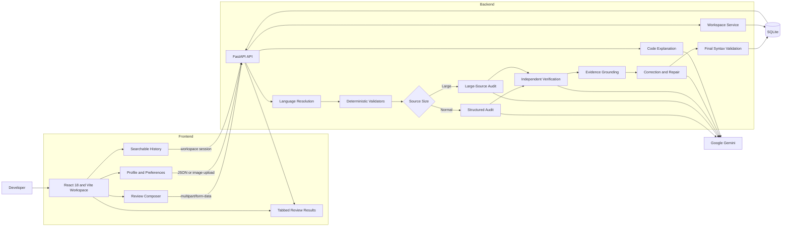
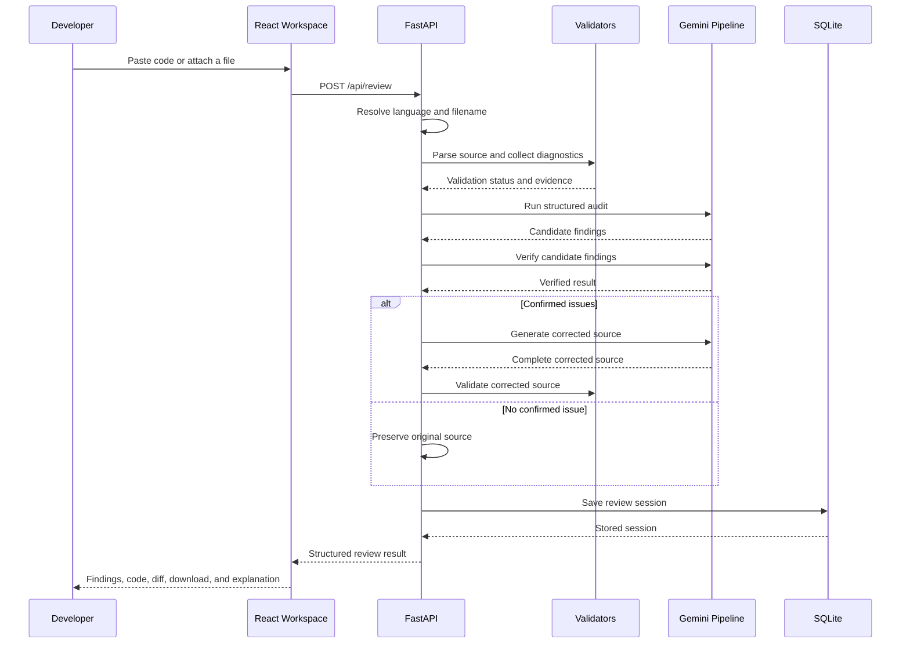
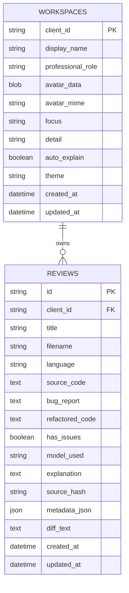

<div align="center">
  <a href="#codefix-ai">
    
  </a>

  # CodeFix AI

  ### Intelligent Code Reviewer & Explainer

  **A full-stack code intelligence workspace for reliable defect detection, validated corrections, clean-code verification, and structured code explanation.**

  <br />

  
  
  
  
  
  

  <br />
  <br />

  **DecodeLabs Generative AI Internship Project · Project 4**  
  **Designed and developed by Muhammad Saad Jadoon**
</div>

<br />

<p align="center">
  <a href="./docs/screenshots/01-dark-workspace.png">
    
  </a>
</p>

---

## Table of Contents

- [Overview](#overview)
- [What I Built Beyond the Internship Brief](#what-i-built-beyond-the-internship-brief)
- [Product Gallery](#product-gallery)
- [Core Features](#core-features)
- [Supported Languages](#supported-languages)
- [Review and Validation Pipeline](#review-and-validation-pipeline)
- [Large-Source Review](#large-source-review)
- [Architecture](#architecture)
- [Persistence, Privacy, and Security](#persistence-privacy-and-security)
- [API Reference](#api-reference)
- [Project Structure](#project-structure)
- [Getting Started](#getting-started)
- [Configuration](#configuration)
- [Usage Guide](#usage-guide)
- [Error Handling](#error-handling)
- [Engineering Decisions](#engineering-decisions)
- [What This Project Demonstrates](#what-this-project-demonstrates)
- [Limitations](#limitations)
- [Roadmap](#roadmap)
- [Author](#author)

---

## Overview

I built **CodeFix AI** as a complete code-review workspace rather than a basic prompt-and-response demo. A developer can paste source code or upload a file, let the application identify the language, run deterministic checks, receive an AI-assisted review, inspect confirmed findings, download corrected code, and request a structured explanation.

The project combines a React workspace, a FastAPI backend, Google Gemini, Tree-sitter, language-specific validators, and SQLite persistence. The interface is designed around a real review workflow, with saved sessions, search, user preferences, profile settings, dark and light themes, file handling, and repeat-review consistency.

### Project Summary

| Area | Implementation |
|---|---|
| **Input** | Paste code or upload UTF-8 source files |
| **Language detection** | Source-content analysis, extension matching, and language-family checks |
| **Validation** | Tree-sitter, Python AST, built-in validators, and optional compiler or parser integrations |
| **AI review** | Google Gemini with audit, verification, grounding, correction, and explanation stages |
| **Results** | Confirmed findings, corrected source, syntax highlighting, copy, download, diff, and explanation |
| **Persistence** | SQLite-backed workspaces, preferences, profile data, and review history |
| **Session isolation** | Anonymous HTTP-only workspace cookie with backend-managed data |
| **Interface** | React 18, Vite, responsive layout, custom selectors, and dark or light appearance |
| **Source limit** | Up to 100,000 characters with a separate path for large submissions |

> [!IMPORTANT]
> Submitted source code is sent to the FastAPI backend and then to the configured Gemini model for analysis. Do not submit private keys, passwords, production credentials, or code that you are not authorized to process through an external AI service.

---

## What I Built Beyond the Internship Brief

The internship task focused on an intelligent code reviewer and explainer. I extended that idea into a more complete engineering product with validation, persistence, traceability, and production-oriented delivery support.

| Addition | Purpose |
|---|---|
| **Evidence quality gate** | Combines language confidence, deterministic validation, correction validation, verification state, and repeat-source stability |
| **Risk summary** | Marks clean reviews as verified and classifies confirmed issues by practical severity |
| **Change intelligence** | Shows additions, removals, and change blocks through an original-versus-corrected diff |
| **Review metadata** | Records source hash, validation engines, diagnostics, issue counts, processing time, line count, character count, and verification state |
| **Report export** | Produces Markdown or JSON reports containing findings, validation evidence, corrected code, diff, and explanation |
| **Repeat-review consistency** | Uses SHA-256 source fingerprints to identify byte-identical submissions and reduce contradictory results |
| **Observability** | Adds request identifiers, processing-time headers, structured logs, and detailed health information |
| **Security baseline** | Uses server-side workspace isolation, strict file handling, privacy-aware logging, and browser security headers |
| **Continuous integration** | Checks Python compilation, deterministic tests, Ruff validation, and the production frontend build |
| **Container support** | Includes Dockerfiles, Nginx serving, persistent backend storage, and Docker Compose startup |

These additions make the review result easier to inspect. A reviewer can see what was detected, which validators ran, what changed, and whether the corrected output passed the final validation step.

---

## Product Gallery

> [!NOTE]
> All screenshots use repository-relative paths. Keep the complete `docs/screenshots/` directory in the repository root so every image renders correctly on GitHub.

### Dark Workspace

The main workspace brings together review history, profile controls, code input, file upload, language selection, and review preferences.

<p align="center">
  <a href="./docs/screenshots/01-dark-workspace.png">
    
  </a>
</p>

<br />

### Light Workspace

The light theme keeps the same layout and functionality while providing a brighter visual system.

<p align="center">
  <a href="./docs/screenshots/03-light-workspace.png">
    
  </a>
</p>

<br />

### Workspace Settings

The settings panel manages the profile, appearance, review focus, analysis depth, and automatic explanation preference.

<p align="center">
  <a href="./docs/screenshots/02-settings-dark.png">
    
  </a>
</p>

<br />

### Review Conversation

Each review is shown as a structured conversation containing the submitted code, filename, language, line count, developer profile, and generated result.

<p align="center">
  <a href="./docs/screenshots/04-review-conversation.png">
    
  </a>
</p>

<br />

### Findings and Corrected Output

The overview presents review status, metadata, confirmed issues, and the corrected implementation in one focused workspace.

<p align="center">
  <a href="./docs/screenshots/05-overview-corrected-output.png">
    
  </a>
</p>

<br />

### Evidence-Grounded Finding

Each confirmed issue includes severity, source location, affected symbol, technical cause, likely impact, and correction guidance.

<p align="center">
  <a href="./docs/screenshots/06-evidence-grounded-finding.png">
    
  </a>
</p>

<br />

### Complete Corrected Source

The corrected-code view returns the full file with syntax highlighting, line numbers, copy support, and download support.

<p align="center">
  <a href="./docs/screenshots/07-corrected-code.png">
    
  </a>
</p>

<br />

### Line-by-Line Explanation

The explanation view documents the code summary, execution flow, meaningful line ranges, language concepts, and the relationship between a defect and its correction.

<p align="center">
  <a href="./docs/screenshots/08-line-by-line-explanation.png">
    
  </a>
</p>

<br />

### Clean-Code Verification in Light Mode

When no confirmed issue is found, CodeFix AI displays a verified result and preserves the submitted source unchanged.

<p align="center">
  <a href="./docs/screenshots/09-clean-code-verification.png">
    
  </a>
</p>

<br />

### Automatic Language Detection

For pasted source, the application can detect the programming language and synchronize the filename extension automatically.

<p align="center">
  <a href="./docs/screenshots/10-language-auto-detection.png">
    
  </a>
</p>

<br />

### Clean-Code Verification in Dark Mode

The verified review state remains consistent in the dark theme, including metadata, history, output controls, and continued code input.

<p align="center">
  <a href="./docs/screenshots/11-dark-clean-review.png">
    
  </a>
</p>

<br />

### Programming-Language Selector

The custom selector provides a scrollable language list, selected-state feedback, keyboard interaction, and theme-aware styling.

<p align="center">
  <a href="./docs/screenshots/12-premium-language-selector.png">
    
  </a>
</p>

<br />

### Profile and Review Preferences

Profile information, appearance, review focus, analysis depth, and explanation preferences are managed from one settings experience.

<p align="center">
  <a href="./docs/screenshots/13-workspace-preferences.png">
    
  </a>
</p>

<br />

### File Upload

Source files can be selected from the device or added through drag and drop.

<p align="center">
  <a href="./docs/screenshots/14-file-upload.png">
    
  </a>
</p>

---

## Core Features

### Source Input

- Paste source code into an auto-growing editor.
- Upload files through browsing or drag and drop.
- Read uploaded source as UTF-8 text.
- Sanitize filenames before persistence.
- Enforce configurable source-size limits.
- Preserve the submitted code inside the review conversation after the composer is cleared.

### Language Detection

- Detect language from source content instead of relying only on the selected option.
- Recognize strong patterns such as JSX, TSX, HTML documents, PHP tags, and shell shebangs.
- Score language-specific syntax across the complete submission.
- Synchronize the filename extension with the detected language.
- Compare uploaded-file extensions with detected content.
- Reject unsupported language selections before review processing.

### Review Intelligence

CodeFix AI supports different review goals and levels of detail:

- balanced engineering review;
- correctness and reliability;
- security and defensive coding;
- performance and efficiency;
- concise, standard, or deep technical analysis.

Confirmed findings can include severity, exact source references, cause, impact, and correction guidance.

### Corrected Output

- Returns the complete corrected source instead of only a partial patch.
- Uses syntax highlighting and line numbers.
- Supports copy and filename-aware download.
- Preserves valid source when no change is required.
- Runs additional repair passes when generated code does not pass deterministic validation.

### Explanation

- Short code summary.
- Numbered execution flow.
- Line-by-line or block-by-block walkthrough.
- Important language concepts, APIs, edge cases, and engineering choices.
- Optional automatic explanation after a completed review.
- Saved explanations inside the selected review session.

### Workspace Experience

- New-review action with keyboard shortcut support.
- Searchable review history.
- Filename-based session titles.
- Active-session restoration.
- User profile with name, professional role, and profile image.
- Dark and light themes.
- Responsive desktop, tablet, and mobile layouts.
- Clear loading, success, clean, and failure states.

---

## Supported Languages

| Category | Languages and File Types |
|---|---|
| **Python** | Python (`.py`) |
| **JavaScript ecosystem** | JavaScript (`.js`), JSX (`.jsx`), TypeScript (`.ts`), TSX (`.tsx`) |
| **JVM** | Java (`.java`), Kotlin (`.kt`) |
| **C family** | C (`.c`), C++ (`.cpp`, `.cc`), headers (`.h`, `.hpp`), C# (`.cs`) |
| **Systems and compiled** | Go (`.go`), Rust (`.rs`), Swift (`.swift`) |
| **Scripting** | Ruby (`.rb`), PHP (`.php`), Shell or Bash (`.sh`) |
| **Web and data** | HTML (`.html`), CSS (`.css`), SQL (`.sql`) |
| **Fallback** | Plain text (`.txt`) |

> Deterministic validation depth depends on the parser and compiler tools installed on the backend host. Tree-sitter and built-in structural checks provide the baseline, while optional local toolchains add deeper validation for their languages.

---

## Review and Validation Pipeline

CodeFix AI does not forward source code to the model and display the first response. The backend uses a staged pipeline that combines deterministic evidence with AI-assisted reasoning.

### Review Lifecycle

1. **Input ingestion**  
   The backend accepts pasted source or an uploaded file, then enforces encoding and size requirements.

2. **Language resolution**  
   The selected language, filename extension, and content-based detection result are compared.

3. **Deterministic validation**  
   The source is checked with Tree-sitter, built-in validators, delimiter analysis, AST parsing, or available compiler and parser tools.

4. **Primary audit**  
   Gemini receives the source and deterministic context, then returns structured candidate findings.

5. **Source grounding**  
   Findings without support in the submitted source are removed or corrected before presentation.

6. **Independent verification**  
   A separate pass reviews the full source and checks the candidate findings.

7. **Disagreement handling**  
   When the audit and verification stages disagree, the backend can run a focused tie-break review.

8. **Deterministic diagnostics merge**  
   Parser or compiler diagnostics remain part of the result even when the model attempts to classify the source as clean.

9. **Targeted correction**  
   The complete corrected source is generated only after confirmed findings are available.

10. **Correction validation**  
    The corrected source is parsed again. Focused repair passes can run when validation still fails.

11. **Result persistence**  
    The original source, review report, corrected source, status, model metadata, diff, and explanation are stored in SQLite.

### Deterministic Validation Matrix

| Language or Family | Validation Used by the Backend |
|---|---|
| **Supported grammars** | Tree-sitter language pack where available |
| **Python** | Python `ast.parse` |
| **JavaScript** | Node.js `--check` when installed |
| **JSX, TypeScript, TSX** | TypeScript compiler parser when installed |
| **C, C++, headers** | `clang`, `clang++`, `gcc`, or `g++` syntax-only checks when installed |
| **Go** | `gofmt -e` when installed |
| **Ruby** | `ruby -c` when installed |
| **PHP** | `php -l` when installed |
| **Shell** | `bash -n` when installed |
| **Swift** | `swiftc -parse` when installed |
| **Java** | `javac` syntax-focused checks when installed |
| **Kotlin** | `kotlinc` syntax checks when installed |
| **Rust** | `rustc` metadata compilation when installed |
| **C#** | `csc` or `mcs` when installed |
| **CSS** | Built-in declaration and rule validation |
| **HTML** | Built-in tag and nesting validation |
| **SQL** | Built-in statement and delimiter validation |

### Prompt and Response Controls

The AI layer uses separate instructions for audit, verification, clean-result challenge, correction, large-source review, patch-based repair, and explanation. Model responses are parsed and validated by the backend before they are returned to the frontend. A malformed response is treated as a failure, not as proof that the submitted code is clean.

---

## Large-Source Review

CodeFix AI accepts submissions up to **100,000 characters**. Long files use a dedicated path to reduce truncated responses and unreliable large JSON payloads.

| Control | Default |
|---|---:|
| Maximum source size | `100000` characters |
| Large-source threshold | `24000` characters |
| Maximum configured Gemini output | `65536` tokens |

### Large-Source Strategy

- Analyze the full source with a compact findings schema.
- Verify candidate findings independently.
- Split source into overlapping chunks when a complete response cannot be validated.
- Convert chunk-level line references back to original source positions.
- Deduplicate repeated findings.
- Request line-based edits instead of repeatedly returning the full file inside structured JSON.
- Apply non-overlapping edits to the original source on the backend.
- Preserve unrelated lines.
- Validate the final corrected source before returning it.

This approach keeps the downloadable output complete while reducing the chance of oversized or malformed model responses.

---

## Architecture



### Review Request Sequence



---

## Persistence, Privacy, and Security

CodeFix AI uses a backend-managed workspace model. Review history and preferences are stored in SQLite rather than browser storage.

### Stored Workspace Data

- anonymous workspace identifier;
- display name and professional role;
- profile image bytes and MIME type;
- review focus and analysis depth;
- automatic explanation preference;
- dark or light theme preference;
- original source code;
- verified review report;
- corrected source code;
- diff and review metadata;
- generated explanation;
- creation and update timestamps.

### Session Isolation

- Each browser receives an anonymous UUID workspace identifier.
- The identifier is stored in an HTTP-only cookie with `SameSite=Lax`.
- Secure-cookie mode can be enabled for HTTPS deployments.
- Review content is not stored in `localStorage`, `sessionStorage`, or IndexedDB.
- Backend queries are scoped to the current workspace identifier.

### File and Profile Controls

- Submitted filenames are sanitized.
- Uploaded source must be valid UTF-8 text.
- Source length is checked before analysis.
- Profile images are limited to PNG, JPG, or WebP.
- Profile images are limited to 5 MB.
- API keys and environment secrets remain in backend environment files excluded by `.gitignore`.
- The frontend does not require a Gemini API key.

---

## API Reference

| Method | Endpoint | Purpose |
|---|---|---|
| `GET` | `/api/health` | Return service readiness and capability information |
| `GET` | `/api/workspace` | Load workspace settings and recent review sessions |
| `PUT` | `/api/settings` | Save profile, review, explanation, and appearance preferences |
| `POST` | `/api/profile/avatar` | Upload a profile image |
| `GET` | `/api/profile/avatar` | Read the current workspace profile image |
| `DELETE` | `/api/reviews` | Clear review history for the current workspace |
| `POST` | `/api/review` | Review pasted code or an uploaded file |
| `GET` | `/api/reviews/{review_id}/report?format=markdown` | Export a review report as Markdown |
| `GET` | `/api/reviews/{review_id}/report?format=json` | Export a review report as JSON |
| `POST` | `/api/explain` | Generate and optionally save a structured code explanation |

### Example Review Request

```bash
curl -X POST "http://localhost:8000/api/review" \
  -F "code=def divide(a, b): return a / b" \
  -F "language=py" \
  -F "filename=calculator.py" \
  -F "focus=balanced" \
  -F "detail=standard" \
  -c codefix-cookie.txt \
  -b codefix-cookie.txt
```

### Example Explanation Request

```bash
curl -X POST "http://localhost:8000/api/explain" \
  -H "Content-Type: application/json" \
  -d '{
    "code": "def greet(name):\n    return f\"Hello, {name}\"",
    "language": "py",
    "filename": "greeting.py",
    "detail": "standard"
  }' \
  -c codefix-cookie.txt \
  -b codefix-cookie.txt
```

---

## Database Model



The workspace endpoint returns a configurable history window, with the most recently updated review listed first.

---

## Project Structure

```text
CodeFix-AI/
├── backend/
│   ├── app/
│   │   ├── config.py              # Environment-backed configuration
│   │   ├── gemini_service.py      # Audit, verification, repair, and explanation
│   │   ├── prompts.py             # Model instructions and prompt builders
│   │   ├── schemas.py             # Pydantic request and response models
│   │   └── __init__.py
│   ├── tests/
│   │   └── test_review_quality.py # Language, diff, metadata, and report tests
│   ├── main.py                    # FastAPI routes, SQLite, detection, and validation
│   ├── Dockerfile
│   ├── requirements.txt
│   ├── requirements-dev.txt
│   └── .env.example
├── frontend/
│   ├── public/
│   │   ├── codefix-logo.png
│   │   ├── codefix-logo-light.png
│   │   └── codefix-favicon.png
│   ├── src/
│   │   ├── components/
│   │   │   ├── AnalysisLoading.jsx
│   │   │   ├── BugReport.jsx
│   │   │   ├── CodeBlock.jsx
│   │   │   ├── DiffViewer.jsx
│   │   │   ├── PremiumSelect.jsx
│   │   │   ├── QualityGatePanel.jsx
│   │   │   ├── ReviewComposer.jsx
│   │   │   ├── ReviewWorkspace.jsx
│   │   │   ├── SettingsModal.jsx
│   │   │   └── Sidebar.jsx
│   │   ├── utils/
│   │   │   ├── api.js             # API client and user-facing error mapping
│   │   │   └── language.js        # Language metadata and frontend detection
│   │   ├── App.jsx
│   │   ├── index.css
│   │   └── main.jsx
│   ├── Dockerfile
│   ├── nginx.conf
│   ├── package.json
│   ├── vite.config.js
│   └── .env.example
├── .github/
│   └── workflows/
│       └── ci.yml                 # Backend and frontend checks
├── docs/
│   ├── screenshots/
│   ├── ARCHITECTURE.md
│   └── REVIEW_GUARANTEES.md
├── docker-compose.yml
├── Makefile
├── CHANGELOG.md
├── CONTRIBUTING.md
├── IMPLEMENTATION_NOTES.md
├── SECURITY.md
├── .gitignore
└── README.md
```

Generated and private directories such as `frontend/node_modules/`, `frontend/dist/`, `backend/.venv/`, `backend/.env`, and `backend/storage/` should not be committed.

---

## Getting Started

### Prerequisites

- Python 3.10 or newer
- Node.js 18 or newer
- npm
- Git
- A Google Gemini API key
- Docker Desktop, only when using Docker Compose

Optional language toolchains improve deterministic validation for their corresponding languages, but they are not required to start the application.

### Option 1: Run with Docker Compose

Clone the repository and enter the project directory:

```bash
git clone <your-repository-url>
cd CodeFix-AI
```

Provide the Gemini API key.

#### macOS or Linux

```bash
export GEMINI_API_KEY=your_real_gemini_api_key
docker compose up --build
```

#### Windows PowerShell

```powershell
$env:GEMINI_API_KEY="your_real_gemini_api_key"
docker compose up --build
```

Open the services:

- Frontend: `http://localhost:8080`
- Backend API: `http://localhost:8000`
- API documentation: `http://localhost:8000/docs`

The SQLite database is stored in the `codefix_storage` Docker volume so review history can survive container restarts.

### Option 2: Local Development

#### 1. Clone the Repository

```bash
git clone <your-repository-url>
cd CodeFix-AI
```

#### 2. Configure the Backend

```bash
cd backend
python -m venv .venv
```

##### Windows PowerShell

```powershell
.\.venv\Scripts\Activate.ps1
python -m pip install --upgrade pip
pip install -r requirements.txt
Copy-Item .env.example .env
python -m uvicorn main:app --reload --host 127.0.0.1 --port 8000
```

##### Windows Command Prompt

```bat
.venv\Scripts\activate.bat
python -m pip install --upgrade pip
pip install -r requirements.txt
copy .env.example .env
python -m uvicorn main:app --reload --host 127.0.0.1 --port 8000
```

##### macOS or Linux

```bash
source .venv/bin/activate
python -m pip install --upgrade pip
pip install -r requirements.txt
cp .env.example .env
python -m uvicorn main:app --reload --host 127.0.0.1 --port 8000
```

Before starting the backend, open `backend/.env` and replace the placeholder Gemini key.

#### 3. Configure the Frontend

Open a second terminal:

```bash
cd frontend
npm install
```

##### Windows PowerShell

```powershell
Copy-Item .env.example .env
npm run dev
```

##### Windows Command Prompt

```bat
copy .env.example .env
npm run dev
```

##### macOS or Linux

```bash
cp .env.example .env
npm run dev
```

Open the application at:

```text
http://localhost:5173
```

### Production Frontend Build

```bash
cd frontend
npm run build
npm run preview
```

### Production-Style Backend Start

```bash
cd backend
python -m uvicorn main:app --host 0.0.0.0 --port 8000
```

---

## Configuration

### Backend: `backend/.env`

| Variable | Required | Default or Example | Purpose |
|---|---|---|---|
| `GEMINI_API_KEY` | Yes | `your_gemini_api_key_here` | Authenticates Gemini requests |
| `GEMINI_MODEL` | Recommended | A model enabled for your account | Selects the Gemini model used by review and explanation routes |
| `MAX_CODE_CHARS` | No | `100000` | Maximum accepted source length |
| `LARGE_SOURCE_THRESHOLD` | No | `24000` | Routes long source to the large-source pipeline |
| `GEMINI_MAX_OUTPUT_TOKENS` | No | `65536` | Maximum configured model output capacity |
| `FRONTEND_ORIGIN` | No | `http://localhost:5173` | Allowed frontend origin for CORS |
| `COOKIE_SECURE` | No | `false` | Set to `true` when the application is served over HTTPS |

> Use a Gemini model that is available in your Google AI Studio account. Model availability can vary by account and region.

### Frontend: `frontend/.env`

| Variable | Required | Default | Purpose |
|---|---|---|---|
| `VITE_API_BASE_URL` | No | `http://localhost:8000` | Base URL for FastAPI requests and profile assets |

---

## Usage Guide

### Paste-Code Workflow

1. Select **Paste code**.
2. Enter or paste the source.
3. Review the detected language and filename extension.
4. Change the language manually when required.
5. Choose review preferences from **Settings**.
6. Click **Review code**.
7. Inspect the result through **Overview**, **Findings**, **Corrected code**, and **Line by line**.
8. Copy or download the corrected source.

### File-Upload Workflow

1. Select **Attach file**.
2. Drop a supported UTF-8 source file into the upload area or browse for it.
3. Review the detected language and filename.
4. Start the review.
5. Reopen the saved session later from review history.

### Clean-Code Workflow

When deterministic checks pass and no confirmed defect is found:

- the review is marked **Verified**;
- the original source is preserved;
- the session is saved in history;
- an identical previously verified source can use the repeat-review consistency path.

### Explanation Workflow

Open **Line by line** and select **Explain line by line**, or enable automatic explanation in Settings.

A generated walkthrough can include:

1. code summary;
2. execution flow;
3. line-by-line or block-by-block explanation;
4. important concepts and APIs.

---

## Error Handling

The frontend converts backend and AI-service failures into clear messages instead of exposing raw stack traces.

| Status | Typical Meaning |
|---:|---|
| `400` | The review request could not be processed |
| `401` | The workspace session is no longer valid |
| `403` | The current workspace is not allowed to perform the action |
| `404` | The requested workspace resource does not exist |
| `413` | The source file or profile image exceeds the supported limit |
| `422` | Source, file type, language, settings, or payload validation failed |
| `429` | The analysis service reached a quota or capacity limit |
| `500` | An unexpected backend error occurred |
| `502` | The AI response or explanation could not be verified |
| `503` | The analysis engine is temporarily unavailable |

Quota, timeout, API-key, network, validation, and large-source failures are translated into practical retry guidance.

---

## Engineering Decisions

### Why are findings and corrected source requested separately?

Code can contain quotes, braces, markup, JSX, CSS, and very long text. Mixing findings and a complete source file inside one large structured response increases the chance of malformed output. CodeFix AI first verifies the findings, then requests the corrected source.

### Why run deterministic validation before AI review?

A language model can miss syntax errors or report issues that are not present. Parser and compiler diagnostics provide concrete evidence and give the review pipeline a reliable starting point.

### Why validate the corrected code again?

A correct diagnosis does not guarantee a correct repair. The backend parses the proposed correction and can request a focused repair when deterministic validation still fails.

### Why preserve clean code unchanged?

A reviewer should not create unnecessary changes. When no confirmed issue exists, CodeFix AI returns the submitted source instead of rewriting it for style alone.

### Why store sessions on the backend?

Backend persistence keeps review history, profile data, and preferences available without storing source code in browser local storage. It also provides a clearer path to authenticated accounts and managed databases later.

---

## What This Project Demonstrates

CodeFix AI brings together several areas of software engineering and applied AI:

- structured Gemini integration for audit, verification, correction, and explanation;
- prompt design for normal and large-source workflows;
- React and Vite frontend development;
- FastAPI backend development;
- programming-language detection and extension synchronization;
- Tree-sitter, AST, parser, and compiler integration;
- evidence grounding and repeat-review consistency;
- SQLite workspace and review persistence;
- HTTP-only session isolation and input controls;
- responsive dark and light user interfaces;
- Docker, Nginx, Docker Compose, and CI support;
- large-input review through chunking and targeted line edits.

### Recommended Reviewer Walkthrough

1. Open the application in dark mode.
2. Paste a short valid Python program and show the verified result.
3. Submit the same source again to demonstrate repeat-review consistency.
4. Paste malformed CSS, JavaScript, or HTML and show deterministic diagnostics.
5. Open the corrected-code view, copy the output, and download the fixed file.
6. Generate the line-by-line explanation.
7. Upload a source file and show language detection.
8. Switch to the light theme.
9. Search and reopen a saved review.
10. Refresh the application and show that the workspace state remains available.

---

## Limitations

- AI-assisted review supports engineering judgment but does not replace testing or human review.
- Important corrections should be tested before deployment.
- Compiler-level validation is strongest when the corresponding language toolchain is installed on the backend machine.
- SQLite is suitable for local and internship-scale deployment. A managed relational database is more appropriate for high-concurrency production use.
- Anonymous workspace isolation is browser-based and is not a replacement for a complete authenticated multi-user system.
- The application does not execute submitted source code. Deterministic checks focus on syntax and structure.
- Model quality, quota, and availability depend on the Gemini model configured for the deployment.

---

## Roadmap

- Authenticated accounts and secure cross-device synchronization.
- PostgreSQL support for higher-concurrency deployments.
- Repository-level and multi-file review with dependency context.
- GitHub pull-request integration.
- Inline patch application.
- Test generation and regression validation.
- Integrations with ESLint, Ruff, Bandit, Semgrep, and language-specific linters.
- Streaming progress through Server-Sent Events or WebSockets.
- Team workspaces and shared review sessions.
- Review analytics and code-quality trends.

---

## Author

<div align="center">
  

  ### Muhammad Saad Jadoon

  **Developer of CodeFix AI, Intelligent Code Reviewer & Explainer**

  I built CodeFix AI as an advanced DecodeLabs Generative AI internship project, with a focus on reliable AI-assisted review, practical validation, full-stack engineering, and a polished developer experience.
</div>

---

<div align="center">
  <strong>CodeFix AI</strong><br />
  Review, understand, and improve code with confidence.
</div>
