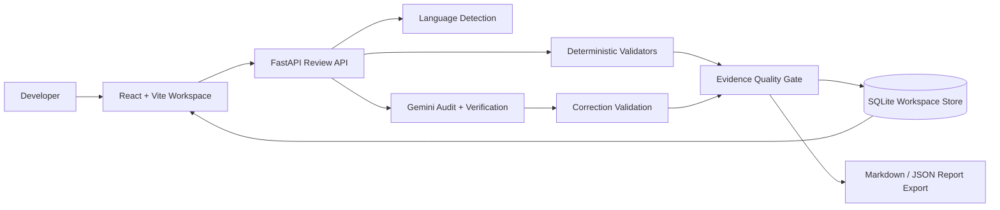

# CodeFix AI Architecture

## Runtime Layers

## Trust Hierarchy

1. Parser, compiler, AST, and structural diagnostics.
2. Source-grounded model findings that survive verification.
3. Correction validation against the same language toolchain.
4. Repeat-source fingerprints for stable clean-code results.
5. Explicit uncertainty when a trustworthy conclusion cannot be produced.

## Review Metadata

Each new review stores:

- SHA-256 source fingerprint;
- language detection score, confidence, and evidence;
- source validation status, engines, and diagnostics;
- correction validation status, engines, and diagnostics;
- issue counts and risk level;
- quality confidence score;
- processing time and source size;
- unified diff and change statistics;
- pipeline verification status.

## Privacy Boundary

The frontend keeps transient UI state only. Source code, corrected code, explanations, settings, history, and profile images persist in the backend database for the current isolated workspace.
