<p align="center">
  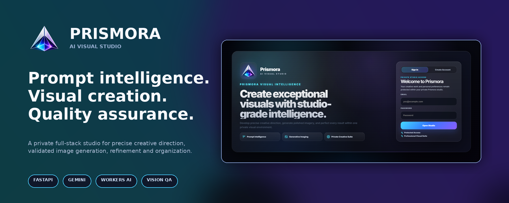
</p>

<p align="center">
  <a href="#quick-start"></a>
  <a href="#product-tour"></a>
  <a href="#system-architecture"></a>
</p>

<p align="center">
  
  
  
  
  
  
  <a href="./LICENSE"></a>
</p>

<h1 align="center">Prismora</h1>

<p align="center">
  <strong>A private, product-grade AI visual studio for prompt intelligence, image generation, precision refinement, safety validation, automated visual quality assurance, and creative asset organization.</strong>
</p>

<p align="center">
  <a href="#overview">Overview</a> ·
  <a href="#product-tour">Product Tour</a> ·
  <a href="#creation-pipeline">Pipeline</a> ·
  <a href="#system-architecture">Architecture</a> ·
  <a href="#api-reference">API</a> ·
  <a href="#quick-start">Installation</a>
</p>

---

## Overview

Prismora began as an internship image-generation project and was expanded into a complete visual-production environment rather than a single prompt box connected to an API.

A user can create a private account, develop a rough concept in **Prompt Studio**, transform it into a structured production prompt, select a visual direction and canvas, generate one or more images, refine an existing result while preserving its identity, review quality and safety metadata, organize creations into a visual library, curate favorites, revisit complete creation threads, and download validated assets.

The system combines a responsive browser application with a FastAPI backend, Gemini-based prompt and vision intelligence, Cloudflare Workers AI image generation, local persistence, disk-first provider processing, user-scoped asset delivery, and automated tests.

> **Prismora is designed as a workflow:** idea → structured direction → safety gate → generation → binary validation → visual QA → private library → refinement.

### Project at a glance

<table>
  <tr>
    <td align="center"><strong>8</strong><br />Visual modes</td>
    <td align="center"><strong>6</strong><br />Creative finishes</td>
    <td align="center"><strong>8</strong><br />Canvas formats</td>
    <td align="center"><strong>1–4</strong><br />Variations per request</td>
  </tr>
  <tr>
    <td align="center"><strong>2</strong><br />Interface themes</td>
    <td align="center"><strong>22</strong><br />Application/API routes</td>
    <td align="center"><strong>7</strong><br />Core data tables</td>
    <td align="center"><strong>8/8</strong><br />Automated tests passing</td>
  </tr>
</table>

---

## Why Prismora is more than an API wrapper

| Engineering area | Prismora implementation |
|---|---|
| **Prompt intelligence** | Understands concepts written in English, Urdu, Roman Urdu, or Hindi and compiles them into focused natural-English production prompts. |
| **Intent preservation** | Protects subject identity, subject count, relationships, action, clothing, colors, objects, environment, and unspecified details during refinement. |
| **Deterministic fallback** | Builds a structured prompt locally when Gemini prompt enhancement is unavailable. |
| **Generation reliability** | Streams provider responses to temporary files, handles both direct-image and JSON/base64 responses, and avoids joining large payloads in memory. |
| **Asset validation** | Fully decodes generated files, applies EXIF orientation, normalizes dimensions, converts to PNG, calculates SHA-256, and records file metadata. |
| **Automated visual QA** | Combines image heuristics with Gemini vision review for aesthetics, semantic alignment, and output safety. |
| **Automatic recovery** | Can regenerate low-quality output according to a configurable retry policy before returning a failure. |
| **Private organization** | Stores user-scoped threads, messages, generations, images, settings, sessions, favorites, profile data, and history. |
| **Product experience** | Includes responsive dark/light themes, prompt auto-growth, scroll preservation, inline enhancement, refinement dialogs, feedback toasts, downloads, and synchronized collections. |
| **Honest quality states** | Distinguishes a verified pass from a review-unavailable fallback instead of displaying unsupported quality claims. |

---

## Product tour

All previews below preserve the complete frame. Click any image to open the original full-resolution PNG.

### 1. Premium private-studio access

Prismora presents authentication as the entrance to a private creative workspace, with dedicated sign-in and account-creation states.

<a href="./docs/screenshots/01-authentication-overview.png">
  
</a>

<table>
  <tr>
    <td width="50%" align="center" valign="top">
      <a href="./docs/screenshots/02-sign-in-panel.png">
        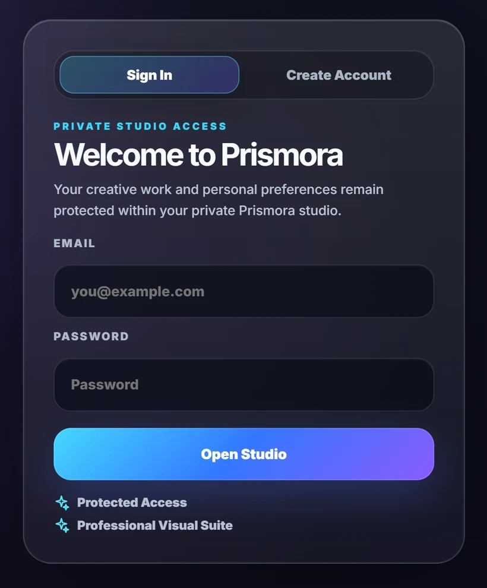
      </a>
      <br /><strong>Returning-user sign in</strong>
    </td>
    <td width="50%" align="center" valign="top">
      <a href="./docs/screenshots/03-create-account-panel.png">
        
      </a>
      <br /><strong>Private studio registration</strong>
    </td>
  </tr>
</table>

### 2. Prompt Studio

Prompt Studio separates ideation from generation. Users can define an initial concept, list exclusions, refine the direction, review the production prompt, and move the final prompt into the creation workspace.

<a href="./docs/screenshots/04-prompt-studio.png">
  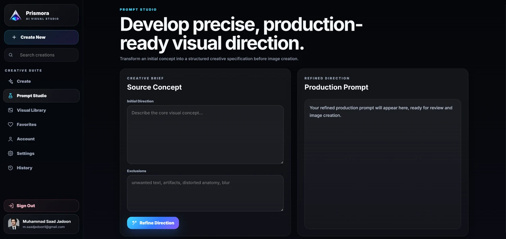
</a>

### 3. Visual Library and curated favorites

The library displays generated work as a visual collection, while Favorites provides a focused curation layer for selected assets.

<table>
  <tr>
    <td width="50%" align="center" valign="top">
      <a href="./docs/screenshots/05-visual-library.png">
        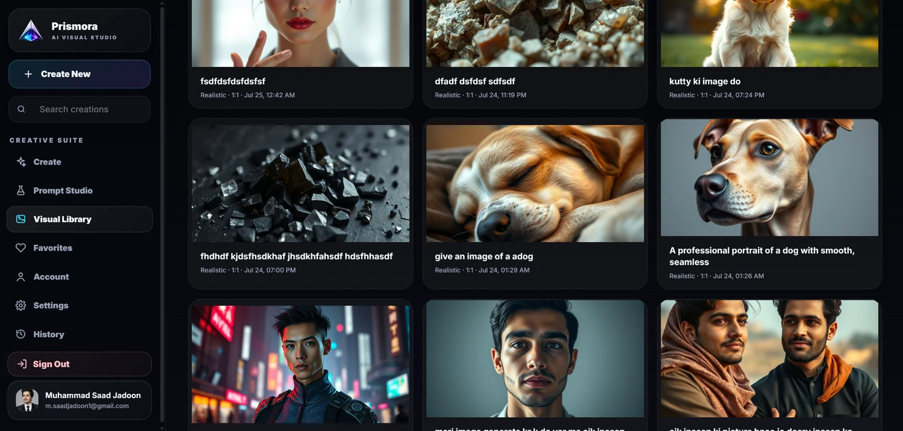
      </a>
      <br /><strong>Visual Library</strong>
    </td>
    <td width="50%" align="center" valign="top">
      <a href="./docs/screenshots/06-favorites.png">
        
      </a>
      <br /><strong>Curated Selections</strong>
    </td>
  </tr>
</table>

### 4. Personal Studio and persistent preferences

Account identity, avatar management, email updates, password changes, theme selection, prompt-intelligence behavior, and creative defaults are managed inside the same product language.

<table>
  <tr>
    <td width="50%" align="center" valign="top">
      <a href="./docs/screenshots/07-personal-studio-account.png">
        
      </a>
      <br /><strong>Personal Studio</strong>
    </td>
    <td width="50%" align="center" valign="top">
      <a href="./docs/screenshots/08-studio-preferences.png">
        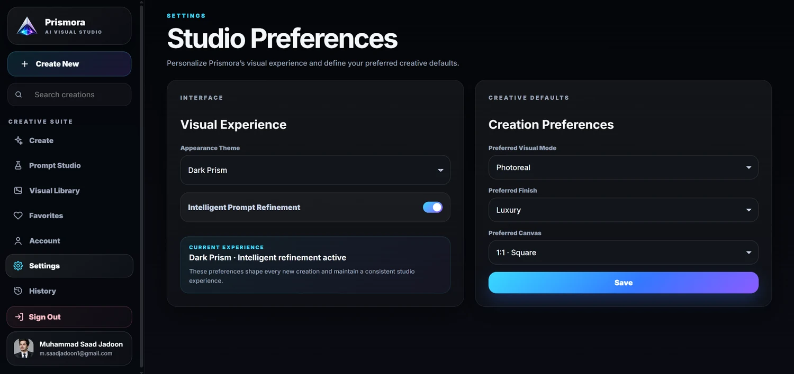
      </a>
      <br /><strong>Studio Preferences</strong>
    </td>
  </tr>
</table>

### 5. Full creation workspace

The main workspace brings together the generation timeline, output cards, prompt composer, prompt enhancement, visual controls, refinement actions, download actions, quality feedback, and responsive theme behavior.

<a href="./docs/screenshots/09-create-studio-light-theme.png">
  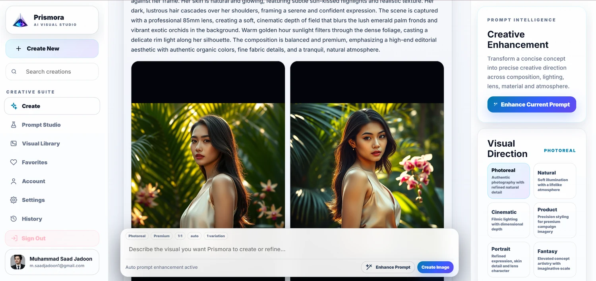
</a>

### 6. Creation History

Every result remains connected to its prompt, mode, canvas, timestamp, status, preview, view action, and download action.

<a href="./docs/screenshots/10-creation-history.png">
  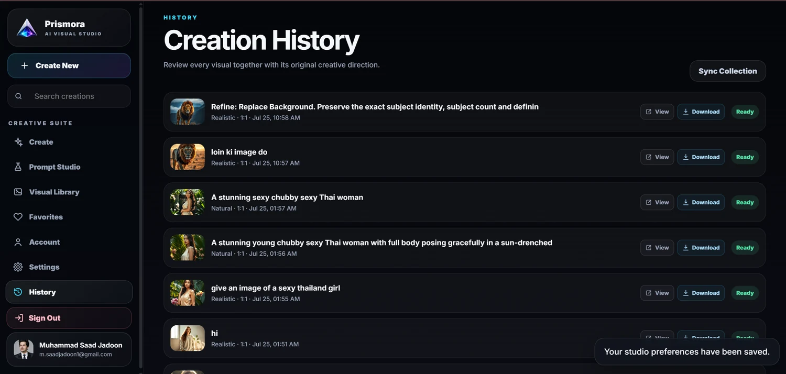
</a>

### 7. Precision creative controls

The inspector provides substantial control without crowding the central canvas. The latest interface exposes eight visual directions, six finishes, eight canvas ratios, automatic or fixed seed behavior, variation count, prompt refinement, and exclusions.

<table>
  <tr>
    <td width="50%" align="center" valign="top">
      <a href="./docs/screenshots/11-visual-direction-controls.png">
        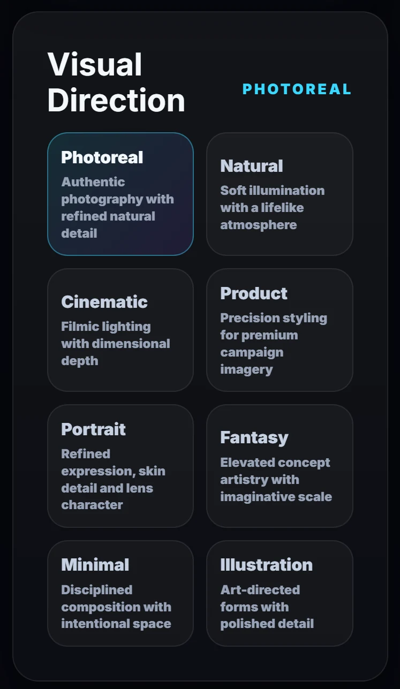
      </a>
      <br /><strong>Visual Direction</strong>
    </td>
    <td width="50%" align="center" valign="top">
      <a href="./docs/screenshots/12-creative-finish-controls.png">
        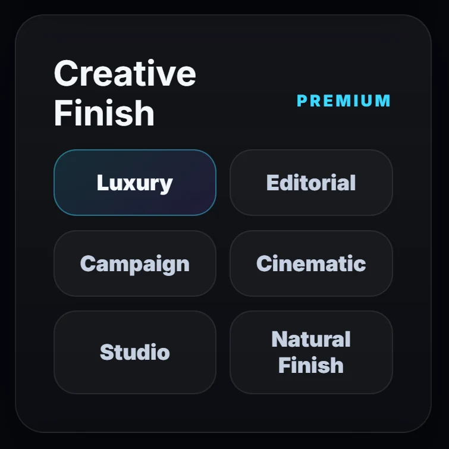
      </a>
      <br /><strong>Creative Finish</strong>
    </td>
  </tr>
  <tr>
    <td width="50%" align="center" valign="top">
      <a href="./docs/screenshots/13-canvas-format-controls.png">
        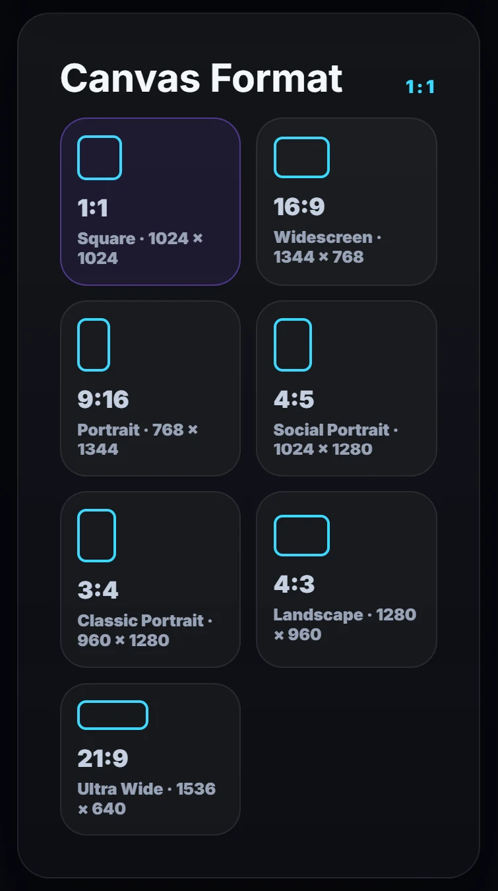
      </a>
      <br /><strong>Canvas Format</strong>
    </td>
    <td width="50%" align="center" valign="top">
      <a href="./docs/screenshots/14-generation-controls.png">
        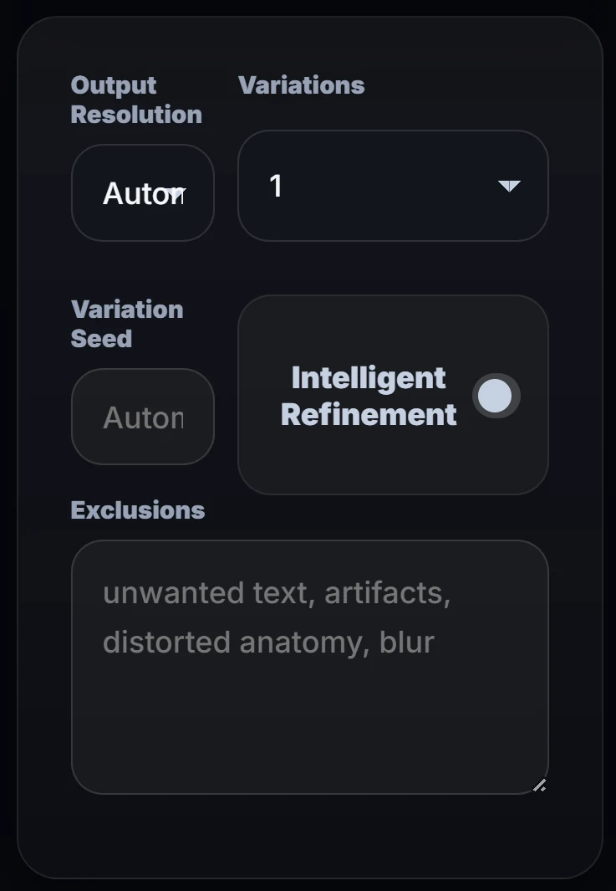
      </a>
      <br /><strong>Generation Configuration</strong>
    </td>
  </tr>
</table>

### 8. Inline prompt enhancement

The composer supports a concise manual direction and a reviewable enhanced prompt. Prompt text grows within a controlled height, becomes internally scrollable when long, and remains editable before generation.

<a href="./docs/screenshots/15-prompt-composer.png">
  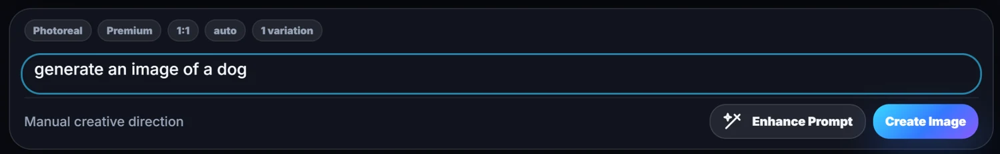
</a>

<a href="./docs/screenshots/16-enhanced-prompt-review.png">
  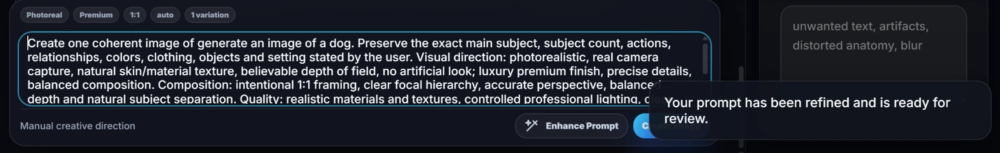
</a>

### 9. Validated generation result

A completed result presents the production prompt, generated visual, dimensions, file size, aesthetic score, semantic prompt-match score, quality status, safety status, and direct actions.

<p align="center">
  <a href="./docs/screenshots/17-quality-verified-generation.png">
    
  </a>
</p>

---

## Core capabilities

### Prompt intelligence

- Enhances short or incomplete visual ideas into production-ready prompts.
- Understands English, Urdu, Roman Urdu, and Hindi input through the configured Gemini model.
- Preserves critical user intent rather than replacing the concept with an unrelated interpretation.
- Adds useful composition, lens, lighting, material, environment, depth, and quality direction.
- Supports separate exclusions/negative preferences.
- Uses a deterministic local compiler when external prompt intelligence is unavailable.
- Cleans headings, markdown fences, repeated whitespace, and overly long provider output before use.

### Generation and refinement

- Generates through Cloudflare Workers AI using the configurable FLUX.1 Schnell endpoint.
- Supports 1–4 variations in a single request.
- Supports automatic or explicit seed values.
- Enforces ratio-compatible output resolution through strict Pydantic validation.
- Creates refinement requests from an earlier generation.
- Locks the previous prompt as context and applies only the requested changes.
- Keeps unspecified subject and scene details consistent in the refinement prompt.

### Creative organization

- Private creation threads with user and assistant messages.
- Visual Library with full result cards.
- Curated Favorites collection.
- Creation History with reopen and download actions.
- Persistent user preferences for theme, default mode, default finish, default ratio, and auto-enhancement.
- Profile identity, avatar upload, email update, and password update.
- Deletion that removes both database records and stored generated files.

### Product experience

- Dark Prism and Light Prism themes.
- Responsive sidebar and workspace layout.
- Hash-based client routing with browser navigation support.
- Preserved workspace scroll position.
- Automatic movement to a pending/new generation without jumping back to the top.
- Auto-growing prompt input with a controlled internal scrollbar.
- Friendly safety, quality, provider, timeout, and authentication messages.
- Toast confirmations for refinement, settings, and collection actions.

---

## Creative control system

### Visual directions

| Mode | Production intent |
|---|---|
| `realistic` | Real-camera appearance, natural textures, believable depth, no artificial look. |
| `natural` | Organic daylight, authentic surroundings, subtle contrast, realistic imperfections. |
| `cinematic` | Filmic light, dimensional composition, controlled shadows, atmospheric depth. |
| `product` | Premium campaign imagery, clean commercial set, refined edges and reflections. |
| `portrait` | Expressive face, realistic eyes, polished separation, professional portrait light. |
| `fantasy` | Elevated concept artistry, intricate detail, luminous atmosphere, imaginative scale. |
| `minimal` | Disciplined composition, elegant negative space, restrained presentation. |
| `illustration` | Art-directed forms, stylized storytelling, polished illustrative detail. |

### Creative finishes

| Finish | Direction |
|---|---|
| `premium` | Luxury finish, precise detail, and balanced composition. |
| `editorial` | Sophisticated magazine-style visual direction. |
| `commercial` | Polished, campaign-ready brand presentation. |
| `film` | Cinematic grade, lens character, and atmospheric depth. |
| `studio` | Controlled professional light and a polished studio output. |
| `raw` | Faithful rendering with minimal added styling. |

### Canvas formats

| Ratio | Output canvas | Typical use |
|---|---:|---|
| `1:1` | `1024 × 1024` | Square posts, avatars, balanced compositions. |
| `16:9` | `1344 × 768` | Widescreen scenes, banners, presentations. |
| `9:16` | `768 × 1344` | Reels, Shorts, TikTok, vertical storytelling. |
| `4:5` | `1024 × 1280` | Social portrait posts and feed campaigns. |
| `5:4` | `1280 × 1024` | Landscape editorial and product work. |
| `3:4` | `960 × 1280` | Classic portrait photography. |
| `4:3` | `1280 × 960` | Traditional landscape compositions. |
| `21:9` | `1536 × 640` | Ultra-wide cinematic frames. |

---

## Creation pipeline

```mermaid
flowchart LR
    A[User concept] --> B[Input safety gate]
    B -->|Allowed| C{Auto enhance?}
    B -->|Rejected| X[Clear safety response]
    C -->|Yes + Gemini available| D[Gemini Prompt Architect]
    C -->|No or unavailable| E[Deterministic prompt compiler]
    D --> F[Final production prompt]
    E --> F
    F --> G[Cloudflare Workers AI / FLUX.1 Schnell]
    G --> H[Stream response to temporary file]
    H --> I[Extract direct image, URL, or base64 asset]
    I --> J[Decode + EXIF transpose + normalize canvas]
    J --> K[Hash + metadata + integrity checks]
    K --> L[Pixel aesthetic heuristics]
    L --> M{Gemini vision QA available?}
    M -->|Yes| N[Safety + aesthetic + semantic review]
    M -->|No| O[Review-unavailable fallback state]
    N --> P{Pass thresholds?}
    P -->|Yes| Q[Commit validated asset]
    P -->|No, retries remain| G
    P -->|No| R[Quality-assurance response]
    O --> Q
    Q --> S[Private thread, library, history and download]
```

### Pipeline guarantees

1. **Prompt safety is evaluated before provider generation.**
2. **Provider payloads are written to disk in chunks** instead of being concatenated into one large in-memory response.
3. **Direct images and JSON responses are both supported.** JSON can contain a URL or a base64 image payload.
4. **The returned image must decode completely.** Truncated or unidentified image streams are rejected.
5. **The final asset always matches the selected canvas.** Mismatched provider dimensions are normalized with high-quality resampling and recorded as adjusted.
6. **Every stored image receives a SHA-256 digest and file-size metadata.**
7. **Vision QA can score aesthetics and semantic alignment.** When it is unavailable, Prismora records that limitation instead of inventing scores.
8. **Quality enforcement is configurable.** Failed verified reviews can trigger automatic regeneration before a final error is returned.

---

## Quality assurance and safety

### Input safety gate

`moderate_input_text()` checks the prompt before any image-generation request is sent. It rejects patterns associated with:

- explicit sexual content;
- sexual content involving minors;
- graphic gore;
- self-harm instructions or imagery;
- targeted hateful abuse.

The API returns a structured code such as `INPUT_SAFETY_REJECTED`, while the interface translates it into a respectful user-facing message.

### Binary and dimensional validation

`validate_and_normalize_image()` performs:

- format identification;
- full pixel decode;
- EXIF orientation correction;
- source-dimension capture;
- exact requested-canvas normalization;
- RGB conversion;
- optimized PNG output;
- SHA-256 calculation;
- final file-size calculation;
- dimension-adjustment metadata.

### Visual review

When Gemini vision review is configured, Prismora evaluates:

| Signal | Range | Default pass threshold |
|---|---:|---:|
| Aesthetic score | `0.0–10.0` | `7.0` |
| Semantic prompt alignment | `0.0–1.0` | `0.58` |
| Output safety | Boolean | Must be safe |

Aesthetic review considers composition, lighting, coherence, anatomy/material quality, detail, and polish. Semantic review considers subject, count, action, relationships, colors, objects, and setting.

The threshold values, review enforcement, output moderation, file limits, and retry count are configurable through environment variables.

---

## System architecture

Prismora uses a deliberately compact single-service architecture. FastAPI serves both the static frontend and the JSON API, which keeps local setup simple and eliminates the need for a separate development frontend server.

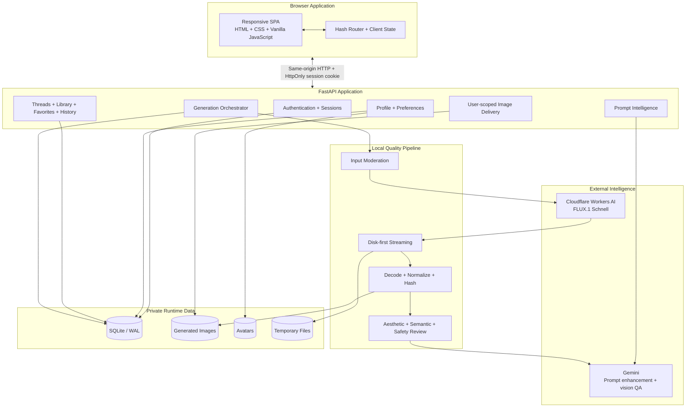

### Architectural characteristics

- **Same-origin application:** frontend and API are served from one FastAPI process.
- **No frontend build step:** the interface is delivered as static HTML, CSS, and JavaScript.
- **SQLite WAL mode:** appropriate for local development and demonstration workloads.
- **Disk-first provider handling:** better memory behavior for large JSON/base64 responses.
- **Provider abstraction points:** prompt enhancement, image generation, and vision QA are separated into clear functions.
- **Runtime storage isolation:** generated data is excluded from source control.
- **Strict schema validation:** supported modes, finishes, ratios, resolutions, variation counts, and seed limits are enforced at the API boundary.

---

## Authentication and data protection

### Implemented controls

- Passwords are hashed using **PBKDF2-HMAC-SHA256 with 250,000 iterations** and a random 16-byte salt.
- Password verification uses `hmac.compare_digest()` to avoid simple timing comparisons.
- Session tokens are generated with `secrets.token_urlsafe(48)`.
- Only a SHA-256 hash of each session token is stored in SQLite.
- Session cookies are `HttpOnly`, `SameSite=Lax`, scoped to `/`, and expire after 14 days.
- Logout removes the stored session and clears the browser cookie.
- Recovery requests use a generic response to avoid revealing whether an email exists.
- Generation, thread, favorite, deletion, and image queries are scoped to the authenticated user.
- Generated image delivery checks both the filename and the owning user before returning a file.
- Avatar uploads are limited to 5 MB, decoded as images, resized to a maximum of 512 × 512, and saved as JPEG.
- `.env`, databases, generated images, avatars, logs, and temporary data are excluded from Git.

> **Production note:** the current local-development cookie uses `secure=False`. A deployment behind HTTPS should set `Secure`, add CSRF protection for state-changing routes, configure rate limits, and move secrets to the platform secret manager.

---

## Data model

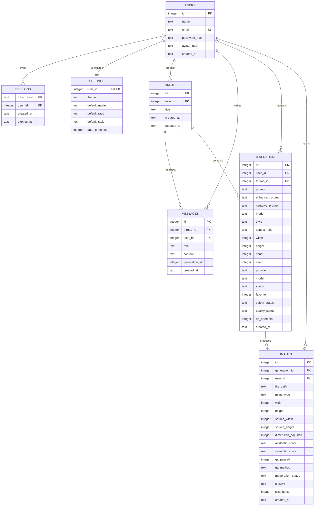

---

## Technology stack

| Layer | Technology | Responsibility |
|---|---|---|
| Application server | FastAPI | Static interface, REST endpoints, validation, authentication, orchestration. |
| Runtime | Python 3.13+ | Backend logic, provider integration, storage, safety, and QA. |
| Validation | Pydantic 2 | Strict request models and compatible canvas validation. |
| Prompt intelligence | Google Gemini | Prompt enhancement and multilingual concept interpretation. |
| Vision intelligence | Google Gemini | Output safety, aesthetic scoring, and semantic prompt alignment. |
| Image generation | Cloudflare Workers AI | FLUX.1 Schnell image generation. |
| HTTP client | Requests | Provider calls and streamed response handling. |
| Image processing | Pillow | Decode, EXIF transpose, resize, normalize, convert, inspect, and score. |
| Persistence | SQLite | Users, sessions, settings, threads, messages, generations, and image metadata. |
| Frontend | HTML, CSS, Vanilla JavaScript | Responsive SPA, client state, routing, interaction, and themes. |
| Testing | Pytest + FastAPI TestClient | API, schema, moderation, streaming extraction, and normalization tests. |
| Automation | GitHub Actions | Repeatable dependency installation and test execution. |

---

## Repository structure

```text
Prismora-AI-Visual-Studio/
├── .github/
│   └── workflows/
│       └── tests.yml
├── backend/
│   ├── main.py                     # FastAPI app, routes, DB, auth and orchestration
│   ├── quality_pipeline.py         # Safety, streaming, validation and visual QA
│   ├── requirements.txt
│   ├── requirements-dev.txt
│   ├── pytest.ini
│   ├── static/
│   │   ├── index.html
│   │   ├── css/style.css
│   │   ├── js/app.js
│   │   └── assets/                 # Prismora brand assets
│   ├── storage/
│   │   ├── avatars/.gitkeep
│   │   ├── images/.gitkeep
│   │   ├── logs/.gitkeep
│   │   └── tmp/.gitkeep
│   └── tests/
│       ├── test_core.py
│       └── test_quality_pipeline.py
├── docs/
│   ├── architecture.md
│   ├── assets/
│   │   ├── prismora-readme-cover.png
│   │   └── prismora-social-preview.png
│   └── screenshots/
│       ├── 01-authentication-overview.png
│       ├── ...
│       ├── 17-quality-verified-generation.png
│       └── web/                    # Optimized README previews
├── scripts/
│   ├── setup_unix.sh
│   ├── setup_windows.bat
│   ├── setup_windows.ps1
│   ├── run_unix.sh
│   ├── run_windows.bat
│   └── run_windows.ps1
├── .env.example
├── .gitignore
├── LICENSE
├── README.md
└── SECURITY.md
```

---

## API reference

All protected routes require the `prismora_session` cookie created during registration or login.

<details>
<summary><strong>Application and health</strong></summary>

| Method | Route | Description |
|---|---|---|
| `GET` | `/` | Serves the Prismora SPA. |
| `GET` | `/api/health` | Returns database, provider, storage, threshold, and QA configuration status. |
| `GET` | `/{path:path}` | Serves static files or falls back to the SPA entry point. |

</details>

<details>
<summary><strong>Authentication</strong></summary>

| Method | Route | Description |
|---|---|---|
| `POST` | `/api/auth/register` | Creates a user, default settings, and a session. |
| `POST` | `/api/auth/login` | Verifies credentials and creates a session. |
| `POST` | `/api/auth/forgot-password` | Records a recovery request and returns a generic response. |
| `POST` | `/api/auth/logout` | Deletes the active server-side session and cookie. |
| `GET` | `/api/auth/me` | Returns the authenticated public user profile. |

</details>

<details>
<summary><strong>Profile and settings</strong></summary>

| Method | Route | Description |
|---|---|---|
| `GET` | `/api/settings` | Returns the authenticated user's creative defaults. |
| `PUT` | `/api/settings` | Updates theme, mode, ratio, finish, and auto-enhancement. |
| `PUT` | `/api/profile` | Updates the user's name and email. |
| `PUT` | `/api/profile/password` | Changes the password after current-password verification. |
| `POST` | `/api/profile/avatar` | Uploads and normalizes a profile portrait. |
| `GET` | `/api/profile/avatar/{user_id}` | Returns a stored profile portrait. |

</details>

<details>
<summary><strong>Prompt intelligence and generation</strong></summary>

| Method | Route | Description |
|---|---|---|
| `POST` | `/api/prompt/enhance` | Compiles an idea into a production-ready prompt. |
| `POST` | `/api/generations` | Runs moderation, enhancement, generation, validation, QA, persistence, and messaging. |
| `GET` | `/api/generations` | Lists up to 120 user-scoped generations; supports a favorite filter. |
| `POST` | `/api/generations/{generation_id}/favorite` | Toggles favorite status. |
| `DELETE` | `/api/generations/{generation_id}` | Deletes a generation and its stored assets. |
| `GET` | `/api/images/{filename}` | Returns a generated image only when owned by the current user. |

</details>

<details>
<summary><strong>Threads and history</strong></summary>

| Method | Route | Description |
|---|---|---|
| `GET` | `/api/threads` | Lists up to 80 creation sessions ordered by recent activity. |
| `GET` | `/api/threads/{thread_id}` | Returns one thread with messages and generations. |

</details>

### Example generation request

```json
{
  "prompt": "A confident rescue dog standing beside a rain-covered city window",
  "negative_prompt": "text, watermark, distorted anatomy, duplicate dog",
  "mode": "cinematic",
  "style": "premium",
  "aspect_ratio": "4:5",
  "resolution": "auto",
  "count": 1,
  "seed": 82431,
  "auto_enhance": true,
  "thread_id": null,
  "refine_from_generation_id": null,
  "refine_instruction": ""
}
```

### Example refinement request

```json
{
  "prompt": "Use the previous generation as the locked base scene",
  "negative_prompt": "text, watermark, duplicate subjects",
  "mode": "cinematic",
  "style": "premium",
  "aspect_ratio": "4:5",
  "resolution": "auto",
  "count": 1,
  "seed": null,
  "auto_enhance": true,
  "thread_id": 14,
  "refine_from_generation_id": 37,
  "refine_instruction": "Replace only the background with a quiet blue-hour city street"
}
```

---

## Quick start

### Prerequisites

- Python **3.13 or newer**
- `pip`
- A Cloudflare account with Workers AI access for live generation
- A Gemini API key for AI prompt enhancement and vision QA

> Prismora can still compile prompts locally without Gemini. Live generated images require the Cloudflare credentials unless `ALLOW_DEV_PLACEHOLDER=true` is enabled for development previews.

### 1. Clone and enter the repository

```bash
git clone <your-repository-url>
cd Prismora-AI-Visual-Studio
```

### 2. Create the environment file

**Windows PowerShell**

```powershell
Copy-Item .env.example .env
```

**Linux or macOS**

```bash
cp .env.example .env
```

Add your provider credentials and replace `APP_SECRET_KEY` with a long random value.

### 3. Use the setup scripts

**Windows PowerShell**

```powershell
.\scripts\setup_windows.ps1
.\scripts\run_windows.ps1
```

**Windows Command Prompt**

```bat
scripts\setup_windows.bat
scripts\run_windows.bat
```

**Linux or macOS**

```bash
chmod +x scripts/setup_unix.sh scripts/run_unix.sh
./scripts/setup_unix.sh
./scripts/run_unix.sh
```

### 4. Manual installation

**Windows PowerShell**

```powershell
python -m venv .venv
.\.venv\Scripts\Activate.ps1
python -m pip install --upgrade pip
python -m pip install -r backend\requirements.txt
python -m uvicorn main:app --app-dir backend --reload --host 127.0.0.1 --port 8000
```

**Linux or macOS**

```bash
python3 -m venv .venv
source .venv/bin/activate
python -m pip install --upgrade pip
python -m pip install -r backend/requirements.txt
python -m uvicorn main:app --app-dir backend --reload --host 127.0.0.1 --port 8000
```

Open `http://127.0.0.1:8000` in the browser.

---

## Environment configuration

```dotenv
APP_SECRET_KEY=replace_with_a_long_random_secret
DATABASE_PATH=storage/prismora.db
ALLOW_DEV_PLACEHOLDER=false

GEMINI_API_KEY=
GEMINI_MODEL=gemini-3.1-flash-lite

CLOUDFLARE_ACCOUNT_ID=
CLOUDFLARE_API_TOKEN=
CLOUDFLARE_MODEL=@cf/black-forest-labs/flux-1-schnell

QA_ENABLED=true
QA_ENFORCE=true
OUTPUT_MODERATION_ENABLED=true
QA_REGENERATION_ATTEMPTS=1
AESTHETIC_THRESHOLD=7.0
SEMANTIC_THRESHOLD=0.58
MAX_PROVIDER_JSON_BYTES=67108864
MAX_IMAGE_BYTES=41943040
```

| Variable | Purpose |
|---|---|
| `APP_SECRET_KEY` | Application secret placeholder for deployment configuration. Use a strong random value. |
| `DATABASE_PATH` | SQLite path; relative values are resolved under `backend/`. |
| `ALLOW_DEV_PLACEHOLDER` | Allows a locally generated placeholder when the image provider is not configured. |
| `GEMINI_API_KEY` | Enables Gemini prompt enhancement and vision QA. |
| `GEMINI_MODEL` | Configurable Gemini model identifier. |
| `CLOUDFLARE_ACCOUNT_ID` | Cloudflare account identifier. |
| `CLOUDFLARE_API_TOKEN` | Token with Workers AI access. |
| `CLOUDFLARE_MODEL` | Workers AI image model identifier. |
| `QA_ENABLED` | Enables automated visual review logic. |
| `QA_ENFORCE` | Rejects verified outputs that do not meet configured thresholds. |
| `OUTPUT_MODERATION_ENABLED` | Rejects output when the configured vision reviewer marks it unsafe. |
| `QA_REGENERATION_ATTEMPTS` | Extra regeneration attempts after a verified quality failure; clamped from `0` to `2`. |
| `AESTHETIC_THRESHOLD` | Required aesthetic score when QA is enforced. |
| `SEMANTIC_THRESHOLD` | Required prompt-alignment score when QA is enforced. |
| `MAX_PROVIDER_JSON_BYTES` | Maximum streamed JSON response size. |
| `MAX_IMAGE_BYTES` | Maximum streamed or decoded image size. |

---

## Testing and continuous integration

The current suite passes completely:

```text
........                                                                 [100%]
8 passed
```

Run it locally:

```bash
python -m pip install -r backend/requirements-dev.txt
python -m pytest -q backend/tests
```

### Covered behavior

- health endpoint availability;
- account registration and login;
- authenticated profile/settings retrieval;
- SPA entry-point delivery;
- rejection of unsupported mode, finish, ratio, and resolution combinations;
- input-safety rejection for explicit prompts;
- disk-based extraction of base64 provider payloads;
- exact output-canvas normalization.

The GitHub Actions workflow installs dependencies and runs the same suite on repository updates.

---

## Runtime storage

The following files are created during execution and should not be committed:

```text
backend/storage/
├── prismora.db
├── avatars/
├── images/
├── logs/
└── tmp/
```

- `prismora.db` stores application records.
- `avatars/` stores normalized profile portraits.
- `images/` stores committed generated PNG files.
- `tmp/` stores provider responses and intermediate assets only while they are being processed.
- failed generations trigger asset cleanup before the final error response.

---

## Engineering decisions

### Single-service delivery

FastAPI serves the SPA and API together, reducing setup complexity and avoiding a separate frontend runtime for an internship/demo environment.

### Disk-first provider processing

Cloud providers may return large base64 strings inside JSON. Prismora writes streamed chunks to temporary files and decodes base64 ranges from memory-mapped JSON instead of loading the entire provider response and decoded image into RAM at the same time.

### Strict canvas compatibility

The API refuses a fixed resolution that does not correspond to the selected ratio. This prevents silent mismatches between the UI selection and the generated output contract.

### Exact final dimensions

Provider output dimensions are treated as untrusted. Every accepted asset is normalized to the requested canvas and the source dimensions are retained in metadata.

### Graceful intelligence fallback

Prompt compilation continues without Gemini through a deterministic local direction builder. Vision QA unavailability is recorded as a fallback state rather than represented as a verified pass.

### User-scoped assets

The image route verifies database ownership before returning a generated file, even when a filename is known.

### Friendly error translation

Provider errors, unsafe-content errors, quality failures, and session failures are translated into messages that make sense inside a creative product instead of exposing raw infrastructure output.

---

## Current scope and production hardening

Prismora is complete as an advanced internship project and strong local demonstration platform. A public multi-user deployment should add the following infrastructure controls.

| Current implementation | Production recommendation |
|---|---|
| SQLite with WAL | Managed PostgreSQL with migrations and connection pooling. |
| Local image/portrait storage | Private object storage with signed delivery URLs. |
| Synchronous generation request | Background worker and job queue for long-running provider calls. |
| Local `HttpOnly` cookie | HTTPS-only `Secure` cookie, CSRF strategy, session rotation, and configurable expiry. |
| Application-level moderation | Provider moderation plus policy logging and reviewed appeal workflow where required. |
| Basic provider retry behavior | Circuit breaker, idempotency keys, quotas, and structured retry telemetry. |
| Application logs | Centralized observability, tracing, metrics, dashboards, and alerting. |
| Recovery request recording | Real transactional email with signed, expiring reset tokens. |
| Existing API validation | IP/user rate limits, abuse controls, request-size middleware, and security headers. |
| Unit/API tests | Browser end-to-end tests, provider contract tests, and deployment smoke tests. |

---

## Roadmap

- [ ] PostgreSQL persistence and migration tooling.
- [ ] S3-compatible private object storage.
- [ ] Background generation queue with progress updates.
- [ ] Real email-based password recovery.
- [ ] Additional image providers behind one generation interface.
- [ ] Named collections and project folders.
- [ ] Side-by-side refinement comparison.
- [ ] Prompt/version history with restore controls.
- [ ] Playwright end-to-end coverage.
- [ ] Accessibility and keyboard-navigation audit.
- [ ] Provider latency, retry, safety, and quality dashboards.
- [ ] Containerized production deployment.

---

## Repository presentation assets

`docs/assets/prismora-social-preview.png` is included as a GitHub social-preview image. Upload it through the repository settings so Prismora has a consistent branded appearance when the repository is shared.

The README uses optimized WebP previews for performance while every preview links to its original full-resolution PNG.

---

## Author

**Muhammad Saad Jadoon**  
Creator and developer of Prismora.

Prismora was developed from an internship brief into a complete AI visual-studio product spanning interface design, frontend engineering, backend APIs, database modeling, authentication, provider integration, prompt intelligence, image processing, safety, visual quality assurance, persistence, and automated testing.

---

## License

Distributed under the [MIT License](./LICENSE).

---

<p align="center">
  
</p>

<h3 align="center">Develop precise creative direction. Generate with confidence. Preserve every result.</h3>

<p align="center">
  Built with a focus on <strong>intent fidelity</strong>, <strong>visual quality</strong>, <strong>private organization</strong>, and a <strong>premium product experience</strong>.
</p>
