<div align="center">
  <a href="./backend/static/assets/prismora-logo.png">
    
  </a>

# Prismora

### AI Visual Studio for prompt intelligence, image generation, refinement, safety, and automated quality assurance

Prismora turns a concise visual idea into a structured production prompt, generates the requested artwork through Cloudflare Workers AI, validates the returned asset, reviews it for prompt alignment and visual quality, and organizes every result inside a private creative workspace.

[](./backend/requirements.txt)
[](./backend/main.py)
[](./backend/main.py)
[](./backend/main.py)
[](./backend/main.py)
[](./backend/tests)
[](./LICENSE)

**A complete internship project expanded into a polished, product-oriented AI creation platform.**

</div>

---

<a href="./docs/screenshots/01-authentication-overview.png">
  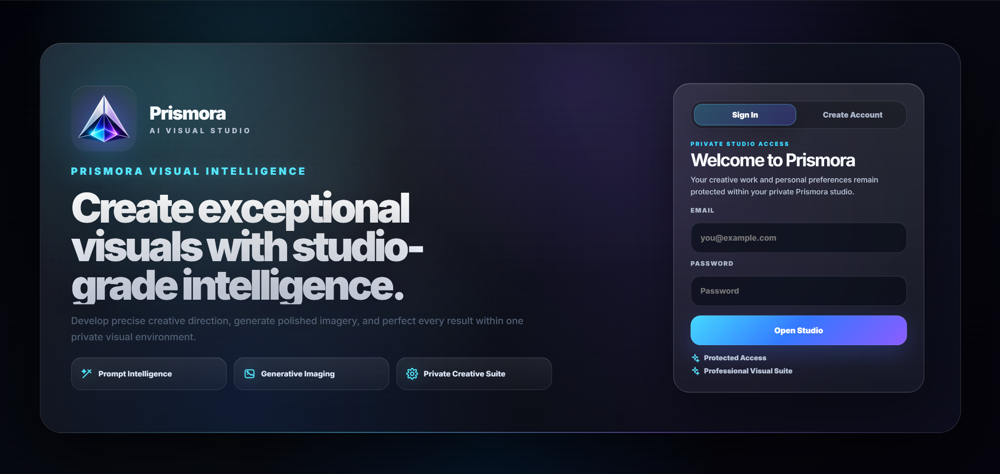
</a>

> **Screenshot note:** every interface image in this README is linked to its original full-resolution file. Select any screenshot to inspect it without cropping or quality loss.

---

## Table of Contents

- [Overview](#overview)
- [Why Prismora Stands Out](#why-prismora-stands-out)
- [Interface Showcase](#interface-showcase)
- [Core Capabilities](#core-capabilities)
- [End-to-End Creation Pipeline](#end-to-end-creation-pipeline)
- [System Architecture](#system-architecture)
- [Creative Controls](#creative-controls)
- [Quality Assurance and Safety](#quality-assurance-and-safety)
- [Authentication and Data Protection](#authentication-and-data-protection)
- [Technology Stack](#technology-stack)
- [Repository Structure](#repository-structure)
- [Database Model](#database-model)
- [API Reference](#api-reference)
- [Local Installation](#local-installation)
- [Environment Configuration](#environment-configuration)
- [Testing and Continuous Integration](#testing-and-continuous-integration)
- [Runtime Storage](#runtime-storage)
- [Engineering Decisions](#engineering-decisions)
- [Current Scope and Production Hardening](#current-scope-and-production-hardening)
- [Roadmap](#roadmap)
- [Author](#author)
- [License](#license)

---

## Overview

Prismora is a private, full-stack AI image-generation studio built as one cohesive FastAPI application. The backend serves both the REST API and the premium browser interface, removing the need for a separate frontend server during local development.

The project combines:

- **Prompt intelligence** through Gemini-based prompt refinement.
- **Text-to-image generation** through Cloudflare Workers AI and FLUX.1 Schnell.
- **Deterministic fallback prompt compilation** when Gemini prompt enhancement is unavailable.
- **Input and output safety gates** with clear, user-friendly rejection messages.
- **Automated image validation** including pixel decoding, dimensions, normalization, checksums, and file-size controls.
- **Multimodal quality review** using a generated image together with its source prompt.
- **Automatic quality retry logic** when an output fails configured visual thresholds.
- **Private accounts, sessions, preferences, creation threads, history, favorites, profiles, and downloads.**
- **Dark Prism and Light Prism themes** inside a responsive single-page interface.

Prismora is not only a prompt box connected to an image API. It is an end-to-end creative workflow that treats prompt construction, generation reliability, asset validation, quality review, organization, and refinement as parts of the same product.

---

## Why Prismora Stands Out

| Area | Prismora implementation |
|---|---|
| **Prompt quality** | Converts short English, Urdu, Roman Urdu, or Hindi ideas into focused natural-English production prompts. |
| **Intent preservation** | Explicitly protects subject count, identity descriptors, actions, relationships, colors, clothing, objects, location, and atmosphere. |
| **Visual control** | Supports modes, finishes, canvas ratios, resolution selection, variations, seeds, and exclusions. |
| **Generation resilience** | Uses streamed provider responses, transient-error retries, exponential backoff, and jitter. |
| **Memory awareness** | Streams provider payloads to temporary files instead of concatenating large responses in RAM. |
| **Asset integrity** | Fully decodes images, applies EXIF orientation, normalizes dimensions, hashes files, and stores metadata. |
| **Quality assurance** | Combines pixel-level aesthetic heuristics with Gemini visual review for safety, aesthetics, and semantic prompt alignment. |
| **Automatic recovery** | Can regenerate an output when the visual does not satisfy configured quality thresholds. |
| **Private organization** | Keeps creations user-scoped across threads, library, favorites, history, profile, and preferences. |
| **Premium UX** | Provides a carefully designed responsive SPA with dark/light themes, inline feedback, preserved scroll position, and refinement workflows. |

---

## Interface Showcase

### 1. Private Studio Access

Prismora starts with a premium authentication experience for returning users and new studio accounts.

<table>
  <tr>
    <td width="50%" align="center">
      <a href="./docs/screenshots/02-sign-in-panel.png">
        
      </a>
      <br /><strong>Secure Sign In</strong>
    </td>
    <td width="50%" align="center">
      <a href="./docs/screenshots/03-create-account-panel.png">
        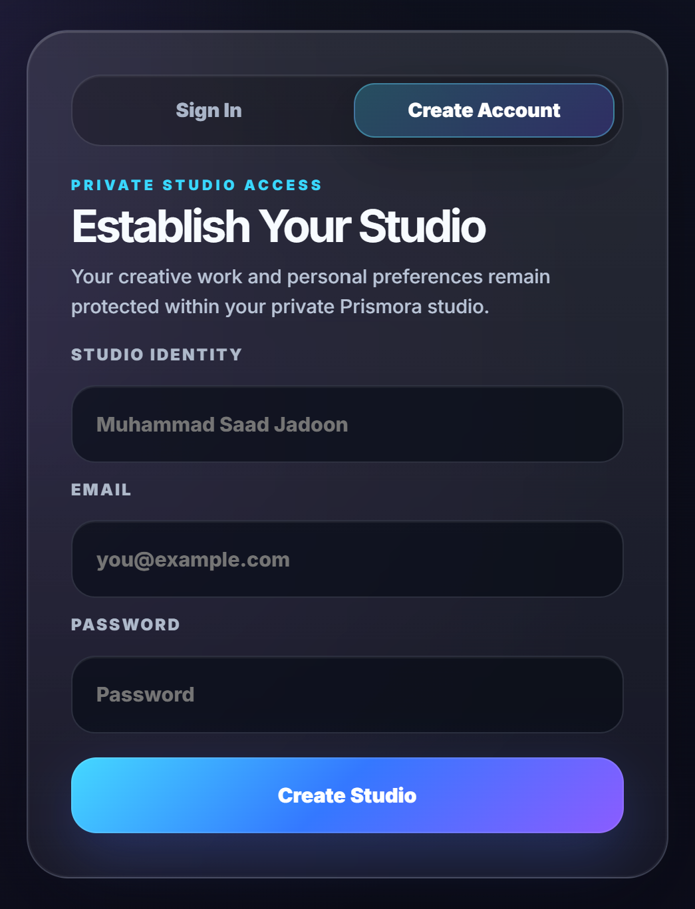
      </a>
      <br /><strong>Create a Private Studio</strong>
    </td>
  </tr>
</table>

### 2. Prompt Studio

The dedicated Prompt Studio separates concept development from image creation. A user can enter an initial direction, define exclusions, refine the idea, review the complete production prompt, and send it to the Create workspace.

<a href="./docs/screenshots/04-prompt-studio.png">
  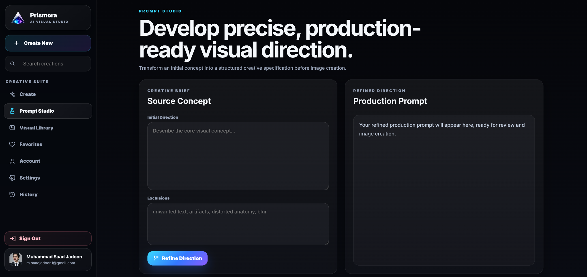
</a>

### 3. Visual Library and Curated Favorites

Generated assets are presented as a private visual collection. Users can reopen the original creation thread, synchronize the collection, and maintain a separate curated favorites view.

<table>
  <tr>
    <td width="50%" align="center">
      <a href="./docs/screenshots/05-visual-library.png">
        
      </a>
      <br /><strong>Visual Library</strong>
    </td>
    <td width="50%" align="center">
      <a href="./docs/screenshots/06-favorites.png">
        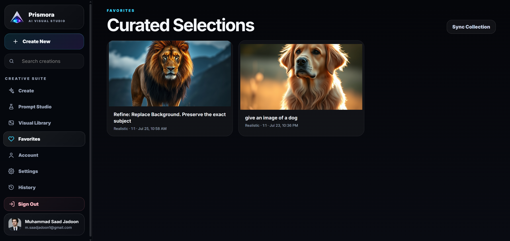
      </a>
      <br /><strong>Curated Selections</strong>
    </td>
  </tr>
</table>

### 4. Personal Studio and Preferences

The account area supports profile identity, email updates, and avatar upload. The preferences area stores theme, default visual mode, finish, canvas, and intelligent prompt-refinement behavior.

<table>
  <tr>
    <td width="50%" align="center">
      <a href="./docs/screenshots/07-personal-studio-account.png">
        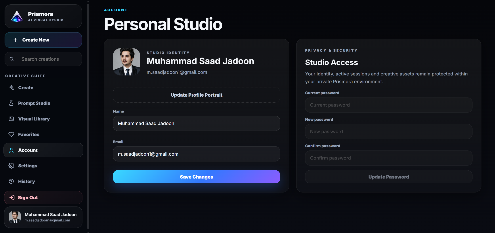
      </a>
      <br /><strong>Personal Studio</strong>
    </td>
    <td width="50%" align="center">
      <a href="./docs/screenshots/08-studio-preferences.png">
        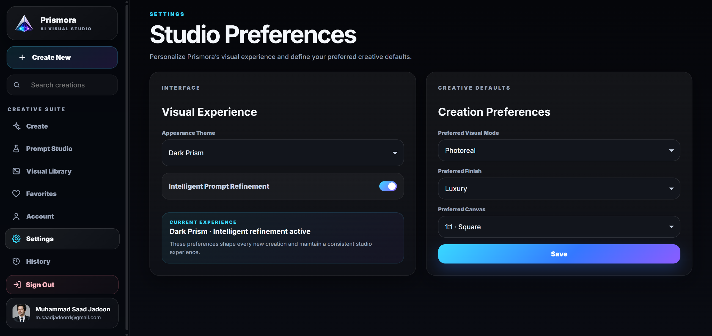
      </a>
      <br /><strong>Studio Preferences</strong>
    </td>
  </tr>
</table>

### 5. Full Creation Workspace

The main studio combines the conversation history, generated results, fixed prompt composer, creative inspector, theme support, and direct actions for download, copy, refinement, favorites, and removal.

<a href="./docs/screenshots/09-create-studio-light-theme.png">
  
</a>

### 6. Creation History

Every creation remains connected to its original prompt, visual mode, aspect ratio, timestamp, image preview, status, view action, and download action.

<a href="./docs/screenshots/10-creation-history.png">
  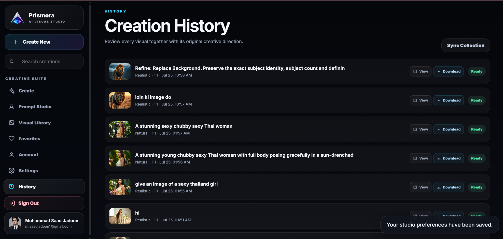
</a>

### 7. Precision Creative Controls

The inspector exposes the complete generation configuration without overloading the central workspace.

<table>
  <tr>
    <td width="33.33%" align="center" valign="top">
      <a href="./docs/screenshots/11-visual-direction-controls.png">
        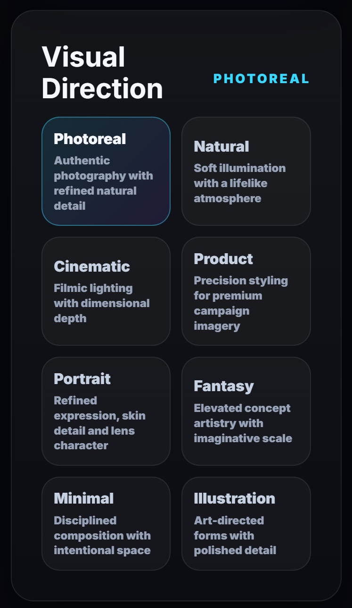
      </a>
      <br /><strong>Visual Direction</strong>
    </td>
    <td width="33.33%" align="center" valign="top">
      <a href="./docs/screenshots/12-creative-finish-controls.png">
        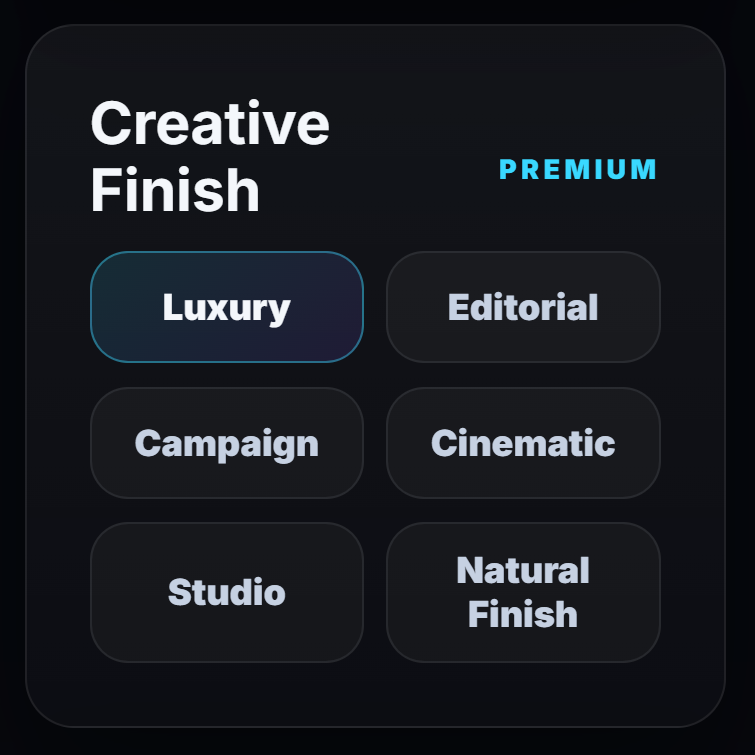
      </a>
      <br /><strong>Creative Finish</strong>
    </td>
    <td width="33.33%" align="center" valign="top">
      <a href="./docs/screenshots/13-canvas-format-controls.png">
        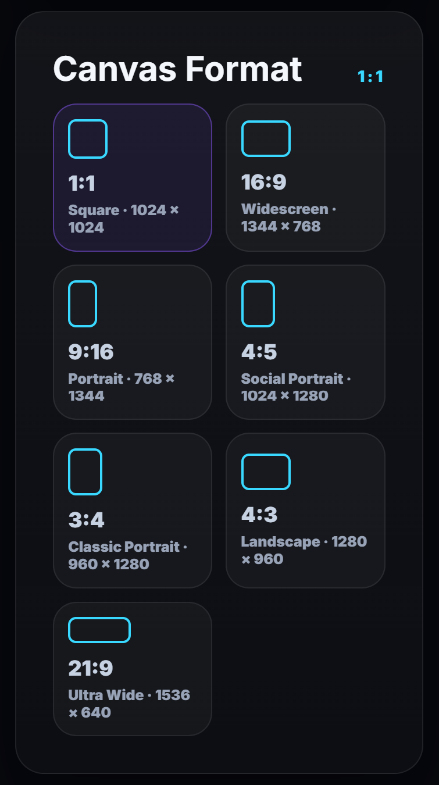
      </a>
      <br /><strong>Canvas Format</strong>
    </td>
  </tr>
</table>

<table>
  <tr>
    <td width="33.33%" align="center" valign="top">
      <a href="./docs/screenshots/14-generation-controls.png">
        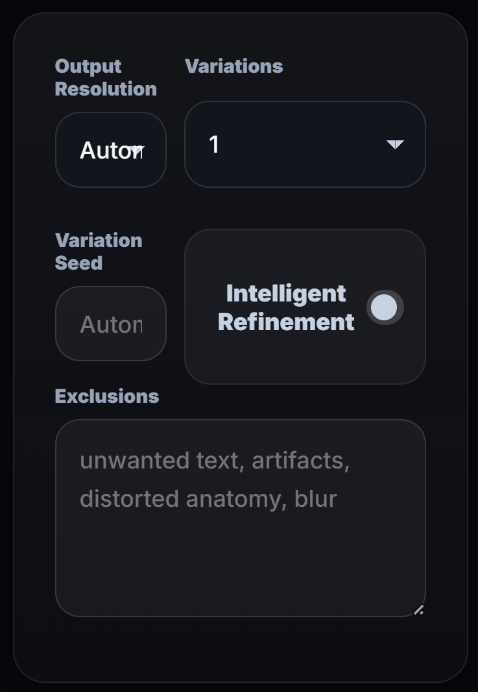
      </a>
      <br /><strong>Generation Configuration</strong>
    </td>
    <td width="33.33%" align="center" valign="top">
      <a href="./docs/screenshots/15-prompt-composer.png">
        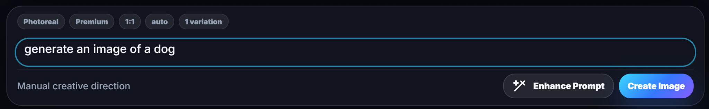
      </a>
      <br /><strong>Prompt Composer</strong>
    </td>
    <td width="33.33%" align="center" valign="top">
      <a href="./docs/screenshots/16-enhanced-prompt-review.png">
        
      </a>
      <br /><strong>Enhanced Prompt Review</strong>
    </td>
  </tr>
</table>

### 8. Validated Generation Result

Each completed result can display dimensions, file size, aesthetic score, semantic prompt-match score, quality verification, safety verification, and direct asset actions.

<p align="center">
  <a href="./docs/screenshots/17-quality-verified-generation.png">
    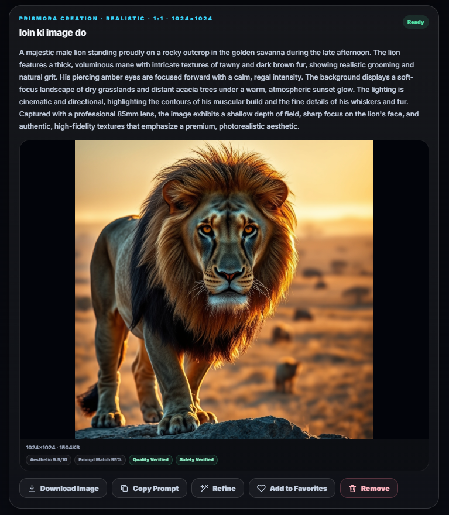
  </a>
</p>

---

## Core Capabilities

### Prompt Intelligence

- Refines short visual concepts into production-ready prompts.
- Understands English, Urdu, Roman Urdu, and Hindi input.
- Produces fluent natural-English direction for the image model.
- Preserves the exact requested subject, count, relationships, action, clothing, colors, objects, setting, and atmosphere.
- Adds composition, camera, lighting, materials, depth, and meaningful visual detail without changing the core concept.
- Avoids repetitive quality buzzwords and unrelated additions.
- Supports both inline enhancement and a separate Prompt Studio workflow.
- Uses a deterministic prompt compiler as a graceful fallback when Gemini is not configured or temporarily unavailable.

### Image Generation

- Generates through **Cloudflare Workers AI**.
- Uses **FLUX.1 Schnell** by default.
- Supports one to four variations per request.
- Supports an optional deterministic seed.
- Supports negative directions through the exclusions field.
- Preserves a generation inside its creation thread.
- Keeps generation metadata including provider, model, dimensions, status, safety state, quality state, and QA attempts.

### Precision Refinement

- Opens any previous generation in a dedicated refinement dialog.
- Supports quick refinement directions such as lighting, detail, background, color, composition, and element removal.
- Can preserve the primary subject identity and composition.
- Reuses the complete prior enhanced prompt as locked context.
- Applies only the requested changes while preserving unspecified details.
- Stores the refined result inside the existing creation thread.

### Private Creative Organization

- User registration and sign-in.
- Server-side session persistence.
- Creation threads and messages.
- Visual Library.
- Favorites collection.
- Full creation history.
- Image download.
- Prompt copy.
- Generation removal with file cleanup.
- Profile name and email updates.
- Profile portrait upload.
- Persistent creative defaults and theme preferences.

### Interface Experience

- Responsive single-page application.
- Hash-based navigation with browser back/forward support.
- Dark Prism and Light Prism themes.
- Inspector shown only where creative controls are needed.
- Internal scrolling for sidebar, workspace, inspector, and long prompts.
- Scroll-position preservation between views.
- Automatic movement toward the newest studio result without forcing unrelated pages to scroll.
- Friendly loading, success, warning, and error feedback.
- Responsive layouts for desktop, tablet, and mobile widths.

---

## End-to-End Creation Pipeline

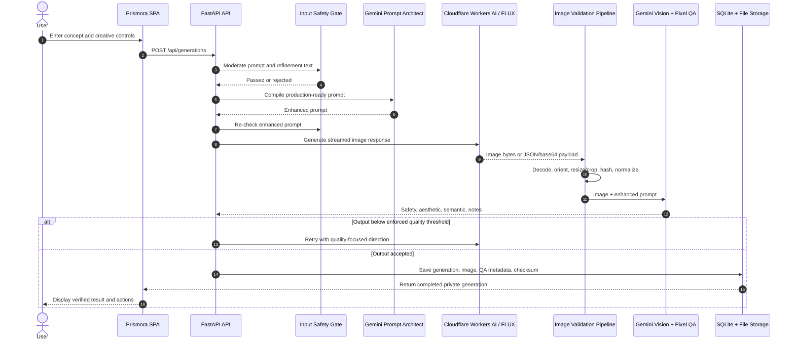

### Pipeline Stages

1. **Request validation** — Pydantic validates prompt length, enum values, count, seed, aspect ratio, and compatible output resolution.
2. **Input safety** — the original concept and any refinement instruction are checked before provider calls are made.
3. **Prompt compilation** — Gemini converts the concept into one complete visual specification; a deterministic fallback remains available.
4. **Enhanced-prompt safety** — the compiled prompt is checked again before generation.
5. **Provider execution** — Cloudflare receives the clean prompt, selected width and height, step count, and optional seed.
6. **Resilient transport** — transient `429`, `500`, `502`, `503`, and `504` responses are retried with exponential backoff and jitter.
7. **Disk-first extraction** — image or JSON responses are streamed to temporary files with strict byte limits.
8. **Provider-response decoding** — URL, direct image, base64, and data-URI-style payloads are supported.
9. **Pixel validation** — Pillow verifies the source, fully decodes pixel data, and applies EXIF orientation.
10. **Canvas normalization** — mismatched dimensions are fitted to the exact requested canvas using Lanczos resampling.
11. **Integrity metadata** — SHA-256 and byte size are calculated for the normalized asset.
12. **Visual review** — pixel heuristics and, when configured, Gemini Vision score aesthetics, semantic alignment, and safety.
13. **Automatic quality retry** — an output that fails enforced thresholds can be regenerated with stronger fidelity guidance.
14. **Private persistence** — accepted images and all generation metadata are stored under the authenticated user.
15. **Presentation** — the result card exposes image actions and quality information in the studio.

---

## System Architecture

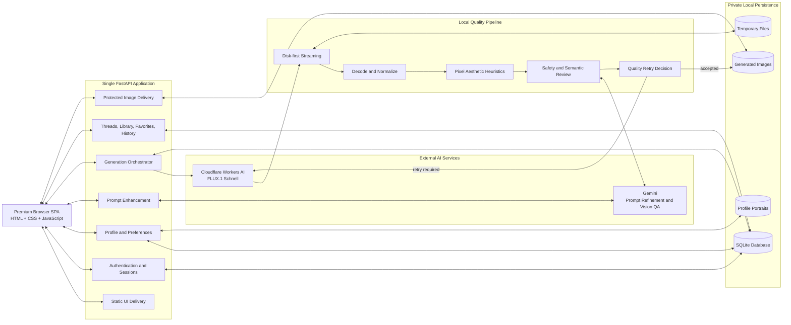

### Architectural Characteristics

- **Single deployable service:** FastAPI serves both the SPA and API.
- **No local browser database:** durable application data stays on the server side.
- **User-scoped assets:** protected image routes validate asset ownership before delivery.
- **Local-first persistence:** SQLite and filesystem storage keep setup simple for evaluation and internship demonstration.
- **Separated quality module:** image transport, extraction, validation, moderation, and scoring live in `quality_pipeline.py`.
- **Progressive capability:** prompt compilation and basic image validation still work in reduced form when optional Gemini review is unavailable.

---

## Creative Controls

### Visual Modes

| Internal value | Interface label | Direction |
|---|---|---|
| `realistic` | Photoreal | Authentic photography with refined natural detail |
| `natural` | Natural | Soft illumination with a lifelike atmosphere |
| `cinematic` | Cinematic | Filmic lighting with dimensional depth |
| `product` | Product | Precision styling for premium campaign imagery |
| `portrait` | Portrait | Refined expression, skin detail, and lens character |
| `fantasy` | Fantasy | Elevated concept artistry with imaginative scale |
| `minimal` | Minimal | Disciplined composition with intentional space |
| `illustration` | Illustration | Art-directed forms with polished detail |

### Creative Finishes

| Internal value | Interface label |
|---|---|
| `premium` | Luxury |
| `editorial` | Editorial |
| `commercial` | Campaign |
| `film` | Cinematic |
| `studio` | Studio |
| `raw` | Natural Finish |

### Canvas Formats

| Ratio | Resolution | Intended use |
|---|---:|---|
| `1:1` | `1024 × 1024` | Square posts, avatars, product compositions |
| `16:9` | `1344 × 768` | Widescreen scenes and presentation visuals |
| `9:16` | `768 × 1344` | Reels, Shorts, Stories, and vertical art |
| `4:5` | `1024 × 1280` | Social portrait posts |
| `5:4` | `1280 × 1024` | API-supported landscape format |
| `3:4` | `960 × 1280` | Classic portrait compositions |
| `4:3` | `1280 × 960` | Landscape photography and editorial layouts |
| `21:9` | `1536 × 640` | Ultra-wide cinematic scenes |

> The current inspector exposes seven primary presets. The backend additionally accepts the `5:4` format through the validated API schema.

### Operational Input Limits

| Input | Current validation |
|---|---:|
| Source prompt | 2–4,000 characters |
| Exclusions / negative prompt | Up to 2,000 characters |
| Refinement instruction | Up to 2,000 characters |
| Source refinement context | Up to 3,000 characters |
| Variations | 1–4 |
| Seed | `0` to `2,147,483,647` |
| Profile portrait | Maximum 5 MB; normalized to JPEG with a maximum 512 × 512 bounding size |
| Provider JSON payload | 64 MB default maximum |
| Generated image payload | 40 MB default maximum |

---

## Quality Assurance and Safety

Prismora includes quality and safety as part of the generation path rather than treating them as optional labels added after completion.

### Input Safety Gate

The local safety layer rejects configured categories before a generation request is sent, including:

- Explicit sexual content.
- Sexual content involving minors.
- Graphic gore.
- Self-harm instructions or imagery requests.
- Hateful abuse patterns.

The same safety gate is applied again after prompt enhancement so that an external prompt transformation cannot silently bypass the initial review.

### Output Validation

Every provider result is processed through:

- Maximum-size enforcement.
- Direct-image or JSON-response handling.
- Memory-mapped JSON scanning.
- Incremental base64 decoding.
- Complete image verification.
- Full pixel decoding to detect truncated assets.
- EXIF orientation correction.
- Exact target-canvas normalization.
- PNG normalization.
- SHA-256 checksum generation.
- Byte-size calculation.
- Dimension-match and adjustment metadata.

### Automated Visual Quality Review

When Gemini is configured, the reviewer evaluates:

- **Safety:** whether the generated image violates output-safety categories.
- **Aesthetic score:** `0–10` for composition, lighting, coherence, anatomy/material quality, detail, and polish.
- **Semantic score:** `0–1` for alignment with the prompt’s subject, count, action, relationships, colors, objects, and setting.
- **Notes:** a concise review result stored with the image.

Default thresholds:

```text
Aesthetic threshold: 7.0 / 10
Semantic threshold:  0.58 / 1.00
```

If Gemini visual review is unavailable, Prismora still performs file-integrity checks and a local pixel-based aesthetic heuristic using contrast, entropy, and edge information. In that fallback state, semantic alignment and AI output-safety review are correctly marked unavailable instead of being falsely reported as passed.

---

## Authentication and Data Protection

### Implemented Controls

- Passwords are hashed using **PBKDF2-HMAC-SHA256**.
- Each password uses a unique 16-byte random salt.
- The password derivation currently uses **250,000 rounds**.
- Session tokens are generated with cryptographically secure randomness.
- Only a SHA-256 hash of each session token is stored in SQLite.
- Session cookies are `HttpOnly` and `SameSite=Lax`.
- Sessions expire after 14 days.
- Email uniqueness is enforced case-insensitively.
- Image delivery checks both the authenticated user and the stored asset owner.
- Filenames are sanitized and generated assets use user, generation, and checksum-derived names.
- Deleted generations remove their associated stored image files.
- Generic account-recovery responses avoid revealing whether an email address exists.
- Secrets, databases, generated images, avatars, logs, and temporary files are excluded through `.gitignore`.

### Important Deployment Note

The current cookie configuration is designed for local HTTP development and sets `secure=False`. A public deployment should serve HTTPS and change the production cookie policy to `Secure`, ideally through an environment-aware setting.

See [SECURITY.md](./SECURITY.md) for repository secret-handling guidance.

---

## Technology Stack

| Layer | Technology | Responsibility |
|---|---|---|
| Backend framework | FastAPI | REST API, dependency-based authentication, static delivery, file responses |
| Validation | Pydantic v2 | Strict request schemas, enums, bounds, and cross-field canvas validation |
| Application server | Uvicorn | Local ASGI development server |
| Database | SQLite | Users, sessions, preferences, threads, messages, generations, images |
| Image generation | Cloudflare Workers AI | FLUX.1 Schnell execution |
| Prompt intelligence | Gemini API | Multilingual prompt compilation and refinement |
| Multimodal QA | Gemini API | Image-plus-prompt review for safety, aesthetics, and semantic alignment |
| Image processing | Pillow | Decode, verify, orient, resize/crop, normalize, preview, and avatar processing |
| HTTP client | Requests | Provider calls, streaming, timeout handling, and retries |
| Frontend | HTML5, CSS3, Vanilla JavaScript | Responsive SPA, routing, state, forms, gallery, and interactions |
| Tests | Pytest, FastAPI TestClient, HTTPX | Core API and quality-pipeline verification |
| CI | GitHub Actions | Automated tests on pushes and pull requests |

---

## Repository Structure

```text
prismora-ai-visual-studio/
├── .github/
│   └── workflows/
│       └── tests.yml                 # GitHub Actions test workflow
├── backend/
│   ├── static/
│   │   ├── assets/                   # Prismora logos and brand assets
│   │   ├── css/
│   │   │   └── style.css             # Complete responsive visual system
│   │   ├── js/
│   │   │   └── app.js                # SPA state, views, API calls, and interactions
│   │   └── index.html                # Application shell
│   ├── storage/
│   │   ├── avatars/.gitkeep          # Runtime profile portraits
│   │   ├── images/.gitkeep           # Runtime generated visuals
│   │   ├── logs/.gitkeep             # Runtime logs
│   │   └── tmp/.gitkeep              # Disk-first provider and QA files
│   ├── tests/
│   │   ├── test_core.py              # Health, auth, settings, and frontend checks
│   │   └── test_quality_pipeline.py  # Validation, safety, decoding, and canvas tests
│   ├── __init__.py
│   ├── main.py                       # FastAPI app, DB, auth, generation, and API routes
│   ├── quality_pipeline.py           # Streaming, decoding, validation, safety, and QA
│   ├── requirements.txt
│   ├── requirements-dev.txt
│   └── pytest.ini
├── docs/
│   ├── architecture.md
│   └── screenshots/                  # Full-resolution README interface gallery
├── scripts/
│   ├── run_unix.sh
│   ├── run_windows.bat
│   ├── run_windows.ps1
│   ├── setup_unix.sh
│   ├── setup_windows.bat
│   └── setup_windows.ps1
├── .env.example
├── .gitignore
├── LICENSE
├── README.md
└── SECURITY.md
```

---

## Database Model

Prismora initializes and migrates its SQLite schema automatically at application import.

| Table | Purpose | Notable fields |
|---|---|---|
| `users` | Private studio identities | name, email, password hash, avatar path, created time |
| `sessions` | Authenticated browser sessions | hashed token, user, creation time, expiry |
| `settings` | Per-user creative defaults | theme, mode, ratio, style, auto-enhance |
| `threads` | Creation sessions | user, title, created time, updated time |
| `messages` | User and assistant activity inside a thread | role, content, generation reference, timestamp |
| `generations` | Complete generation requests and states | prompts, controls, provider, model, dimensions, seed, status, favorite, safety, quality, QA attempts |
| `images` | Validated output assets | file path, dimensions, source dimensions, scores, QA state, moderation, checksum, size |

SQLite runs in **WAL mode** to improve local read/write behavior.

---

## API Reference

All private routes require the `prismora_session` cookie unless noted otherwise.

### Application and Health

| Method | Route | Authentication | Purpose |
|---|---|---:|---|
| `GET` | `/` | No | Serve the Prismora SPA |
| `GET` | `/api/health` | No | Report database, provider, QA, threshold, and storage status |

### Authentication

| Method | Route | Authentication | Purpose |
|---|---|---:|---|
| `POST` | `/api/auth/register` | No | Create a user, default settings, and session |
| `POST` | `/api/auth/login` | No | Verify credentials and create a session |
| `POST` | `/api/auth/forgot-password` | No | Return a privacy-safe recovery response and record a recovery request |
| `POST` | `/api/auth/logout` | Session optional | Delete the current server-side session and clear the cookie |
| `GET` | `/api/auth/me` | Yes | Return the current public user profile |

### Profile and Preferences

| Method | Route | Authentication | Purpose |
|---|---|---:|---|
| `GET` | `/api/settings` | Yes | Read saved theme and creative defaults |
| `PUT` | `/api/settings` | Yes | Upsert theme, mode, ratio, style, and auto-enhance |
| `PUT` | `/api/profile` | Yes | Update name and email |
| `PUT` | `/api/profile/password` | Yes | Verify the current password and save a new password hash |
| `POST` | `/api/profile/avatar` | Yes | Upload and normalize a profile portrait |
| `GET` | `/api/profile/avatar/{user_id}` | No route dependency; user-specific file lookup | Return a stored profile portrait |

> The backend password-update route is implemented. The current account screenshot intentionally presents the password panel as a reserved disabled interface state.

### Prompt Intelligence and Generation

| Method | Route | Authentication | Purpose |
|---|---|---:|---|
| `POST` | `/api/prompt/enhance` | Yes | Safety-check and compile a production prompt |
| `POST` | `/api/generations` | Yes | Create or refine one to four validated images |
| `GET` | `/api/generations` | Yes | List up to 120 recent generations; supports `favorite=0|1` |

### Threads, Collections, and Assets

| Method | Route | Authentication | Purpose |
|---|---|---:|---|
| `GET` | `/api/threads` | Yes | List up to 80 recent creation threads |
| `GET` | `/api/threads/{thread_id}` | Yes | Return one thread with messages and generations |
| `POST` | `/api/generations/{generation_id}/favorite` | Yes | Toggle favorite state |
| `DELETE` | `/api/generations/{generation_id}` | Yes | Remove the generation record and associated files |
| `GET` | `/api/images/{filename}` | Yes | Deliver an image only when it belongs to the current user |

### Example Generation Request

```json
{
  "prompt": "A cinematic rescue dog standing in gentle rain beneath a warm streetlight",
  "negative_prompt": "text, watermark, duplicate animal, malformed anatomy",
  "mode": "cinematic",
  "style": "film",
  "aspect_ratio": "9:16",
  "resolution": "auto",
  "count": 1,
  "seed": 18402,
  "auto_enhance": true,
  "thread_id": null,
  "refine_from_generation_id": null,
  "refine_instruction": ""
}
```

### Example Refinement Request

```json
{
  "prompt": "Existing visual prompt",
  "negative_prompt": "text, watermark, distorted anatomy",
  "mode": "cinematic",
  "style": "premium",
  "aspect_ratio": "9:16",
  "resolution": "auto",
  "count": 1,
  "seed": null,
  "auto_enhance": true,
  "thread_id": 12,
  "refine_from_generation_id": 38,
  "refine_instruction": "Preserve the dog and framing, replace the background with a quiet railway platform at sunset."
}
```

---

## Local Installation

### Prerequisites

- Python **3.13 or 3.14**.
- A Gemini API key for live prompt enhancement and visual QA.
- A Cloudflare account ID and Workers AI API token for live generation.
- Git for cloning and publishing the repository.

> Prismora can be demonstrated without live provider credentials by enabling the development placeholder. Live AI output requires the Cloudflare credentials.

### 1. Clone the Repository

```bash
git clone <your-repository-url>
cd prismora-ai-visual-studio
```

### 2. Configure Environment Variables

```bash
cp .env.example .env
```

On Windows Command Prompt:

```bat
copy .env.example .env
```

Generate a strong local application secret:

```bash
python -c "import secrets; print(secrets.token_urlsafe(48))"
```

Paste the generated value into `APP_SECRET_KEY` inside `.env`.

### 3. Fast Setup Scripts

#### Windows PowerShell

```powershell
.\scripts\setup_windows.ps1
notepad .env
.\scripts\run_windows.ps1
```

#### Windows Command Prompt

```bat
scripts\setup_windows.bat
notepad .env
scripts\run_windows.bat
```

#### Linux or macOS

```bash
chmod +x scripts/setup_unix.sh scripts/run_unix.sh
./scripts/setup_unix.sh
nano .env
./scripts/run_unix.sh
```

### 4. Manual Setup

```bash
cd backend
python -m venv .venv
```

Activate the environment:

```bash
# Linux / macOS
source .venv/bin/activate

# Windows PowerShell
.\.venv\Scripts\Activate.ps1

# Windows Command Prompt
.venv\Scripts\activate.bat
```

Install dependencies and run:

```bash
python -m pip install --upgrade pip
python -m pip install -r requirements-dev.txt
uvicorn main:app --reload --host 127.0.0.1 --port 8000
```

Open:

```text
http://127.0.0.1:8000
```

---

## Environment Configuration

The backend loads `.env` from both `backend/.env` and the repository root. The provided setup scripts create the root `.env` file.

### Recommended Local Configuration

```env
APP_SECRET_KEY=replace_with_a_long_random_secret
DATABASE_PATH=storage/prismora.db

GEMINI_API_KEY=your_gemini_api_key
GEMINI_MODEL=your_enabled_gemini_model

CLOUDFLARE_ACCOUNT_ID=your_cloudflare_account_id
CLOUDFLARE_API_TOKEN=your_cloudflare_api_token
CLOUDFLARE_MODEL=@cf/black-forest-labs/flux-1-schnell

ALLOW_DEV_PLACEHOLDER=false

QA_ENABLED=true
QA_ENFORCE=true
OUTPUT_MODERATION_ENABLED=true
QA_REGENERATION_ATTEMPTS=1
AESTHETIC_THRESHOLD=7.0
SEMANTIC_THRESHOLD=0.58

MAX_PROVIDER_JSON_BYTES=67108864
MAX_IMAGE_BYTES=41943040
```

### Variable Reference

| Variable | Required | Default / behavior |
|---|---:|---|
| `APP_SECRET_KEY` | Yes | Used by the application configuration; replace the development value before use |
| `DATABASE_PATH` | No | `storage/prismora.db`, resolved relative to `backend/` |
| `GEMINI_API_KEY` | Recommended | Without it, prompt enhancement uses the deterministic compiler and visual semantic review is unavailable |
| `GEMINI_MODEL` | Recommended | Model used for prompt compilation and image review |
| `CLOUDFLARE_ACCOUNT_ID` | For live generation | Cloudflare account identifier |
| `CLOUDFLARE_API_TOKEN` | For live generation | Token authorized for Workers AI |
| `CLOUDFLARE_MODEL` | No | `@cf/black-forest-labs/flux-1-schnell` |
| `ALLOW_DEV_PLACEHOLDER` | No | `false`; when `true`, creates branded placeholder images without Cloudflare |
| `QA_ENABLED` | No | `true`; enables visual-quality review logic |
| `QA_ENFORCE` | No | `true`; rejects available reviews that fail thresholds |
| `OUTPUT_MODERATION_ENABLED` | No | `true`; rejects available output reviews marked unsafe |
| `QA_REGENERATION_ATTEMPTS` | No | `1`, clamped between `0` and `2` |
| `AESTHETIC_THRESHOLD` | No | `7.0` |
| `SEMANTIC_THRESHOLD` | No | `0.58` |
| `MAX_PROVIDER_JSON_BYTES` | No | `64 MiB` |
| `MAX_IMAGE_BYTES` | No | `40 MiB` |

> Never commit the real `.env` file. The repository intentionally tracks only `.env.example`.

---

## Testing and Continuous Integration

### Run the Test Suite

```bash
cd backend
python -m pip install -r requirements-dev.txt
pytest -q
```

Current verified result:

```text
8 passed
```

### Covered Behavior

- Health endpoint availability.
- Registration, logout, login, current-user lookup, and settings retrieval.
- SPA root delivery.
- Strict generation enum validation.
- Aspect-ratio and resolution compatibility validation.
- Input safety rejection.
- Disk-based base64 provider-payload extraction.
- Output normalization to the requested canvas.

### GitHub Actions

`.github/workflows/tests.yml` runs the suite on:

- Pushes to `main` or `master`.
- Every pull request.

The CI environment uses Python 3.13, installs `requirements-dev.txt`, disables external QA/output moderation for deterministic tests, and enables the development placeholder.

---

## Runtime Storage

Prismora creates runtime data under `backend/storage/`:

```text
backend/storage/
├── prismora.db       # SQLite application database
├── avatars/          # Normalized user portraits
├── images/           # Validated generated images
├── logs/             # Reserved runtime logs
└── tmp/              # Provider streams, JSON, decoded files, and QA intermediates
```

The repository tracks only `.gitkeep` placeholders. Runtime data is excluded by `.gitignore`.

Generated filenames follow a user/generation/checksum pattern:

```text
u<user_id>_g<generation_id>_<sha256-prefix>.png
```

This makes stored assets identifiable without exposing the original prompt in the filename.

---

## Engineering Decisions

### 1. Single-Service Architecture

Serving the static SPA and REST API from FastAPI simplifies local evaluation, avoids a second development server, and removes cross-origin configuration from the default workflow.

### 2. Disk-First Provider Processing

Large image responses and JSON/base64 payloads are written incrementally to disk. This avoids building one very large in-memory response before decoding.

### 3. Strict Canvas Validation

The API uses literal enums plus a model-level validator to prevent incompatible ratio and resolution combinations before provider execution.

### 4. Exact Output Normalization

Providers may return dimensions that do not perfectly match the requested canvas. Prismora records both source and requested dimensions, then normalizes the final asset while preserving a warning in metadata.

### 5. Honest Quality States

A missing vision reviewer does not become a fake “passed” result. Prismora distinguishes:

- Full Gemini visual review.
- Pixel-quality fallback.
- Safety review unavailable.
- Semantic review unavailable.
- Quality passed or rejected.

### 6. Graceful Prompt Fallback

The user can still receive a carefully structured prompt when Gemini is missing or temporarily unavailable. The fallback is deterministic and uses the same selected mode, finish, canvas, exclusions, and refinement context.

### 7. Friendly Error Translation

Provider, timeout, safety, quality, dimension, and internal failures are converted into user-facing messages that do not expose raw backend details or stack traces.

### 8. User-Scoped Asset Delivery

Generated image files are not exposed as a public static directory. The protected image route verifies ownership against the database before returning the file.

---

## Current Scope and Production Hardening

Prismora is a complete and polished internship-grade application with production-minded engineering, but a public multi-user deployment should add the following hardening steps:

- Run behind HTTPS and set session cookies to `Secure` in production.
- Restrict allowed origins instead of using a permissive development value.
- Move secrets to the deployment platform’s secret manager.
- Add request rate limiting and generation quotas.
- Add CSRF protection for state-changing cookie-authenticated requests.
- Replace local SQLite with a managed relational database for horizontal scaling.
- Replace local generated-image storage with durable object storage.
- Move long-running generation and QA work to a background queue.
- Add database indexes for high-volume generation, thread, and image queries.
- Connect account recovery to verified email delivery and expiring reset tokens.
- Enable the password-change interface that already has backend support.
- Add structured application logging and centralized monitoring.
- Add provider usage/cost telemetry and per-user limits.
- Add end-to-end browser tests and accessibility audits.
- Add container and deployment manifests when a target platform is selected.

This distinction keeps the repository technically honest while showing a clear path from an advanced internship project to a scalable hosted product.

---

## Roadmap

- [ ] Asynchronous generation jobs with progress events.
- [ ] Email-based password recovery.
- [ ] Enabled password-change interface.
- [ ] Object-storage adapter for generated images and avatars.
- [ ] PostgreSQL deployment profile.
- [ ] Docker and production ASGI configuration.
- [ ] Per-user usage dashboard and generation quotas.
- [ ] Advanced search, filters, and collection folders.
- [ ] Multi-image downloads and ZIP export.
- [ ] Prompt version comparison and refinement lineage.
- [ ] Additional output providers behind one generation interface.
- [ ] Accessibility and keyboard-navigation review.
- [ ] Playwright end-to-end test coverage.
- [ ] Admin observability for provider latency, retries, quality failures, and safety events.

---

## Author

**Muhammad Saad Jadoon**  
Project creator and developer of Prismora.

Prismora began as an internship assignment and was expanded into a complete AI visual-studio experience spanning product design, frontend engineering, backend APIs, provider integration, security, persistence, quality assurance, and automated testing.

---

## License

This project is licensed under the [MIT License](./LICENSE).

---

<div align="center">

### Prismora — Develop precise creative direction. Generate with confidence. Preserve every result.

Built with a focus on **visual quality, intent fidelity, private organization, and premium product experience**.

</div>
