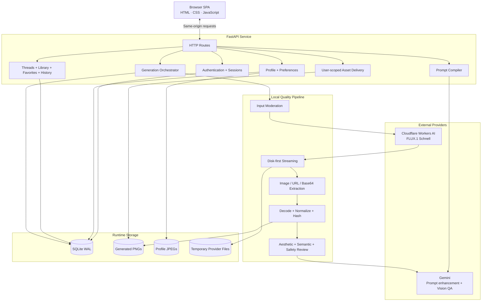

# Prismora Architecture

Prismora is delivered as one FastAPI service that serves both the browser application and the JSON API. This architecture keeps local development simple while maintaining clear internal boundaries between authentication, prompt intelligence, generation, asset validation, visual review, persistence, and user-scoped delivery.

## Component map

## Runtime generation flow

1. The authenticated browser sends a generation request.
2. Pydantic validates the selected mode, finish, canvas, resolution, variation count, seed, and refinement references.
3. Input moderation evaluates the user prompt before a provider call.
4. Prompt intelligence either uses Gemini or the deterministic local prompt compiler.
5. The generation orchestrator sends the final prompt to Cloudflare Workers AI.
6. The provider response is streamed to disk.
7. Prismora extracts a direct image, remote image URL, or base64 image from the response.
8. Pillow fully decodes the asset, applies EXIF orientation, and normalizes it to the exact requested canvas.
9. The quality pipeline calculates SHA-256 and file metadata.
10. Pixel heuristics calculate a local aesthetic score.
11. When configured, Gemini vision QA reviews output safety, aesthetics, and semantic prompt alignment.
12. A verified quality failure can trigger a configured regeneration attempt.
13. Accepted images are moved from temporary storage into user-scoped runtime storage.
14. Generation, image, quality, safety, thread, and message records are committed to SQLite.
15. The browser receives the serialized result and displays the completed generation card.

## Security boundaries

- Passwords are stored as PBKDF2-HMAC-SHA256 hashes with random salts.
- Session tokens are stored only as SHA-256 hashes.
- Protected routes require the active `HttpOnly` session cookie.
- Thread, generation, favorite, deletion, and image queries are scoped to the authenticated user.
- Generated images are not exposed as a public static directory; `/api/images/{filename}` verifies ownership before delivery.
- Secrets and runtime storage are excluded from source control.

## Persistence model

SQLite stores users, sessions, preferences, threads, messages, generation requests, and image metadata. Binary assets are stored on disk and referenced from database records.

The local architecture is appropriate for demonstration and single-node use. A public deployment should use managed PostgreSQL, private object storage, background workers, HTTPS-only cookies, rate limiting, CSRF protection, centralized observability, and a real email recovery workflow.

## Extension points

The current code has clear replacement boundaries for:

- prompt-enhancement providers;
- image-generation providers;
- visual-quality reviewers;
- moderation services;
- relational databases;
- object storage;
- asynchronous generation workers.
