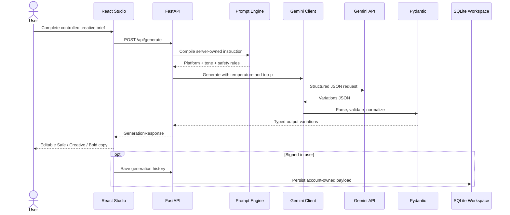
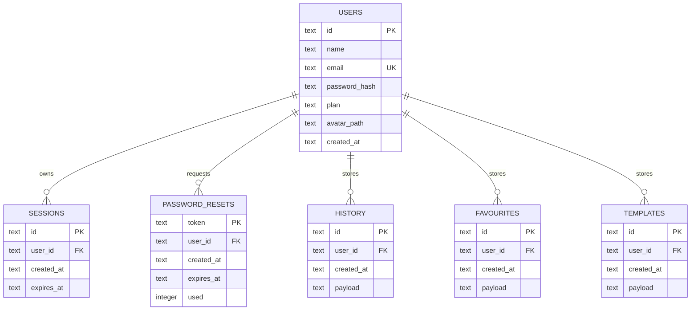

<a id="top"></a>

<div align="center">
  

# Lexora | AI Tone Studio

### A full-stack workspace for controlled copy generation, tone transformation, and CSV campaign automation

<p>
  I built Lexora to turn product facts and existing copy into clear, platform-ready content without hiding the important decisions inside one prompt box. The product combines a structured creative brief, Gemini-powered generation, editable variations, account-based workspaces, and bulk CSV processing in one consistent workflow.
</p>

<p>
  
  
  
  
</p>

<p>
  
  
  
  
  
  
  
  
</p>

<p>
  <a href="#product-tour"><strong>Product Tour</strong></a>
  · <a href="#feature-system"><strong>Features</strong></a>
  · <a href="#architecture"><strong>Architecture</strong></a>
  · <a href="#quick-start"><strong>Quick Start</strong></a>
  · <a href="#api-reference"><strong>API</strong></a>
  · <a href="#testing--continuous-integration"><strong>Testing</strong></a>
</p>
</div>

---

<a href="docs/screenshots/01-home.png">
  
</a>

<p align="center"><sub>Lexora home screen with direct access to Studio, Bulk, Workspace, and Profile.</sub></p>

---

## Executive Overview

**Lexora** started as the DecodeLabs internship task **Automated Copywriting Tone Transformer**. I expanded the original brief into a working full-stack product that supports both one-off copy generation and repeatable campaign workflows.

A user can define the audience, objective, language, length, platform, tone, formality, CTA, keywords, brand voice, variation count, temperature, and top-p. The backend then builds a server-owned instruction, sends it to Gemini, validates the structured response with Pydantic, and returns editable **Safe**, **Creative**, and **Bold** variations with platform-specific character feedback.

The interactive Studio, authenticated Workspace, CSV bulk processor, and command-line interface all use the same generation pipeline. This keeps the behaviour consistent and avoids maintaining separate prompt logic for each entry point.

> **Design principle:** give users meaningful creative control, keep the generation contract predictable, and make the result easy to review, edit, reuse, and export.

### Project at a Glance

<table>
  <tr>
    <td align="center"><strong>13</strong><br/><sub>generation & transformation modes</sub></td>
    <td align="center"><strong>8</strong><br/><sub>platform-aware presets</sub></td>
    <td align="center"><strong>9</strong><br/><sub>tone profiles</sub></td>
    <td align="center"><strong>1–5</strong><br/><sub>structured variations per request</sub></td>
  </tr>
  <tr>
    <td align="center"><strong>200</strong><br/><sub>CSV rows per bulk job</sub></td>
    <td align="center"><strong>3</strong><br/><sub>private workspace collections</sub></td>
    <td align="center"><strong>20+</strong><br/><sub>documented REST operations</sub></td>
    <td align="center"><strong>2</strong><br/><sub>CI verification jobs</sub></td>
  </tr>
</table>

---

## How the Internship Brief Evolved

| Internship requirement | What I implemented in Lexora |
|---|---|
| Transform copy into a selected tone | A 13-mode transformation suite supporting generation, rewrite, shortening, expansion, improvement, simplification, humanization, grammar correction, professionalization, tone change, headlines, hashtags, and translation. |
| Produce useful marketing text | Platform-specific character budgets, content structures, hashtag policies, CTA controls, formality, emoji level, audience, objective, language, keywords, and copy length. |
| Integrate an AI model | Async Gemini integration with schema-constrained JSON, Pydantic validation, output normalization, concurrency control, and retry classification. |
| Present results | An editable output studio with variation switching, live counts, compliance feedback, copy and download actions, favourites, regeneration, and result clearing. |
| Handle one request at a time | A CSV bulk system with preview, required-column checks, typed backend validation, row-level results, counters, client-side cancellation, and export. |
| Build a demonstration interface | A responsive product with authentication, profile management, history, favourites, reusable templates, backend persistence, tests, CI, CLI access, and deployment guidance. |

---

## Core Engineering Decisions

| Engineering area | What is implemented |
|---|---|
| **Explicit generation controls** | Model, copy, audience, platform, brand, and business settings are represented as product inputs instead of being buried in one free-form prompt. |
| **Structured response contract** | Gemini returns a defined JSON shape, which the backend validates and normalizes before sending it to the frontend. |
| **Three creative positions** | Safe, Creative, and Bold variations let the user compare different levels of expression without relying on one unpredictable result. |
| **Platform intelligence** | Each supported platform carries a character budget, formatting instruction, and hashtag policy. |
| **Account-owned workspace** | History, favourites, templates, profile data, and profile images are persisted on the backend and scoped to the authenticated account. |
| **Bulk automation** | The same generation engine handles UTF-8 CSV uploads of up to 200 usable rows while preserving typed validation and row-level error reporting. |
| **Reliability controls** | Request-size guards, rate limits, login throttling, Gemini concurrency control, error classification, exponential retry, and user-friendly API responses. |
| **Developer workflow** | Typed models, environment templates, OpenAPI documentation, a standalone CLI, backend tests, and GitHub Actions for test and build verification. |
| **Documented next steps** | The repository records the work still needed for a public multi-user deployment, including secure cookies, distributed limits, PostgreSQL, durable jobs, reset-email delivery, observability, and AI evaluation. |

---

<a id="product-tour"></a>

## Product Tour

> Every screenshot below uses a repository-relative path and is clickable for full-resolution viewing on GitHub.

### 1. Studio: Brief, Control, Generate

The Studio turns a marketing task into a structured creative brief. Users can select an operation mode, define product facts and audience intent, choose a platform and tone, control formality and CTA behaviour, save a brand voice, and tune temperature and top-p before generation.

<table>
  <tr>
    <td width="50%" valign="top">
      <a href="docs/screenshots/08-studio-advanced-brief.png"></a>
      <br/><sub><strong>Advanced Brief:</strong> operation mode, product facts, and audience controls.</sub>
    </td>
    <td width="50%" valign="top">
      <a href="docs/screenshots/09-studio-controls.png"></a>
      <br/><sub><strong>Precision Controls:</strong> platform, tone, formality, variations, brand voice, temperature, and top-p.</sub>
    </td>
  </tr>
</table>

### 2. Output Lifecycle: Empty, Processing, Editable

The output panel has a clear empty state, a visible processing state, and an editable result view. Generated copy is treated as working content, not as a static chat response.

<table>
  <tr>
    <td width="50%" valign="top">
      <a href="docs/screenshots/10-output-empty-state.png"></a>
      <br/><sub><strong>Empty State:</strong> clear guidance before a brief is generated.</sub>
    </td>
    <td width="50%" valign="top">
      <a href="docs/screenshots/13-generation-progress.png"></a>
      <br/><sub><strong>Generation Progress:</strong> staged feedback while the request is being processed.</sub>
    </td>
  </tr>
</table>

### 3. Controlled Variations: Safe, Creative, Bold

Each variation can be edited directly and includes word count, character count, platform budget, compliance status, hashtags, CTA, sampling settings, and output actions.

<table>
  <tr>
    <td width="33.33%" valign="top">
      <a href="docs/screenshots/14-output-safe.png"></a>
      <br/><sub><strong>Safe:</strong> polished, reliable, and low-risk.</sub>
    </td>
    <td width="33.33%" valign="top">
      <a href="docs/screenshots/16-output-creative.png"></a>
      <br/><sub><strong>Creative:</strong> distinctive while remaining accurate.</sub>
    </td>
    <td width="33.33%" valign="top">
      <a href="docs/screenshots/15-output-bold.png"></a>
      <br/><sub><strong>Bold:</strong> stronger and more confident without unsupported claims.</sub>
    </td>
  </tr>
</table>

### 4. Workspace: History, Favourites, Templates

Signed-in users can search and filter generation history, duplicate earlier briefs, save templates, reuse favourite outputs, and manage each workspace collection separately.

<table>
  <tr>
    <td width="50%" valign="top">
      <a href="docs/screenshots/03-workspace-history.png"></a>
      <br/><sub><strong>History & Favourites:</strong> searchable, filterable, reusable content.</sub>
    </td>
    <td width="50%" valign="top">
      <a href="docs/screenshots/04-workspace-saved-template.png"></a>
      <br/><sub><strong>Saved Templates:</strong> reusable campaign briefs persisted per account.</sub>
    </td>
  </tr>
</table>

### 5. Bulk CSV: Upload, Validate, Run, Export

Bulk mode uses the same typed generation pipeline as the Studio. It includes a downloadable template, drag-and-drop upload, client-side preview, required-field checks, backend validation, progress feedback, row-level results, and CSV export.

<table>
  <tr>
    <td width="50%" valign="top">
      <a href="docs/screenshots/05-bulk-upload.png"></a>
      <br/><sub><strong>Upload & Preview:</strong> template download, file selection, preview, and validation state.</sub>
    </td>
    <td width="50%" valign="top">
      <a href="docs/screenshots/06-bulk-results.png"></a>
      <br/><sub><strong>Batch Results:</strong> success/failure counters and row-level generated headlines.</sub>
    </td>
  </tr>
</table>

<a href="docs/screenshots/07-exported-results-csv.png">
  
</a>
<p align="center"><sub><strong>Exported CSV:</strong> row ID, product, platform, tone, status, headline, body, CTA, and error fields.</sub></p>

### 6. Account Experience: Sign In, Recovery, Profile

Lexora includes account creation and sign-in, remembered sessions, a local-development password reset flow, profile editing, profile image management, password updates, sign-out, and permanent account deletion.

<table>
  <tr>
    <td width="50%" valign="top">
      <a href="docs/screenshots/12-sign-in.png"></a>
      <br/><sub><strong>Sign In:</strong> credentialed access and optional remembered session.</sub>
    </td>
    <td width="50%" valign="top">
      <a href="docs/screenshots/11-password-reset.png"></a>
      <br/><sub><strong>Password Recovery:</strong> development-only password reset flow.</sub>
    </td>
  </tr>
</table>

<a href="docs/screenshots/02-profile-dashboard.png">
  
</a>
<p align="center"><sub><strong>Profile Dashboard:</strong> identity, workspace status, image controls, password management, logout, and danger zone.</sub></p>

<p align="right"><a href="#top">Back to top ↑</a></p>

---

<a id="feature-system"></a>

## Feature System

### Advanced AI Studio

The Studio uses a structured brief so that the user can control the parts of the task that materially affect the result.

- **13 operation modes:** Generate, Rewrite, Shorten, Expand, Improve, Simplify, Humanize, Grammar Fix, Professional, Change Tone, Headlines, Hashtags, and Translate.
- **8 platform presets:** LinkedIn, Instagram, Facebook, Email, X/Twitter, Google Ads, YouTube, and TikTok.
- **9 tone profiles:** Witty, Professional, Bold, Friendly, Luxury, Urgent, Energetic, Empathetic, and Confident.
- **7 objectives:** Sales, Awareness, Engagement, Lead Generation, Education, Launch, and Retention.
- **Copy controls:** target audience, language, short/medium/long length, keywords, emoji level, formality, CTA type, and optional custom CTA.
- **Model controls:** temperature from `0.0–2.0` and top-p from `0.0–1.0`.
- **Variation control:** request between `1–5` structured outputs.

### Brand Voice Profile

A structured brand profile can guide every generated variation:

- Brand description
- Preferred tone
- Preferred vocabulary
- Words to avoid
- Audience notes
- CTA style
- Example copy to emulate

The full brief can be reused from saved templates or restored from generation history.

### Safe · Creative · Bold Strategy

| Variation | Purpose |
|---|---|
| **Safe** | Polished, dependable, low-risk, and immediately usable. |
| **Creative** | More memorable and differentiated while remaining factual and platform-appropriate. |
| **Bold** | Stronger, punchier, and more confident without inventing claims or guarantees. |

The output editor supports direct headline, body, and CTA editing; variation switching; word and character counts; platform compliance feedback; clipboard copy; saving; favourites; regeneration; `.txt` download; and clearing the current result.

### Platform-Aware Rules

| Platform | Character budget | Intended structure | Hashtags |
|---|---:|---|---|
| X / Twitter | 280 | Single concise post with strict character discipline | Supported |
| Google Ads | 450 | Benefit-led ad headline and compact description | Disabled |
| Email | 1,500 | Subject-style headline, skimmable body, one CTA | Disabled |
| Instagram | 2,200 | Visual hook, caption, CTA, and hashtag set | Supported |
| TikTok | 2,200 | Strong hook, short caption, social-native CTA | Supported |
| LinkedIn | 3,000 | Professional hook, short paragraphs, insight, CTA | Supported |
| Facebook | 3,000 | Conversational post with a natural CTA | Supported |
| YouTube | 5,000 | Title, description, and tags-friendly copy | Supported |

### Private Workspace

Authenticated users receive server-persisted collections for:

- Searchable generation history
- Platform and tone filters
- Duplicate/reuse workflow
- Save-as-template workflow
- Favourite outputs
- Reusable templates
- Individual deletion and section clearing
- Automatic retention of the newest `80` history items, `80` favourites, and `40` templates per account

### Account & Profile Management

- Account creation and sign-in
- “Remember me” sessions
- HTTP-only session-cookie authentication
- Sign-out
- Local-development password-reset flow
- Profile name update
- JPG, PNG, and WebP profile image upload
- Profile image removal
- Password change with session invalidation
- Permanent account and workspace deletion

### Bulk CSV System

- Downloadable extended CSV template
- Drag-and-drop or file-browser upload
- Client-side CSV preview
- Required-column checks
- Row-level missing-field feedback
- UTF-8 backend parsing
- Enum and numeric validation
- Duplicate-row warnings in backend logs
- Up to `200` usable rows per job
- Concurrent async generation under the configured Gemini semaphore
- Client-side request cancellation with `AbortController`
- Success, failed, and pending counters
- Row-level result/error records
- CSV export of the primary generated variation

### Standalone CLI

The backend can also be used without the React interface. The CLI validates platform and tone arguments, exposes temperature and top-p, supports compiled-prompt inspection, prints JSON, and can write results to a file.

---

<a id="architecture"></a>

## Architecture


### Generation Lifecycle



### Server-Side Prompt Strategy

The core instruction stays on the backend and combines:

- Task-mode guidance
- Product or offer facts
- Audience and objective
- Language and copy length
- Keywords and emoji level
- Formality and CTA behaviour
- Brand voice profile
- Tone-specific writing guidance
- Platform-specific formatting rules
- Character budget and hashtag policy
- Brand-safety constraints
- Exact JSON schema requirements

Keeping the instruction on the backend reduces prompt drift and ensures that Studio, Bulk, and CLI requests follow the same rules.

### Component Responsibilities

| Layer | Responsibility |
|---|---|
| `frontend/src/App.jsx` | Route state, user session, workspace orchestration, generation flow, dialogs, and toast feedback. |
| `frontend/src/components/ConsolePanel.jsx` | Creative brief, brand voice, platform, tone, variation, temperature, and top-p controls. |
| `frontend/src/components/PressPanel.jsx` | Empty/loading/error states, variation editor, counts, compliance, and output actions. |
| `frontend/src/components/BulkPanel.jsx` | CSV preview, validation feedback, batch controls, result table, and export. |
| `frontend/src/api.js` | Credentialed HTTP boundary, user/asset normalization, and friendly network errors. |
| `backend/app/main.py` | FastAPI app, middleware, auth/profile/workspace/generation/bulk routes, CORS, and request guards. |
| `backend/app/prompt_engine.py` | Controlled master prompt, platform/tone/mode rules, safety guidance, and output-schema instruction. |
| `backend/app/gemini_client.py` | Async Gemini integration, semaphore, retries, error classification, JSON parsing, and style normalization. |
| `backend/app/bulk_pipeline.py` | UTF-8 CSV parsing, row validation, typed conversion, concurrent generation, and row-level errors. |
| `backend/app/db.py` | SQLite schema, PBKDF2 password hashing, sessions, reset records, profiles, history, favourites, and templates. |
| `backend/app/models.py` | Pydantic models, enums, platform constraints, output models, and bulk models. |
| `backend/cli.py` | Command-line access to the same prompt and generation pipeline. |

<p align="right"><a href="#top">Back to top ↑</a></p>

---

## Technology Stack

### Frontend

| Technology | Purpose |
|---|---|
| React 18.3 | Component-based interface and application state |
| Vite 5.4 | Development server and production bundling |
| Tailwind CSS 3.4 | Responsive design system and utility styling |
| Native Fetch API | Credentialed backend communication |
| Browser APIs | Clipboard, file upload, drag/drop, downloads, hash navigation, `AbortController`, and reduced-motion detection |

### Backend

| Technology | Purpose |
|---|---|
| FastAPI | Async REST API and automatic OpenAPI documentation |
| Uvicorn | ASGI server |
| Pydantic 2 | Typed request/response validation |
| Pydantic Settings | Environment-driven configuration |
| Google Generative AI SDK | Gemini model integration |
| Tenacity | Exponential retry for transient AI failures |
| SQLite | Local account and private-workspace persistence |
| Python Multipart | CSV and profile-image uploads |
| HTTPX / TestClient | API testing support |
| Pytest | Backend tests |

---

## Repository Structure

```text
DecodeLabs - Automated Copywriting Tone Transformer/
├── .github/
│   └── workflows/
│       └── ci.yml                    # Backend tests + frontend build
├── backend/
│   ├── app/
│   │   ├── __init__.py
│   │   ├── bulk_pipeline.py          # CSV validation and async batch generation
│   │   ├── config.py                 # Central environment configuration
│   │   ├── db.py                     # SQLite persistence and account security
│   │   ├── gemini_client.py          # Gemini integration, retry, validation
│   │   ├── main.py                   # FastAPI application and routes
│   │   ├── models.py                 # Pydantic models, enums, constraints
│   │   └── prompt_engine.py          # Controlled master prompt compiler
│   ├── data/
│   │   └── uploads/                  # Runtime profile images; ignored by Git
│   ├── tests/
│   │   ├── test_auth_backend.py
│   │   ├── test_gemini_client.py
│   │   └── test_prompt_engine.py
│   ├── .env.example
│   ├── README.md
│   ├── cli.py
│   └── requirements.txt
├── docs/
│   └── screenshots/                  # Product gallery used by this README
├── frontend/
│   ├── src/
│   │   ├── assets/
│   │   │   └── lexora-logo.png
│   │   ├── components/
│   │   │   ├── BulkPanel.jsx
│   │   │   ├── CompilingTicker.jsx
│   │   │   ├── ConsolePanel.jsx
│   │   │   ├── Header.jsx
│   │   │   ├── PressPanel.jsx
│   │   │   └── StepIndicator.jsx
│   │   ├── App.jsx
│   │   ├── api.js
│   │   ├── index.css
│   │   └── main.jsx
│   ├── .env.example
│   ├── index.html
│   ├── package.json
│   ├── package-lock.json
│   ├── postcss.config.js
│   ├── tailwind.config.js
│   └── vite.config.js
├── data/                              # Optional runtime data mount
├── .gitignore
├── pytest.ini
└── README.md
```

---

<a id="quick-start"></a>

## Quick Start

### Prerequisites

- Python `3.12+` recommended
- Node.js `20+` (`22` is used in CI)
- npm
- A Gemini API key
- Git

### 1. Clone

```bash
git clone <your-repository-url>
cd "DecodeLabs - Automated Copywriting Tone Transformer"
```

### 2. Start the Backend

<details open>
<summary><strong>Windows PowerShell</strong></summary>

```powershell
cd backend
py -m venv .venv
.\.venv\Scripts\Activate.ps1
pip install -r requirements.txt
Copy-Item .env.example .env
```

Set the API key in `backend/.env`, then run:

```powershell
uvicorn app.main:app --reload --host 127.0.0.1 --port 8000
```

</details>

<details>
<summary><strong>macOS / Linux</strong></summary>

```bash
cd backend
python3 -m venv .venv
source .venv/bin/activate
pip install -r requirements.txt
cp .env.example .env
```

Set the API key in `backend/.env`, then run:

```bash
uvicorn app.main:app --reload --host 127.0.0.1 --port 8000
```

</details>

Backend services:

- API base: `http://localhost:8000`
- Swagger UI: `http://localhost:8000/docs`
- ReDoc: `http://localhost:8000/redoc`
- Health check: `http://localhost:8000/api/health`

### 3. Start the Frontend

Open a second terminal:

```bash
cd frontend
npm install
```

Create the frontend environment file:

```bash
# macOS / Linux
cp .env.example .env

# Windows PowerShell
Copy-Item .env.example .env
```

Run the application:

```bash
npm run dev
```

Open `http://localhost:5173`.

### 4. Production Frontend Build

```bash
cd frontend
npm ci
npm run build
```

The optimized output is written to `frontend/dist/`.

---

## Environment Configuration

<details open>
<summary><strong>Backend: <code>backend/.env</code></strong></summary>

| Variable | Repository default | Description |
|---|---|---|
| `GEMINI_API_KEY` | empty | Required for live generation. Keep it server-side and never commit it. |
| `GEMINI_MODEL` | `gemini-3.1-flash-lite` | Model configured by this repository; set a model enabled for your Gemini account when required. |
| `DATABASE_PATH` | `data/lexora.sqlite3` | SQLite database path relative to the backend working directory. |
| `UPLOAD_DIR` | `data/uploads` | Profile-image directory. |
| `SESSION_COOKIE_NAME` | `lexora_session` | HTTP-only session-cookie name. |
| `MAX_CONCURRENT_REQUESTS` | `10` | Maximum concurrent Gemini calls inside one backend process. |
| `FRONTEND_ORIGIN` | `http://localhost:5173` | Allowed credentialed CORS origin. |
| `MAX_REQUEST_BYTES` | `1000000` | General request-size guard. |
| `MAX_BULK_FILE_BYTES` | `2000000` | Bulk CSV file-size limit. |
| `RATE_LIMIT_PER_MINUTE` | `60` | Per-client in-memory request limit. |

> **Bulk-size note:** the general request middleware is evaluated before the bulk endpoint. To accept multipart CSV requests larger than `MAX_REQUEST_BYTES`, raise that value above the intended CSV size plus multipart overhead.

</details>

<details>
<summary><strong>Frontend: <code>frontend/.env</code></strong></summary>

| Variable | Default | Description |
|---|---|---|
| `VITE_API_BASE_URL` | `http://localhost:8000` | FastAPI base URL used by the React frontend. |

</details>

---

<a id="api-reference"></a>

## API Reference

<details open>
<summary><strong>System, metadata, and AI generation</strong></summary>

| Method | Endpoint | Purpose | Authentication |
|---|---|---|---|
| `GET` | `/api/health` | Service status and API version | Public |
| `GET` | `/api/meta` | Platforms, tones, objectives, lengths, CTA types, modes, and bulk limit | Public |
| `POST` | `/api/generate` | Generate or transform controlled copy | Public |
| `POST` | `/api/bulk/generate` | Process a CSV batch | Public |
| `GET` | `/api/bulk/template` | Download the extended starter CSV | Public |

</details>

<details>
<summary><strong>Authentication and profile</strong></summary>

| Method | Endpoint | Purpose | Authentication |
|---|---|---|---|
| `POST` | `/api/auth/signup` | Create an account and session | Public |
| `POST` | `/api/auth/signin` | Validate credentials and create a session | Public |
| `GET` | `/api/auth/me` | Return the current session user | Optional |
| `POST` | `/api/auth/logout` | Delete the current session | Session |
| `POST` | `/api/auth/forgot` | Prepare a local-development reset token | Public |
| `POST` | `/api/auth/reset` | Reset a password with a valid token | Public |
| `PATCH` | `/api/profile` | Update account name | Required |
| `POST` | `/api/profile/photo` | Upload JPG, PNG, or WebP profile image | Required |
| `DELETE` | `/api/profile/photo` | Remove the active profile-image reference | Required |
| `POST` | `/api/profile/password` | Change password and invalidate sessions | Required |
| `DELETE` | `/api/profile` | Permanently delete account and private records | Required |

</details>

<details>
<summary><strong>Workspace</strong></summary>

| Method | Endpoint | Purpose | Authentication |
|---|---|---|---|
| `GET` | `/api/workspace` | Read history, favourites, and templates | Required |
| `POST` | `/api/workspace/history` | Save a generation | Required |
| `POST` | `/api/workspace/favourites` | Save an output variation | Required |
| `POST` | `/api/workspace/templates` | Save a reusable brief | Required |
| `DELETE` | `/api/workspace/{table}/{item_id}` | Delete one workspace item | Required |
| `DELETE` | `/api/workspace/{table}` | Clear one workspace collection | Required |

</details>

### Generation Request Example

```bash
curl -X POST "http://localhost:8000/api/generate" \
  -H "Content-Type: application/json" \
  -d '{
    "product_name": "Aurora Wireless Earbuds",
    "product_description": "Noise-cancelling earbuds with a 30-hour battery and IPX5 water resistance.",
    "target_audience": "University students",
    "content_objective": "sales",
    "language": "English",
    "copy_length": "medium",
    "keywords": "wireless, study, commute",
    "brand_voice": "Premium, direct, no exaggerated claims.",
    "emoji_level": "low",
    "number_of_variations": 3,
    "formality_level": "balanced",
    "cta_type": "shop_now",
    "custom_cta": "",
    "transform_mode": "generate",
    "source_text": "",
    "platform": "instagram",
    "tone": "energetic",
    "temperature": 0.8,
    "top_p": 0.9
  }'
```

### Response Shape

```json
{
  "platform": "instagram",
  "tone": "energetic",
  "variations": [
    {
      "style": "Safe",
      "headline": "...",
      "body": "...",
      "hashtags": ["#example"],
      "call_to_action": "Shop now",
      "char_count": 420,
      "max_chars": 2200,
      "compliant": true
    }
  ],
  "copy": {
    "style": "Safe",
    "headline": "...",
    "body": "...",
    "hashtags": ["#example"],
    "call_to_action": "Shop now",
    "char_count": 420,
    "max_chars": 2200,
    "compliant": true
  },
  "char_count": 420,
  "max_chars": 2200,
  "compliant": true,
  "temperature": 0.8,
  "top_p": 0.9
}
```

`copy` is a backward-compatible alias of the primary variation; `variations` contains the controlled output set.

---

## Bulk CSV Workflow

### Required Columns

| Column | Description |
|---|---|
| `product_name` | Product, service, campaign, or offer name |
| `product_description` | Factual source description used for generation |
| `platform` | One supported platform enum value |
| `tone` | One supported tone enum value |

### Optional Columns

| Column | Accepted values / purpose |
|---|---|
| `target_audience` | Free text |
| `content_objective` | `sales`, `awareness`, `engagement`, `lead_generation`, `education`, `launch`, `retention` |
| `language` | Free-text language name |
| `copy_length` | `short`, `medium`, `long` |
| `keywords` | Comma-separated text inside one CSV cell |
| `brand_voice` | Free-text voice guidance |
| `emoji_level` | `none`, `low`, `medium`, `high` |
| `number_of_variations` | Integer from `1–5` |
| `formality_level` | `casual`, `balanced`, `formal` |
| `cta_type` | `shop_now`, `learn_more`, `sign_up`, `book_demo`, `download`, `comment`, `follow`, `custom` |
| `temperature` | Float from `0.0–2.0` |
| `top_p` | Float from `0.0–1.0` |

### Minimal CSV

```csv
product_name,product_description,platform,tone
Aurora Wireless Earbuds,"Noise-cancelling earbuds with 30-hour battery life",instagram,energetic
FlowState Project Manager,"Project management software for distributed engineering teams",linkedin,professional
```

### Extended CSV

```csv
product_name,product_description,target_audience,content_objective,language,copy_length,keywords,brand_voice,emoji_level,number_of_variations,formality_level,cta_type,platform,tone,temperature,top_p
Aurora Wireless Earbuds,"Noise-cancelling earbuds with 30-hour battery life and IPX5 water resistance",University students,sales,English,medium,"wireless, battery, study, commute","Energetic but premium. Avoid cheap-sounding hype.",low,3,balanced,shop_now,instagram,energetic,0.8,0.9
```

### Direct API Upload

```bash
curl -X POST "http://localhost:8000/api/bulk/generate" \
  -F "file=@products.csv"
```

### Download the Starter Template

```bash
curl "http://localhost:8000/api/bulk/template" \
  --output lexora_bulk_template.csv
```

---

## Command-Line Interface

### Generate and Print JSON

```bash
cd backend
python cli.py \
  --product "Aurora Wireless Earbuds" \
  --description "Noise-cancelling earbuds with 30-hour battery life and IPX5 water resistance" \
  --platform linkedin \
  --tone professional \
  --temperature 0.7 \
  --top-p 0.9
```

### Inspect the Compiled Prompt

```bash
python cli.py \
  --product "Aurora Wireless Earbuds" \
  --description "Noise-cancelling earbuds with a 30-hour battery" \
  --platform instagram \
  --tone energetic \
  --verbose
```

### Write JSON to a File

```bash
python cli.py \
  --product "Aurora Wireless Earbuds" \
  --description "Noise-cancelling earbuds with a 30-hour battery" \
  --platform twitter \
  --tone bold \
  --output result.json
```

---

## Persistence Model



Workspace payloads are stored as JSON, with ownership enforced through `user_id`. Foreign-key cascade deletion removes the related private records when an account is deleted.

---

## Security & Privacy

Lexora includes the following security and privacy controls:

- Gemini credentials remain on the backend and are loaded from `.env`.
- Passwords are salted and hashed with **PBKDF2-HMAC-SHA256 using 260,000 rounds**.
- Password comparison uses constant-time `hmac.compare_digest`.
- Session identifiers use cryptographically secure random tokens.
- Session cookies are **HTTP-only** and `SameSite=Lax`.
- Remembered sessions expire after 30 days; non-remembered sessions expire after one day.
- Password changes invalidate existing sessions for the account.
- Sign-in attempts receive a dedicated per-client throttle.
- General requests receive a configurable per-minute rate limit.
- Request and bulk-upload sizes are guarded.
- CSV files must be UTF-8 and pass typed row validation.
- Profile images are limited to JPG, PNG, or WebP and `1.5 MB`.
- Workspace routes require an authenticated session.
- User-owned workspace rows are scoped by `user_id`.
- The frontend does not use `localStorage`, `sessionStorage`, or IndexedDB for permanent account/workspace persistence.
- `.gitignore` excludes secrets, virtual environments, dependencies, builds, databases, runtime uploads, caches, logs, and temporary files.
- Prompt safety rules prohibit invented claims, fabricated awards/certifications, false guarantees, competitor attacks, discriminatory content, explicit content, and profanity.

---

## Testing & Continuous Integration

### Backend Tests

```bash
pip install -r backend/requirements.txt
pytest backend/tests
```

The included suite verifies:

- Account creation, session sign-in/sign-out, and password hashing
- Gemini error classification
- Advanced prompt compilation controls

### Frontend Build Verification

```bash
cd frontend
npm ci
npm run build
```

### GitHub Actions

`.github/workflows/ci.yml` runs on every push and pull request:

1. **Backend tests:** Python 3.12, dependency installation, and Pytest.
2. **Frontend build:** Node.js 22, clean npm installation, and Vite production build.

---

## Production Deployment

### Backend

```bash
cd backend
uvicorn app.main:app --host 0.0.0.0 --port 8000
```

Production requirements:

- Inject `GEMINI_API_KEY` through the hosting provider’s secret manager.
- Set `GEMINI_MODEL` to a model enabled for the deployed Gemini account.
- Set `FRONTEND_ORIGIN` to the exact HTTPS frontend origin.
- Mount persistent storage for `DATABASE_PATH` and `UPLOAD_DIR`.
- Place the API behind HTTPS and an appropriate reverse proxy or load balancer.
- Use a process manager suitable for the hosting environment.

### Frontend

```bash
cd frontend
npm ci
npm run build
```

Deploy `frontend/dist/` to a static host and configure:

```env
VITE_API_BASE_URL=https://your-api-domain.example
```

The frontend and backend must be configured consistently because authentication uses credentialed cross-origin cookies.

---

## Production Hardening Considerations

The repository is ready for local demonstration and internship evaluation. A public multi-user release would still require the following work:

1. **Secure cookies:** set the session cookie to `secure=True` under HTTPS and make the behaviour environment-driven.
2. **Password-reset delivery:** send one-time reset links through an email provider and never return the token in a production API response.
3. **Distributed rate limiting:** replace process-local buckets with Redis or gateway-level limits for multi-instance deployments.
4. **Database scale:** migrate from SQLite to PostgreSQL with schema migrations for horizontal scaling.
5. **Upload lifecycle:** add object storage, file scanning where required, and cleanup for replaced/removed images.
6. **Observability:** add structured logs, request IDs, metrics, error tracking, and alerting.
7. **AI evaluation:** add quality scoring, prompt regression tests, safety evaluation, and cost/latency monitoring.
8. **Durable bulk jobs:** move long batches to a queue for resumability, status polling, and worker isolation.
9. **Authentication expansion:** add email verification, a deployment-appropriate CSRF strategy, and optional OAuth/SSO.
10. **Repository licensing:** add a `LICENSE` file before publishing under a formal open-source license.

---

## Roadmap

- [ ] PostgreSQL persistence and migration tooling
- [ ] Redis-backed rate limiting and session options
- [ ] Background queue for durable bulk campaigns
- [ ] Production email verification and reset delivery
- [ ] Global reusable brand profiles per account
- [ ] Team workspaces, roles, and shared templates
- [ ] Streaming generation progress
- [ ] Output version comparison and diff view
- [ ] AI quality, brand-consistency, and safety scoring
- [ ] Usage analytics, quotas, and cost dashboard
- [ ] Automated accessibility and end-to-end browser tests
- [ ] Container and infrastructure deployment files

---

## What I Worked On

<table>
  <tr>
    <td><strong>Product Design</strong><br/><sub>Information architecture, responsive layouts, interaction states, editable outputs, and a consistent visual system.</sub></td>
    <td><strong>AI Integration</strong><br/><sub>Prompt compilation, model controls, structured JSON responses, schema validation, and the Safe, Creative, and Bold variation strategy.</sub></td>
  </tr>
  <tr>
    <td><strong>Backend Engineering</strong><br/><sub>Async REST APIs, typed validation, authentication, persistence, file uploads, bulk processing, and error handling.</sub></td>
    <td><strong>Reliability</strong><br/><sub>Rate limits, request guards, concurrency control, retry classification, automated tests, and CI checks.</sub></td>
  </tr>
  <tr>
    <td><strong>Reusable Workflows</strong><br/><sub>One generation pipeline shared by the web interface, CSV processing, and the command-line client.</sub></td>
    <td><strong>Documentation</strong><br/><sub>Environment setup, API examples, architecture diagrams, deployment notes, security notes, and a complete product tour.</sub></td>
  </tr>
</table>

---

## Author & Internship Context

**Developed by Muhammad Saad Jadoon** for the DecodeLabs internship project **Automated Copywriting Tone Transformer**.

I was responsible for shaping the original task into a full product workflow, including the interface, FastAPI backend, Gemini integration, authentication, workspace persistence, CSV automation, testing, and project documentation.

| | |
|---|---|
| **Internship project** | Automated Copywriting Tone Transformer |
| **Product name** | Lexora |
| **Primary focus** | Full-stack AI product engineering, controlled copy generation, tone transformation, account-based persistence, and bulk campaign automation |

---

<div align="center">

### Lexora turns a creative brief into copy that can be reviewed, edited, reused, and shipped.

<br/>

<a href="#top"><strong>Back to top ↑</strong></a>

</div>
