<div align="center">
  

# Lexora — AI Tone Studio

### Automated Copywriting & Tone Transformation, engineered as a complete AI workspace

<p>
  Lexora converts raw product facts and existing text into controlled, platform-ready copy through advanced creative controls, structured Gemini output, secure user workspaces, and production-minded full-stack engineering.
</p>

<p>
  
  
  
</p>

<p>
  
  
  
  
  
  
  
  
</p>
</div>

---

<p align="center">
  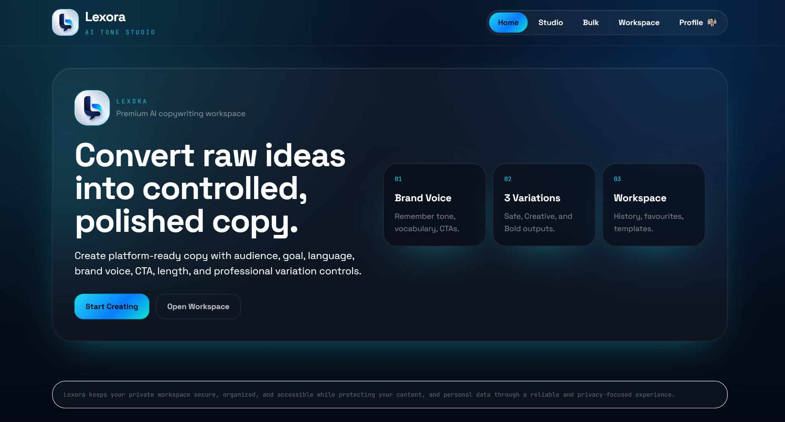
</p>

## Overview

**Lexora** is a full-stack AI copywriting platform created for the DecodeLabs internship project **Automated Copywriting Tone Transformer**. It goes beyond a basic prompt form by treating AI copy generation as a controlled product workflow:

1. Capture a detailed creative brief.
2. Compile the brief into a server-owned instruction template.
3. Generate structured **Safe**, **Creative**, and **Bold** variations.
4. Validate output against a typed schema and platform limits.
5. Refine the copy in an editable output studio.
6. Save history, favourites, and reusable templates in a private account workspace.
7. Scale the same pipeline through CSV batch processing or the command line.

The result is a polished, responsive application that combines product design, prompt engineering, backend reliability, authentication, persistence, bulk automation, testing, and CI in one cohesive system.

> **Core principle:** creative freedom should remain measurable, repeatable, platform-aware, and safe enough for real marketing workflows.

---

## Table of Contents

- [Why Lexora Stands Out](#why-lexora-stands-out)
- [Feature Set](#feature-set)
- [Product Walkthrough](#product-walkthrough)
- [System Architecture](#system-architecture)
- [Generation Lifecycle](#generation-lifecycle)
- [Technology Stack](#technology-stack)
- [Repository Structure](#repository-structure)
- [Getting Started](#getting-started)
- [Environment Configuration](#environment-configuration)
- [API Reference](#api-reference)
- [Generation Request Example](#generation-request-example)
- [Bulk CSV Workflow](#bulk-csv-workflow)
- [Command-Line Interface](#command-line-interface)
- [Persistence Model](#persistence-model)
- [Security & Privacy](#security--privacy)
- [Testing & Continuous Integration](#testing--continuous-integration)
- [Production Deployment Notes](#production-deployment-notes)
- [Known Production Considerations](#known-production-considerations)
- [Roadmap](#roadmap)
- [Author & Internship Context](#author--internship-context)

---

## Why Lexora Stands Out

| Area | Implementation |
|---|---|
| **Controlled generation** | Audience, objective, language, length, keywords, platform, tone, formality, emoji level, CTA, brand voice, variation count, temperature, and top-p are all first-class controls. |
| **Transformation suite** | The same workspace supports fresh generation plus rewrite, shorten, expand, improve, simplify, humanize, grammar correction, professionalization, tone change, headline generation, hashtag generation, and translation. |
| **Structured AI output** | Gemini is instructed to return schema-constrained JSON, then Pydantic validates and normalizes it before the frontend receives anything. |
| **Platform intelligence** | Each platform has its own character budget, formatting guidance, hashtag support, and content structure. |
| **Three-level creative strategy** | Safe, Creative, and Bold outputs provide controlled risk/creativity choices instead of one unpredictable answer. |
| **Real workspace** | Authenticated users receive server-side history, favourites, templates, profile data, and profile-image persistence—without permanent browser storage. |
| **Bulk automation** | CSV upload, preview, validation, progress, cancellation, row-level results, retry control, and results export reuse the same generation pipeline. |
| **Reliability engineering** | Request guards, rate limiting, concurrency limits, transient/permanent Gemini error classification, exponential retry, typed validation, and friendly API errors. |
| **Professional UX** | Responsive dark SaaS interface, mobile navigation, reduced-motion support, keyboard focus states, progress feedback, toasts, confirmation dialogs, and editable outputs. |
| **Developer readiness** | FastAPI docs, standalone CLI, environment templates, backend tests, frontend production build command, and GitHub Actions CI. |

---

## Feature Set

### 1. Advanced AI Studio

Lexora exposes a deep brief instead of relying on a single prompt field.

- **13 operation modes:** Generate, Rewrite, Shorten, Expand, Improve, Simplify, Humanize, Grammar Fix, Professional, Change Tone, Headlines, Hashtags, and Translate.
- **8 platform presets:** LinkedIn, Instagram, Facebook, Email, X/Twitter, Google Ads, YouTube, and TikTok.
- **9 tone profiles:** Witty, Professional, Bold, Friendly, Luxury, Urgent, Energetic, Empathetic, and Confident.
- **7 objectives:** Sales, Awareness, Engagement, Lead Generation, Education, Launch, and Retention.
- **Copy controls:** target audience, language, short/medium/long length, keywords, emoji level, formality, CTA type, and optional custom CTA.
- **Sampling controls:** temperature from `0.0–2.0` and top-p from `0.0–1.0`.
- **Variation control:** request between `1–5` versions.

### 2. Brand Voice Memory Fields

A structured brand voice profile can guide every generated variation:

- Brand description
- Preferred tone
- Preferred vocabulary
- Words to avoid
- Audience notes
- CTA style
- Example copy to emulate

The complete brief can be retained through saved templates and generation history.

### 3. Safe · Creative · Bold Output System

Each response can provide three distinct creative positions:

- **Safe** — polished, dependable, low-risk, and immediately usable.
- **Creative** — more memorable and differentiated while remaining accurate.
- **Bold** — stronger, punchier, and more confident without unsupported claims.

The output editor supports:

- Direct headline, body, and CTA editing
- Variation switching
- Word and character counts
- Platform budget/compliance feedback
- Copy to clipboard
- Save/favourite
- Regenerate
- Download as `.txt`
- Clear output

### 4. Platform-Aware Rules

| Platform | Character Budget | Intended Structure | Hashtags |
|---|---:|---|---|
| X / Twitter | 280 | Single concise post | Supported |
| Google Ads | 450 | Benefit-led headline and compact description | Disabled |
| Email | 1,500 | Subject-style headline, skimmable body, one CTA | Disabled |
| Instagram | 2,200 | Visual hook, caption, CTA, hashtag set | Supported |
| TikTok | 2,200 | Strong hook, short caption, social-native CTA | Supported |
| LinkedIn | 3,000 | Professional hook, context, value, CTA | Supported |
| Facebook | 3,000 | Conversational post and natural CTA | Supported |
| YouTube | 5,000 | Title-style headline, description, discoverability tags | Supported |

### 5. Private User Workspace

Authenticated users receive a backend-persisted workspace containing:

- Searchable generation history
- Platform and tone filters
- Duplicate/reuse workflow
- Save-as-template workflow
- Favourite output collection
- Reusable templates
- Individual deletion and history clearing
- Limits that retain the newest `80` history items, `80` favourites, and `40` templates per account

### 6. Account & Profile Management

- Account creation and sign-in
- “Remember me” sessions
- HTTP-only session cookie authentication
- Sign-out
- Local-development password reset flow
- Profile name update
- JPG, PNG, and WebP profile image upload
- Profile image removal
- Password change with session invalidation
- Permanent account and workspace deletion

### 7. Bulk CSV System

- Downloadable extended CSV template
- Drag-and-drop or file-browser upload
- Client-side preview before submission
- Required-column checks
- Row-level empty-field highlighting
- UTF-8 CSV validation on the backend
- Enum and numeric validation
- Duplicate-row warnings in backend logs
- Up to `200` usable rows per job
- Concurrent asynchronous processing with a configured Gemini semaphore
- Success, failed, and pending counters
- Batch cancellation from the UI
- Row-level headline/error table
- CSV export containing the primary generated variation

### 8. Standalone CLI

The backend can be used without the React interface. The CLI provides validated platform/tone arguments, temperature and top-p controls, verbose prompt inspection, JSON output, and optional file export.

---

## Product Walkthrough

All screenshots below are stored as repository-relative assets so they render correctly on GitHub after the project is pushed.

### Home — Premium Product Entry Point

The home view communicates the product value immediately and provides direct navigation into Studio and Workspace.

<p align="center">
  
</p>

### Profile — Account, Security, and Personal Workspace

The profile dashboard combines identity, plan information, account status, profile editing, image management, password updates, logout, and account deletion.

<p align="center">
  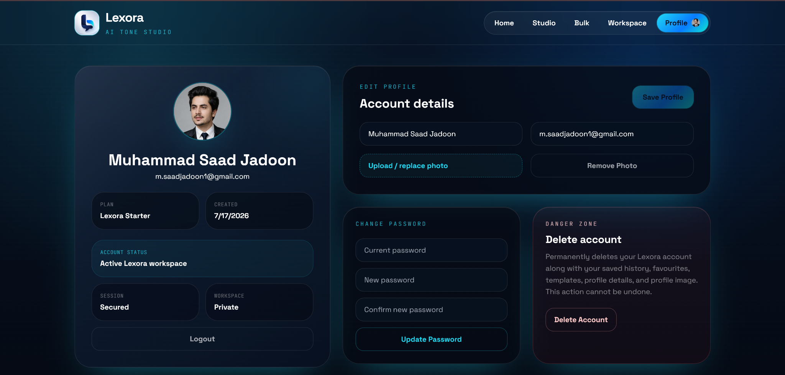
</p>

### Workspace — History, Favourites, and Templates

History includes search and filtering, while favourites and templates remain independently scrollable and reusable.

<p align="center">
  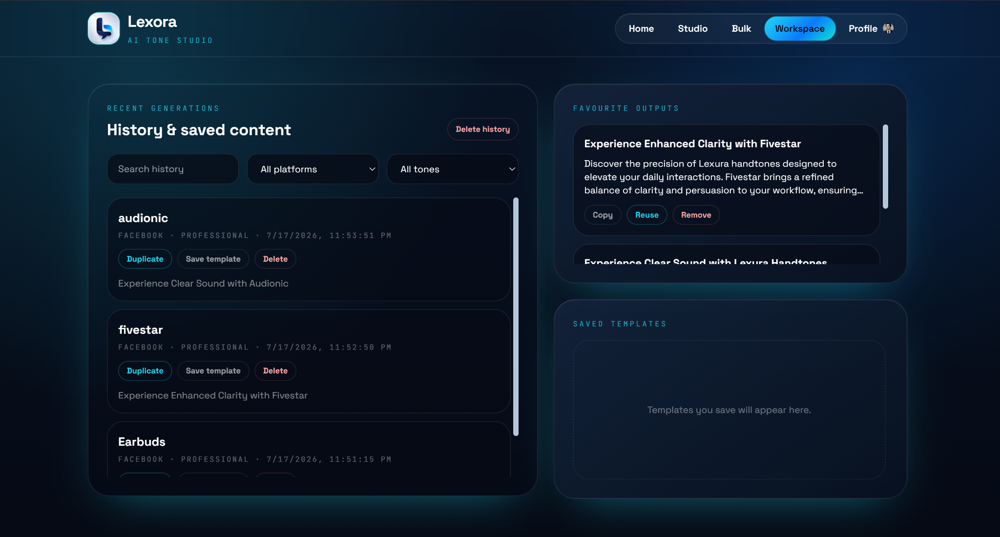
</p>

<p align="center">
  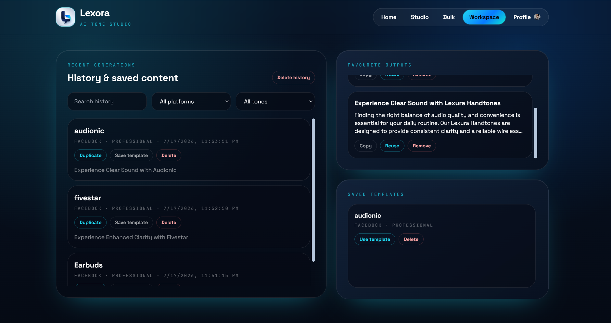
</p>

### Bulk Mode — Upload, Validate, Generate, Export

The bulk interface presents instructions, CSV controls, preview status, generation results, and exports in a focused two-panel layout.

<p align="center">
  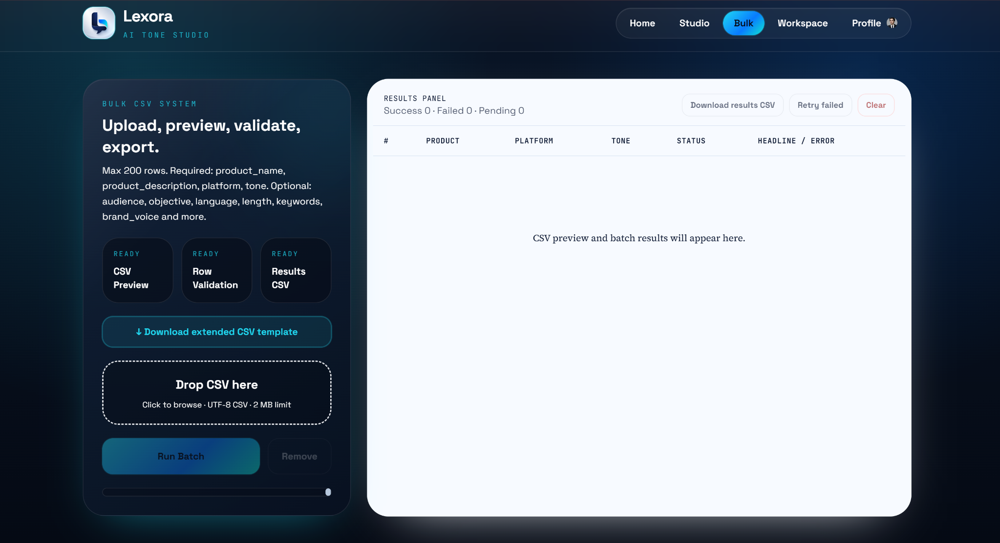
</p>

<p align="center">
  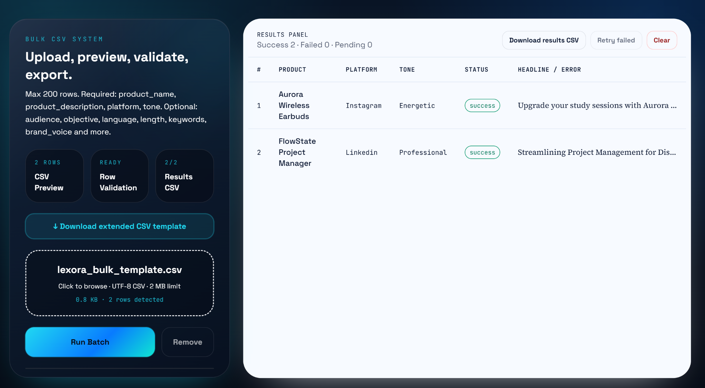
</p>

<p align="center">
  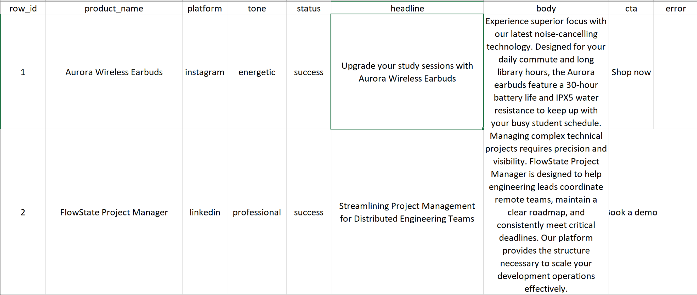
</p>

### Studio — Advanced Brief and Precision Controls

The Studio is divided into a three-step workflow: Brief, Generate, and Refine. It provides both business-level content controls and lower-level model sampling controls.

<p align="center">
  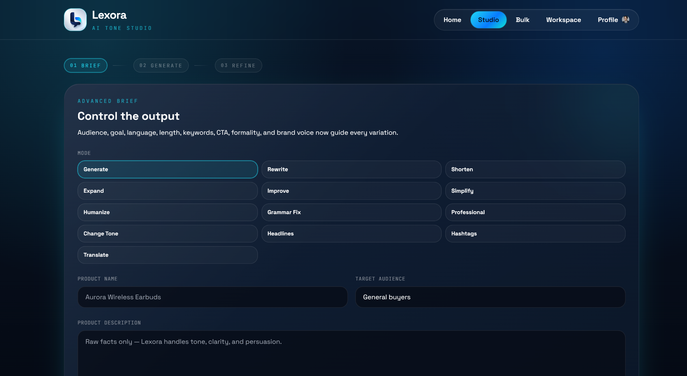
</p>

<p align="center">
  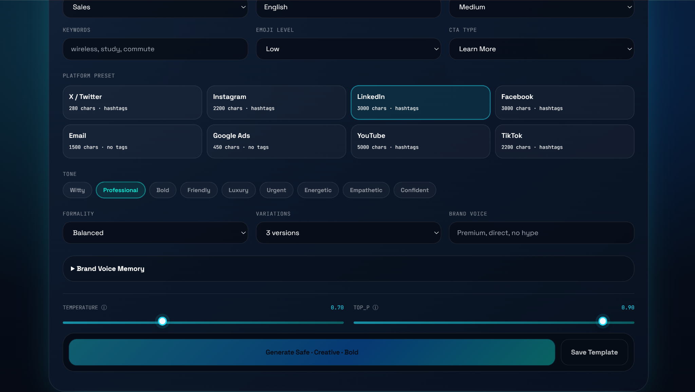
</p>

### Output — Empty, Processing, and Completed States

The output panel communicates each stage clearly: initial empty state, live generation progress, and editable results.

<p align="center">
  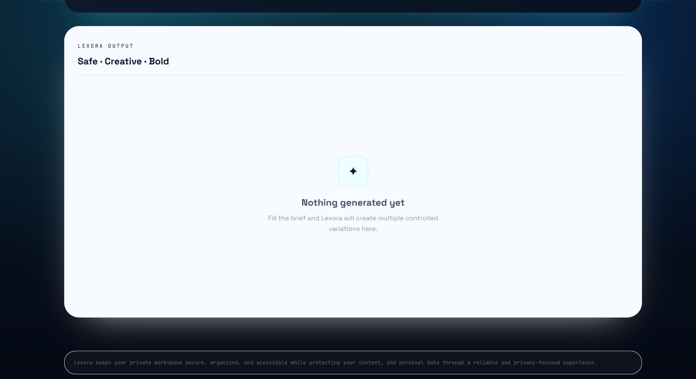
</p>

<p align="center">
  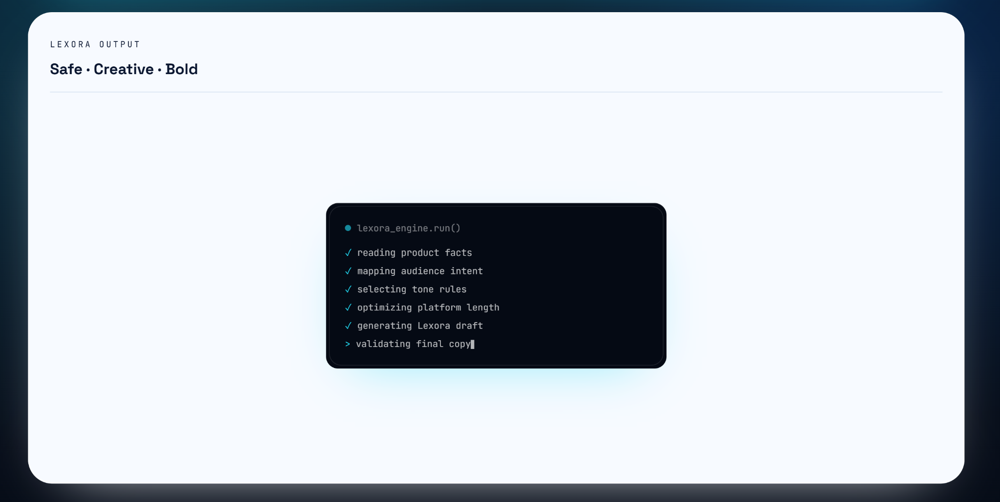
</p>

#### Safe Variation

<p align="center">
  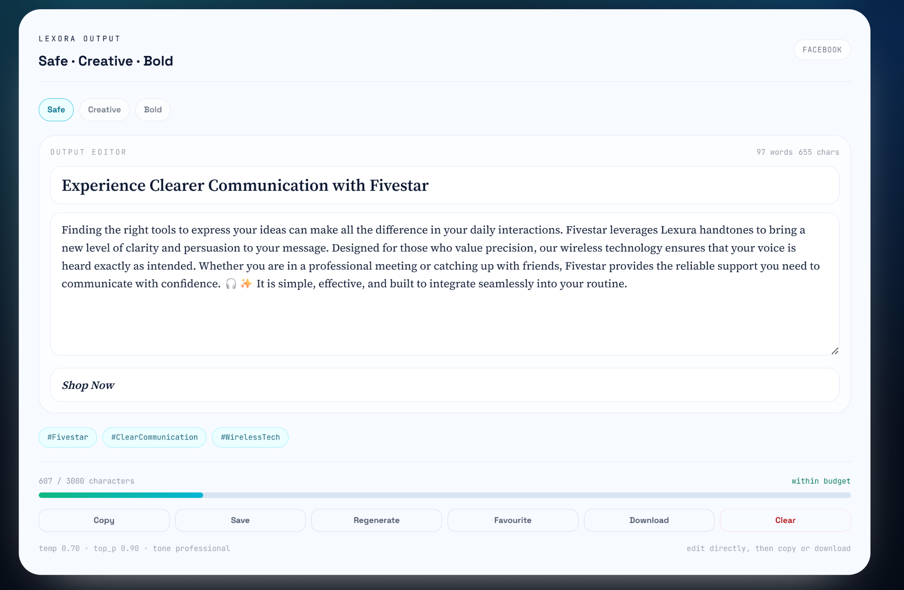
</p>

#### Bold Variation

<p align="center">
  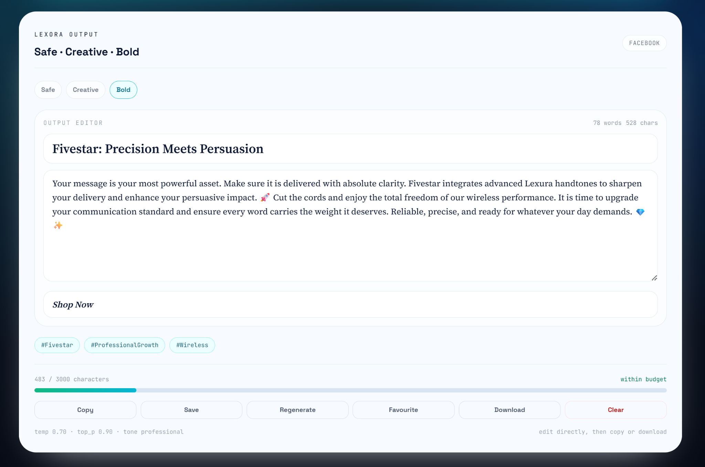
</p>

#### Creative Variation

<p align="center">
  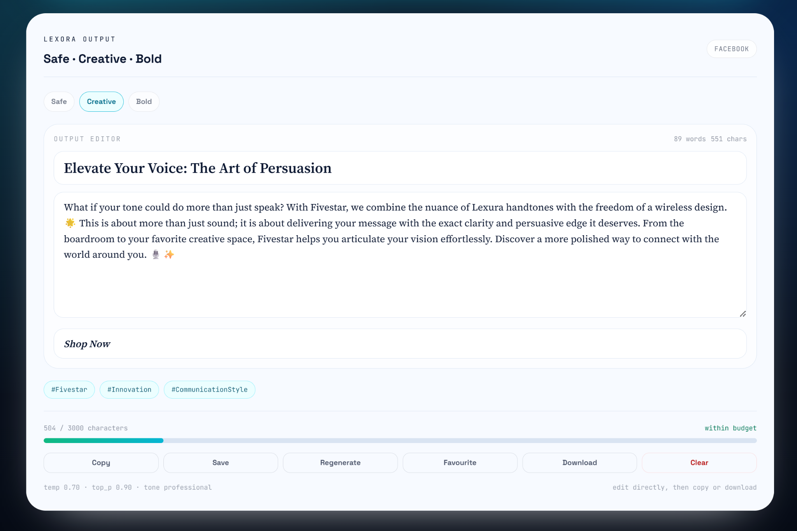
</p>

### Authentication — Sign In and Password Reset

<p align="center">
  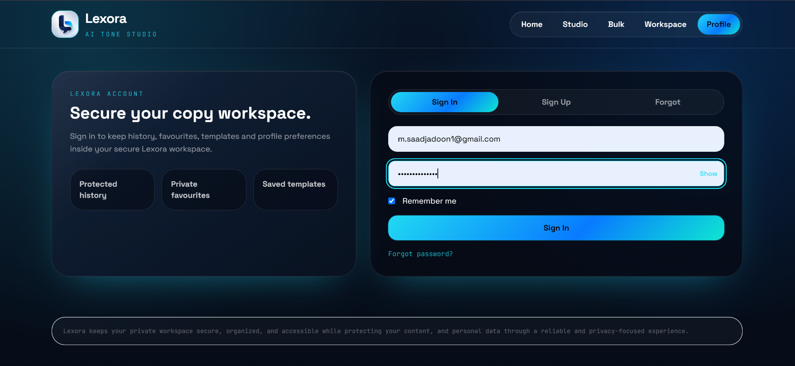
</p>

<p align="center">
  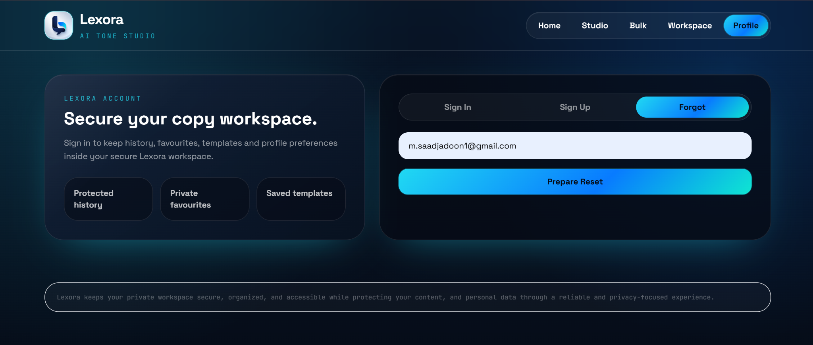
</p>

---

## System Architecture

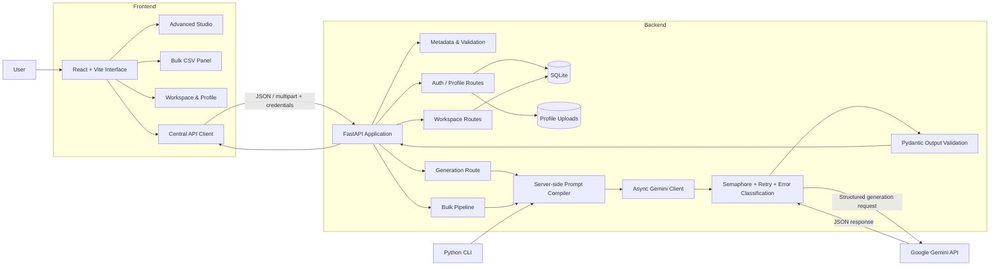

### Architectural Responsibilities

| Layer | Responsibility |
|---|---|
| `frontend/src/App.jsx` | Route state, user session state, workspace orchestration, generation workflow, confirmation dialogs, and toast feedback. |
| `frontend/src/components/ConsolePanel.jsx` | Advanced brief, brand voice, platform, tone, variation, temperature, and top-p controls. |
| `frontend/src/components/PressPanel.jsx` | Loading/error/empty states, variation editor, counts, compliance display, and output actions. |
| `frontend/src/components/BulkPanel.jsx` | CSV preview, validation feedback, batch control, result table, and result export. |
| `frontend/src/api.js` | Single frontend HTTP boundary with credentials, normalized users/assets, and friendly error handling. |
| `backend/app/main.py` | FastAPI application, middleware, auth/profile/workspace/generation/bulk endpoints, CORS, request guards, and metadata. |
| `backend/app/prompt_engine.py` | Server-owned prompt composition, platform instructions, tone rules, transformation rules, safety guidance, and output schema instruction. |
| `backend/app/gemini_client.py` | Async Gemini integration, concurrency control, retries, error classification, structured response parsing, and style normalization. |
| `backend/app/bulk_pipeline.py` | UTF-8 CSV parsing, validation, typed row conversion, concurrent generation, and row-level error capture. |
| `backend/app/db.py` | SQLite schema, PBKDF2 password hashing, sessions, password reset records, profiles, history, favourites, and templates. |
| `backend/app/models.py` | Pydantic request/response models, enums, platform constraints, generated copy models, and bulk models. |
| `backend/cli.py` | Standalone command-line access to the same prompt and Gemini pipeline. |

---

## Generation Lifecycle

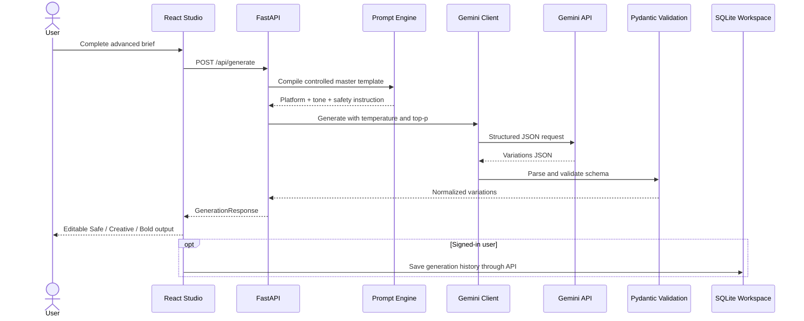

### Server-Side Prompt Strategy

The prompt compiler deliberately keeps the core instruction on the backend. It combines:

- Task mode guidance
- Product/offer facts
- Audience and objective
- Language and copy length
- Keywords and emoji level
- Formality and CTA behavior
- Brand voice profile
- Tone-specific writing guidance
- Platform-specific formatting rules
- Character budget
- Hashtag policy
- Safety constraints
- Exact JSON schema requirements

This reduces prompt drift and keeps behavior consistent across the web Studio, bulk pipeline, and CLI.

---

## Technology Stack

### Frontend

| Technology | Purpose |
|---|---|
| React 18 | Component-based interface and application state |
| Vite 5 | Development server and production bundling |
| Tailwind CSS 3 | Responsive design system and utility styling |
| Native Fetch API | Credentialed backend communication |
| Browser APIs | Clipboard, file upload, drag/drop, downloads, hash navigation, and reduced-motion handling |

### Backend

| Technology | Purpose |
|---|---|
| FastAPI | Async REST API and automatic OpenAPI documentation |
| Uvicorn | ASGI development/production server |
| Pydantic 2 | Typed validation and structured response models |
| Pydantic Settings | Environment-driven configuration |
| Google Generative AI SDK | Gemini model integration |
| Tenacity | Exponential retry for transient AI failures |
| SQLite | Local account and workspace persistence |
| Python Multipart | Profile image and CSV uploads |
| HTTPX | FastAPI testing support |
| Pytest | Backend unit/integration tests |

---

## Repository Structure

```text
DecodeLabs - Automated Copywriting Tone Transformer/
├── .github/
│   └── workflows/
│       └── ci.yml                    # Backend tests + frontend build
├── backend/
│   ├── app/
│   │   ├── __init__.py
│   │   ├── bulk_pipeline.py          # CSV validation and async batch generation
│   │   ├── config.py                 # Central environment configuration
│   │   ├── db.py                     # SQLite persistence and account security
│   │   ├── gemini_client.py          # Gemini integration, retry, validation
│   │   ├── main.py                   # FastAPI application and routes
│   │   ├── models.py                 # Pydantic models, enums, constraints
│   │   └── prompt_engine.py          # Controlled master prompt compiler
│   ├── data/
│   │   └── uploads/                  # Runtime profile images; ignored by Git
│   ├── tests/
│   │   ├── test_auth_backend.py
│   │   ├── test_gemini_client.py
│   │   └── test_prompt_engine.py
│   ├── .env.example
│   ├── README.md
│   ├── cli.py
│   └── requirements.txt
├── docs/
│   └── screenshots/                  # GitHub product gallery used by this README
├── frontend/
│   ├── src/
│   │   ├── assets/
│   │   │   └── lexora-logo.png
│   │   ├── components/
│   │   │   ├── BulkPanel.jsx
│   │   │   ├── CompilingTicker.jsx
│   │   │   ├── ConsolePanel.jsx
│   │   │   ├── Header.jsx
│   │   │   ├── PressPanel.jsx
│   │   │   └── StepIndicator.jsx
│   │   ├── App.jsx
│   │   ├── api.js
│   │   ├── index.css
│   │   └── main.jsx
│   ├── .env.example
│   ├── index.html
│   ├── package.json
│   ├── package-lock.json
│   ├── postcss.config.js
│   ├── tailwind.config.js
│   └── vite.config.js
├── data/                              # Optional runtime data mount
├── .gitignore
├── pytest.ini
└── README.md
```

---

## Getting Started

### Prerequisites

- **Python 3.12+** recommended
- **Node.js 20+**; CI currently uses Node.js 22
- **npm**
- A valid **Gemini API key**
- Git

### 1. Clone the Repository

```bash
git clone <your-repository-url>
cd "DecodeLabs - Automated Copywriting Tone Transformer"
```

### 2. Configure and Run the Backend

#### Windows PowerShell

```powershell
cd backend
py -m venv .venv
.\.venv\Scripts\Activate.ps1
pip install -r requirements.txt
Copy-Item .env.example .env
```

#### macOS / Linux

```bash
cd backend
python3 -m venv .venv
source .venv/bin/activate
pip install -r requirements.txt
cp .env.example .env
```

Open `backend/.env` and replace the placeholder key:

```env
GEMINI_API_KEY=your_real_gemini_api_key
```

Start the API:

```bash
uvicorn app.main:app --reload --host 127.0.0.1 --port 8000
```

Backend services:

- API base: `http://localhost:8000`
- Swagger UI: `http://localhost:8000/docs`
- ReDoc: `http://localhost:8000/redoc`
- Health check: `http://localhost:8000/api/health`

### 3. Configure and Run the Frontend

Open a second terminal:

```bash
cd frontend
npm install
```

Create the local environment file:

#### Windows PowerShell

```powershell
Copy-Item .env.example .env
```

#### macOS / Linux

```bash
cp .env.example .env
```

Run the development server:

```bash
npm run dev
```

Open:

```text
http://localhost:5173
```

### 4. Production Frontend Build

```bash
cd frontend
npm ci
npm run build
```

The optimized output is written to `frontend/dist/`.

---

## Environment Configuration

### Backend — `backend/.env`

| Variable | Default | Description |
|---|---|---|
| `GEMINI_API_KEY` | empty | Required for live AI generation. Keep it server-side and never commit it. |
| `GEMINI_MODEL` | `gemini-3.1-flash-lite` | Configured model name. Change it to a model available to your Gemini account when required. |
| `DATABASE_PATH` | `data/lexora.sqlite3` | SQLite database location, relative to the backend working directory. |
| `UPLOAD_DIR` | `data/uploads` | Directory used for profile images. |
| `SESSION_COOKIE_NAME` | `lexora_session` | HTTP-only session cookie name. |
| `MAX_CONCURRENT_REQUESTS` | `10` | Maximum concurrent Gemini requests inside one backend process. |
| `FRONTEND_ORIGIN` | `http://localhost:5173` | Allowed production frontend origin for credentialed CORS. |
| `MAX_REQUEST_BYTES` | `1000000` | General request-size guard. |
| `MAX_BULK_FILE_BYTES` | `2000000` | Bulk endpoint CSV-size limit. |
| `RATE_LIMIT_PER_MINUTE` | `60` | Per-client in-memory request limit. |

> **Bulk size note:** the general request guard is evaluated before the bulk endpoint. To accept CSV files larger than `MAX_REQUEST_BYTES`, raise that value to at least the intended `MAX_BULK_FILE_BYTES` plus multipart overhead.

### Frontend — `frontend/.env`

| Variable | Default | Description |
|---|---|---|
| `VITE_API_BASE_URL` | `http://localhost:8000` | FastAPI base URL used by the frontend. |

---

## API Reference

### System & Metadata

| Method | Endpoint | Purpose | Authentication |
|---|---|---|---|
| `GET` | `/api/health` | Service status and API version | Public |
| `GET` | `/api/meta` | Platforms, tones, objectives, lengths, CTAs, modes, and bulk limits | Public |

### Authentication

| Method | Endpoint | Purpose | Authentication |
|---|---|---|---|
| `POST` | `/api/auth/signup` | Create an account and session | Public |
| `POST` | `/api/auth/signin` | Validate credentials and create a session | Public |
| `GET` | `/api/auth/me` | Return the current session user | Optional |
| `POST` | `/api/auth/logout` | Delete the current session | Session |
| `POST` | `/api/auth/forgot` | Prepare a password-reset token | Public |
| `POST` | `/api/auth/reset` | Reset a password with a valid token | Public |

### Profile

| Method | Endpoint | Purpose | Authentication |
|---|---|---|---|
| `PATCH` | `/api/profile` | Update account name | Required |
| `POST` | `/api/profile/photo` | Upload JPG, PNG, or WebP profile image | Required |
| `DELETE` | `/api/profile/photo` | Remove the active profile image reference | Required |
| `POST` | `/api/profile/password` | Change password and invalidate sessions | Required |
| `DELETE` | `/api/profile` | Permanently delete account and private records | Required |

### Workspace

| Method | Endpoint | Purpose | Authentication |
|---|---|---|---|
| `GET` | `/api/workspace` | Read history, favourites, and templates | Required |
| `POST` | `/api/workspace/history` | Save a generation | Required |
| `POST` | `/api/workspace/favourites` | Save an output variation | Required |
| `POST` | `/api/workspace/templates` | Save a reusable brief | Required |
| `DELETE` | `/api/workspace/{table}/{item_id}` | Delete one history/favourite/template item | Required |
| `DELETE` | `/api/workspace/{table}` | Clear one workspace section | Required |

### AI Generation & Bulk

| Method | Endpoint | Purpose | Authentication |
|---|---|---|---|
| `POST` | `/api/generate` | Generate or transform controlled copy | Public |
| `POST` | `/api/bulk/generate` | Process a CSV batch | Public |
| `GET` | `/api/bulk/template` | Download the extended starter CSV | Public |

---

## Generation Request Example

```bash
curl -X POST "http://localhost:8000/api/generate" \
  -H "Content-Type: application/json" \
  -d '{
    "product_name": "Aurora Wireless Earbuds",
    "product_description": "Noise-cancelling earbuds with a 30-hour battery and IPX5 water resistance.",
    "target_audience": "University students",
    "content_objective": "sales",
    "language": "English",
    "copy_length": "medium",
    "keywords": "wireless, study, commute",
    "brand_voice": "Premium, direct, no exaggerated claims.",
    "emoji_level": "low",
    "number_of_variations": 3,
    "formality_level": "balanced",
    "cta_type": "shop_now",
    "custom_cta": "",
    "transform_mode": "generate",
    "source_text": "",
    "platform": "instagram",
    "tone": "energetic",
    "temperature": 0.8,
    "top_p": 0.9
  }'
```

### Response Shape

```json
{
  "platform": "instagram",
  "tone": "energetic",
  "variations": [
    {
      "style": "Safe",
      "headline": "...",
      "body": "...",
      "hashtags": ["#example"],
      "call_to_action": "Shop now",
      "char_count": 420,
      "max_chars": 2200,
      "compliant": true
    }
  ],
  "copy": {
    "style": "Safe",
    "headline": "...",
    "body": "...",
    "hashtags": ["#example"],
    "call_to_action": "Shop now",
    "char_count": 420,
    "max_chars": 2200,
    "compliant": true
  },
  "char_count": 420,
  "max_chars": 2200,
  "compliant": true,
  "temperature": 0.8,
  "top_p": 0.9
}
```

`copy` is a backward-compatible alias of the primary variation, while `variations` contains the full controlled output set.

---

## Bulk CSV Workflow

### Required Columns

| Column | Description |
|---|---|
| `product_name` | Product, service, campaign, or offer name |
| `product_description` | Factual source description used for generation |
| `platform` | One supported platform enum value |
| `tone` | One supported tone enum value |

### Optional Columns

| Column | Accepted Values / Purpose |
|---|---|
| `target_audience` | Free text |
| `content_objective` | `sales`, `awareness`, `engagement`, `lead_generation`, `education`, `launch`, `retention` |
| `language` | Free text language name |
| `copy_length` | `short`, `medium`, `long` |
| `keywords` | Comma-separated text within one CSV cell |
| `brand_voice` | Free text voice guidance |
| `emoji_level` | `none`, `low`, `medium`, `high` |
| `number_of_variations` | Integer from `1–5` |
| `formality_level` | `casual`, `balanced`, `formal` |
| `cta_type` | `shop_now`, `learn_more`, `sign_up`, `book_demo`, `download`, `comment`, `follow`, `custom` |
| `temperature` | Float from `0.0–2.0` |
| `top_p` | Float from `0.0–1.0` |

### Minimal CSV Example

```csv
product_name,product_description,platform,tone
Aurora Wireless Earbuds,"Noise-cancelling earbuds with 30-hour battery life",instagram,energetic
FlowState Project Manager,"Project management software for distributed engineering teams",linkedin,professional
```

### Extended CSV Example

```csv
product_name,product_description,target_audience,content_objective,language,copy_length,keywords,brand_voice,emoji_level,number_of_variations,formality_level,cta_type,platform,tone,temperature,top_p
Aurora Wireless Earbuds,"Noise-cancelling earbuds with 30-hour battery life and IPX5 water resistance",University students,sales,English,medium,"wireless, battery, study, commute","Energetic but premium. Avoid cheap-sounding hype.",low,3,balanced,shop_now,instagram,energetic,0.8,0.9
```

### Direct API Upload

```bash
curl -X POST "http://localhost:8000/api/bulk/generate" \
  -F "file=@products.csv"
```

### Download the Starter Template

```bash
curl "http://localhost:8000/api/bulk/template" \
  --output lexora_bulk_template.csv
```

---

## Command-Line Interface

### Generate and Print JSON

```bash
cd backend
python cli.py \
  --product "Aurora Wireless Earbuds" \
  --description "Noise-cancelling earbuds with 30-hour battery life and IPX5 water resistance" \
  --platform linkedin \
  --tone professional \
  --temperature 0.7 \
  --top-p 0.9
```

### Inspect the Compiled Prompt

```bash
python cli.py \
  --product "Aurora Wireless Earbuds" \
  --description "Noise-cancelling earbuds with a 30-hour battery" \
  --platform instagram \
  --tone energetic \
  +verbose
```

### Write the Result to a File

```bash
python cli.py \
  --product "Aurora Wireless Earbuds" \
  --description "Noise-cancelling earbuds with a 30-hour battery" \
  --platform twitter \
  --tone bold \
  --output result.json
```

---

## Persistence Model

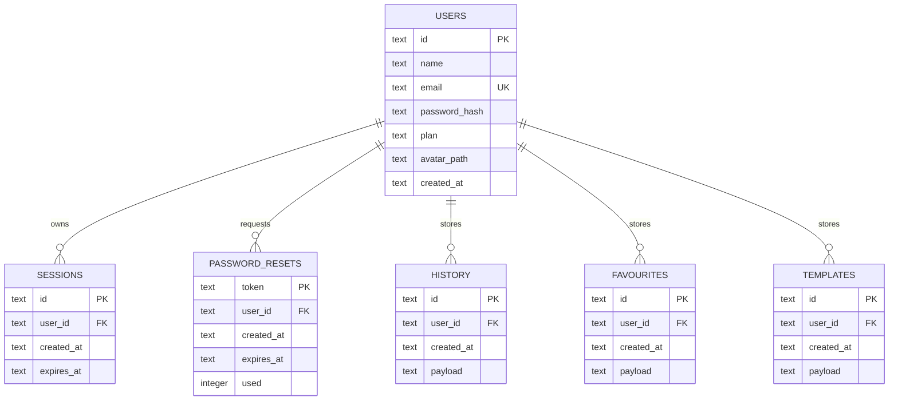

Workspace payloads are serialized as JSON while ownership remains enforced through `user_id`. Foreign-key cascade deletion removes private records when an account is deleted.

---

## Security & Privacy

Lexora includes practical security controls suitable for an internship evaluation build:

- Gemini API keys remain on the backend and are loaded from `.env`.
- Passwords are salted and hashed with **PBKDF2-HMAC-SHA256 using 260,000 rounds**.
- Password comparison uses constant-time `hmac.compare_digest`.
- Session identifiers use cryptographically secure random tokens.
- Session cookies are **HTTP-only** and `SameSite=Lax`.
- Remembered sessions expire after 30 days; non-remembered sessions expire after one day.
- Changing a password invalidates all existing sessions for that user.
- Sign-in attempts receive a dedicated per-client throttle.
- General requests receive a configurable per-minute rate limit.
- Request and bulk-upload sizes are guarded.
- CSV files must be UTF-8 and pass typed row validation.
- Profile images are restricted to JPG, PNG, and WebP and limited to 1.5 MB.
- Workspace endpoints require an authenticated session.
- User workspace rows are scoped by `user_id`.
- The frontend does not use `localStorage`, `sessionStorage`, or IndexedDB for permanent account/workspace persistence.
- `.gitignore` excludes real environment files, virtual environments, dependencies, builds, databases, runtime uploads, caches, and logs.
- Prompt safety rules prohibit invented claims, unsupported statistics, fabricated awards/certifications, false guarantees, named competitor attacks, discriminatory content, explicit content, and profanity.

---

## Testing & Continuous Integration

### Backend Tests

```bash
pip install -r backend/requirements.txt
pytest backend/tests
```

The included test suite covers:

- Account creation, session sign-in/sign-out, and password hashing
- Gemini error classification
- Advanced prompt compilation controls

### Frontend Build Verification

```bash
cd frontend
npm ci
npm run build
```

### GitHub Actions

The workflow in `.github/workflows/ci.yml` runs on every push and pull request:

1. **Backend job** — Python 3.12, dependency installation, and Pytest.
2. **Frontend job** — Node.js 22, clean npm installation, and Vite production build.

---

## Production Deployment Notes

### Backend

```bash
cd backend
uvicorn app.main:app --host 0.0.0.0 --port 8000
```

For deployment:

- Set `GEMINI_API_KEY` through the hosting provider’s secret manager.
- Set `GEMINI_MODEL` to an enabled model for the deployed account.
- Set `FRONTEND_ORIGIN` to the exact HTTPS frontend origin.
- Mount persistent storage for `DATABASE_PATH` and `UPLOAD_DIR`.
- Place the API behind HTTPS and a reverse proxy/load balancer.
- Use a process manager appropriate to the hosting environment.

### Frontend

```bash
cd frontend
npm ci
npm run build
```

Deploy `frontend/dist/` to a static host and configure:

```env
VITE_API_BASE_URL=https://your-api-domain.example
```

The frontend and backend must be configured consistently because authentication uses credentialed cross-origin cookies.

---

## Known Production Considerations

The repository is intentionally complete for local demonstration and internship evaluation. Before a public multi-user production launch, complete the following hardening work:

1. **Secure cookies:** change the session cookie to `secure=True` under HTTPS and make the setting environment-driven.
2. **Password reset delivery:** the local build returns the reset token for testing. Production must send a one-time link through an email provider and never expose the token in the API response.
3. **Distributed rate limiting:** the current limiter is in-memory and process-local. Use Redis or an API gateway when running multiple workers/instances.
4. **Database scale:** SQLite is excellent for local and small single-instance deployments. Use PostgreSQL plus migrations for horizontal scaling.
5. **Upload lifecycle:** add object storage, antivirus/content scanning where required, and automatic cleanup for replaced images.
6. **Observability:** add structured logs, request IDs, metrics, error tracking, and alerting.
7. **AI evaluation:** add automated quality scoring, prompt regression tests, safety evaluation, and cost/latency monitoring.
8. **Bulk job architecture:** move long batches to a durable queue for resumability, job status polling, and worker isolation.
9. **Authentication expansion:** add email verification, CSRF strategy appropriate to the deployment topology, and optional OAuth/SSO.
10. **Licensing:** add a repository `LICENSE` file before distributing the project under a formal open-source license.

---

## Roadmap

- [ ] PostgreSQL persistence and migration tooling
- [ ] Redis-backed rate limiting and session options
- [ ] Background job queue for large bulk campaigns
- [ ] Real email verification and password-reset delivery
- [ ] Global reusable brand profiles per account
- [ ] Team workspaces, roles, and shared templates
- [ ] Streaming generation progress
- [ ] Output version comparison and diff view
- [ ] AI quality, brand-consistency, and safety scoring
- [ ] Usage analytics, quotas, and cost dashboard
- [ ] Automated accessibility and end-to-end browser tests
- [ ] Container and infrastructure deployment files

---

## Evaluation Highlights

Lexora demonstrates more than interface polish. The project shows end-to-end ownership across:

- Product thinking and information architecture
- Responsive UI/UX design
- Frontend state and workflow orchestration
- REST API design
- Typed domain modeling
- Prompt engineering
- Structured AI output validation
- Async concurrency and retry behavior
- Authentication and session management
- Password security
- Database design and per-user persistence
- File upload handling
- Bulk data processing
- CLI engineering
- Automated testing
- CI workflow design
- Security and deployment awareness

---

## Author & Internship Context

**Developed by Muhammad Saad Jadoon** as a DecodeLabs internship project.

**Project:** Automated Copywriting Tone Transformer  
**Product name:** Lexora — AI Tone Studio  
**Focus:** Full-stack AI product engineering, controlled copy generation, tone transformation, secure workspace persistence, and bulk automation.

---

<div align="center">

### Lexora turns unstructured ideas into controlled communication.

**Safe enough to trust. Creative enough to stand out. Bold enough to perform.**

</div>
