<a id="top"></a>

<div align="center">
  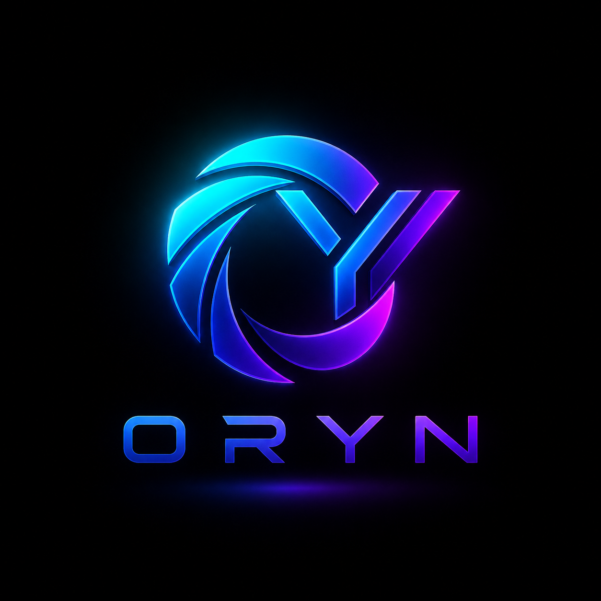
  <h1>Oryn</h1>
  <h3>Zorex AI Workspace</h3>

  <p><strong>A focused, local-first AI workspace for planning, learning, writing, coding, and context-aware conversations.</strong></p>

  <p>
    Built as a <strong>DecodeLabs internship project</strong> and developed into a complete full-stack product with persistent conversations, bounded context, profile personalization, productivity modes, responsive themes, and a FastAPI backend powered by Google Gemini.
  </p>

  <p>
    <a href="#getting-started"></a>
    <a href="#product-tour"></a>
    <a href="#architecture"></a>
  </p>

  <p>
    
    
    
    
    
    
    
  </p>

  <p><strong>Plan · Learn · Write · Code</strong></p>

  <p>
    <a href="#overview">Overview</a> ·
    <a href="#product-tour">Product Tour</a> ·
    <a href="#ai-and-context-engine">AI Engine</a> ·
    <a href="#architecture">Architecture</a> ·
    <a href="#rest-api-reference">API</a> ·
    <a href="#getting-started">Installation</a>
  </p>
</div>

---

<a href="./docs/screenshots/02-dark-workspace-home.png">
  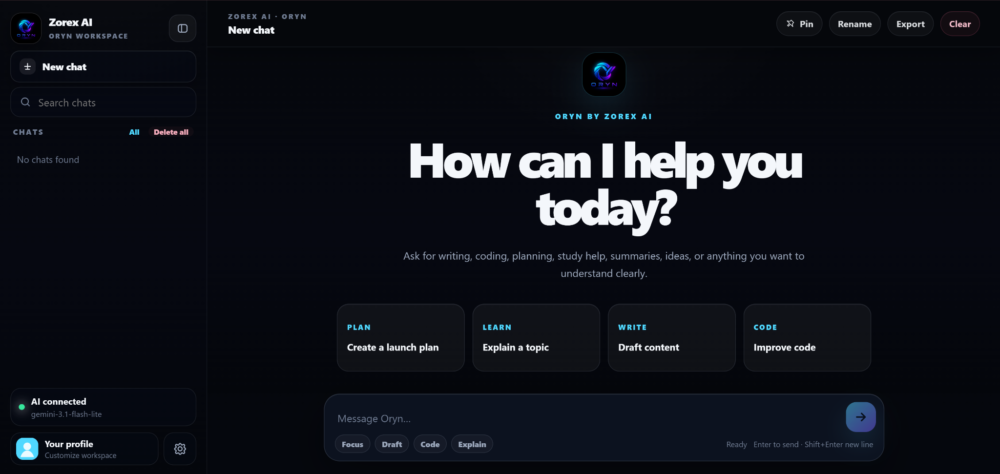
</a>

<p align="center"><sub><strong>Oryn Workspace:</strong> conversation management, guided actions, AI status, profile access, and a focused message composer.</sub></p>

---

## Table of Contents

- [Overview](#overview)
- [Project Vision](#project-vision)
- [Why Oryn Stands Out](#why-oryn-stands-out)
- [Product Tour](#product-tour)
- [Core Features](#core-features)
- [AI and Context Engine](#ai-and-context-engine)
- [Architecture](#architecture)
- [Technology Stack](#technology-stack)
- [Project Structure](#project-structure)
- [REST API Reference](#rest-api-reference)
- [Data and Persistence](#data-and-persistence)
- [Getting Started](#getting-started)
- [Environment Configuration](#environment-configuration)
- [Keyboard Shortcuts](#keyboard-shortcuts)
- [Error Handling](#error-handling)
- [Privacy and Security](#privacy-and-security)
- [Quality Assurance](#quality-assurance)
- [Production Evolution](#production-evolution)
- [Author](#author)
- [Acknowledgements](#acknowledgements)

---

## Overview

**Oryn** is a modern AI productivity workspace developed under the **Zorex AI** brand. It combines a refined browser interface with a real Python backend and Google Gemini integration.

The project is designed to feel like a complete product rather than a simple API demo. Users can create and manage multiple conversations, preserve context, regenerate answers, export chats, personalize their identity, switch themes, use focused prompt modes, write code, study topics, plan work, and communicate naturally in different languages.

Oryn is intentionally **local-first**:

- The Gemini API key remains on the backend.
- Chat history is stored in a local JSON data store.
- Theme and profile preferences stay in the browser.
- The application can run in demo mode before an API key is added.
- The frontend and API are served together by FastAPI.

> Oryn demonstrates full-stack product thinking across AI integration, backend engineering, state management, responsive UI design, persistence, usability, and failure handling.

---

## Project Vision

Most internship chatbot projects stop after sending a prompt to an AI API and printing the response. Oryn was built around a larger product question:

> **What would a focused, personal, professional AI workspace look like if every core interaction were designed as part of one consistent system?**

The result is a workspace that supports the complete conversation lifecycle:

1. Start or discover a conversation.
2. Write a prompt manually or use a guided productivity mode.
3. Send the request to a secure backend endpoint.
4. Build bounded conversation context from saved history.
5. Generate a Gemini response using a controlled system instruction.
6. Save both user and assistant messages.
7. Present formatted content, code, timestamps, and usage information.
8. Continue, regenerate, rename, pin, search, export, clear, or delete the conversation.

---

## Why Oryn Stands Out

| Area | Implementation |
|---|---|
| **Product design** | A complete workspace with sidebar navigation, status cards, profile controls, settings, themes, productivity prompts, and responsive states. |
| **Full-stack engineering** | Vanilla HTML/CSS/JavaScript frontend connected to a documented FastAPI REST backend. |
| **Real AI integration** | Google Gemini through the official `google-genai` Python SDK. |
| **Context management** | Recent messages are selected using both message-count and estimated-token limits. |
| **Persistent conversations** | Chats are saved locally with unique IDs, timestamps, previews, pin state, and messages. |
| **Reliable local storage** | Thread-safe in-memory access with atomic JSON file replacement and broken-file recovery. |
| **Personalization** | Custom profile name, role, note, and uploaded avatar stored in the browser. |
| **Developer experience** | Environment template, one-command Windows launcher, health endpoint, demo mode, and friendly setup errors. |
| **User experience** | Auto-growing composer, typing indicator, toasts, copy actions, regenerated answers, keyboard shortcuts, and collapsible navigation. |
| **Responsible architecture** | API credentials stay on the backend; the frontend never stores the Gemini key. |

---

## Product Tour

> The gallery uses repository-relative paths. Every preview is clickable and opens the original full-resolution image on GitHub.

### 1. Complete Light Theme

The light experience uses dedicated surfaces, borders, shadows, text contrast, and background treatment rather than a basic color inversion.

<a href="./docs/screenshots/03-light-workspace-home.png">
  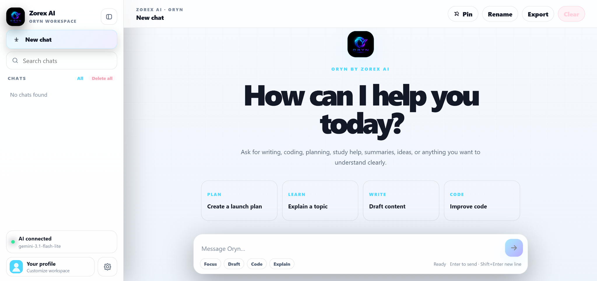
</a>

<p align="center"><sub><strong>Light Workspace:</strong> the same focused experience with a purpose-built light visual system.</sub></p>

### 2. Conversation and Assistant Context

The conversation workspace combines speaker identity, timestamps, copy controls, assistant actions, persistent previews, and message/token feedback. System behavior keeps creator and company information limited to relevant questions.

<table>
  <tr>
    <td width="50%" valign="top">
      <a href="./docs/screenshots/05-conversation-experience.png">
        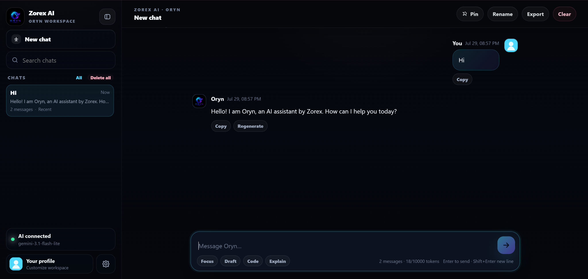
      </a>
      <br /><sub><strong>Conversation Experience:</strong> structured, readable, and action-oriented messaging.</sub>
    </td>
    <td width="50%" valign="top">
      <a href="./docs/screenshots/06-context-aware-identity.png">
        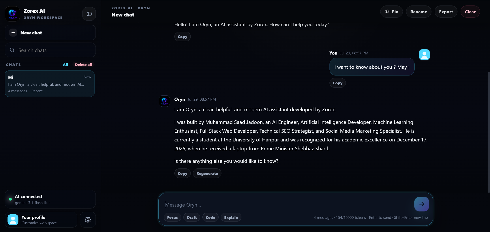
      </a>
      <br /><sub><strong>Context-Aware Identity:</strong> product information appears only when it is relevant.</sub>
    </td>
  </tr>
</table>

### 3. Profile Personalization

Oryn begins with a clean default identity and allows each user to add a profile image, display name, professional role, and short note without creating an online account.

<table>
  <tr>
    <td width="50%" valign="top">
      <a href="./docs/screenshots/08-profile-default.png">
        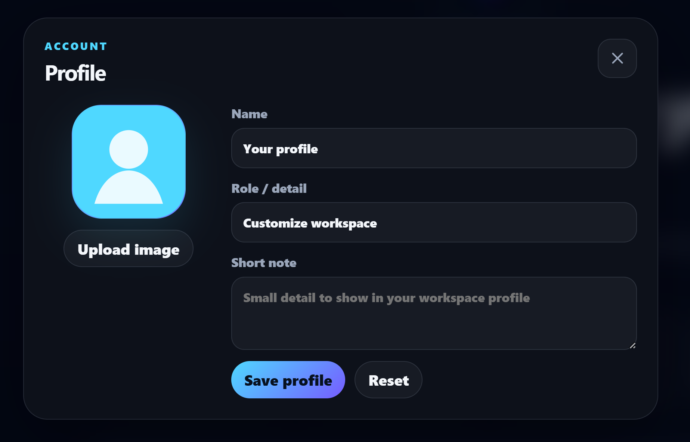
      </a>
      <br /><sub><strong>Default Profile:</strong> a clean starting point with no forced setup.</sub>
    </td>
    <td width="50%" valign="top">
      <a href="./docs/screenshots/09-profile-customized.png">
        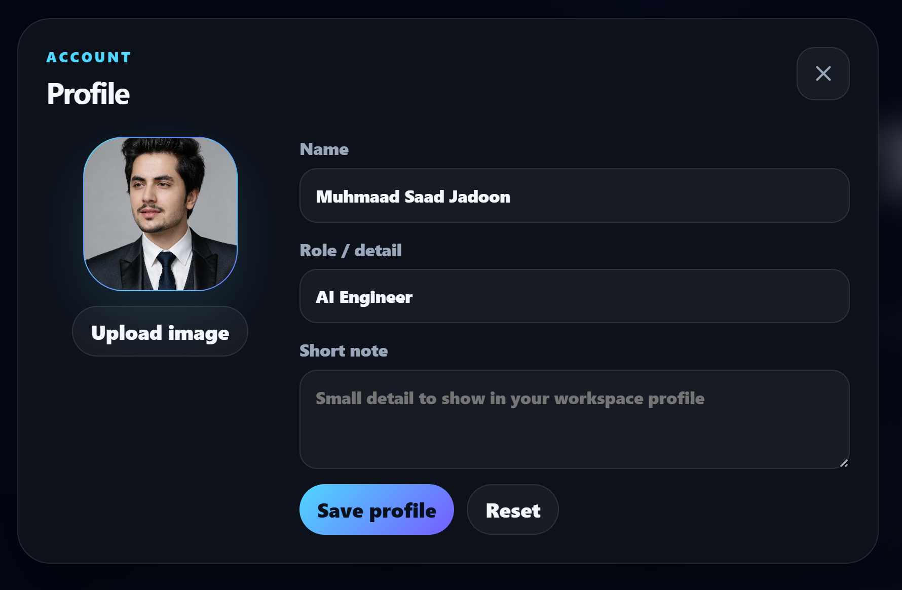
      </a>
      <br /><sub><strong>Customized Profile:</strong> a consistent personal identity across the workspace.</sub>
    </td>
  </tr>
</table>

### 4. Personalized Chat and Focus Mode

The saved avatar appears beside user messages and in the sidebar profile card. The sidebar can also collapse to create a wider reading and writing surface without losing conversation controls.

<table>
  <tr>
    <td width="50%" valign="top">
      <a href="./docs/screenshots/10-creator-response.png">
        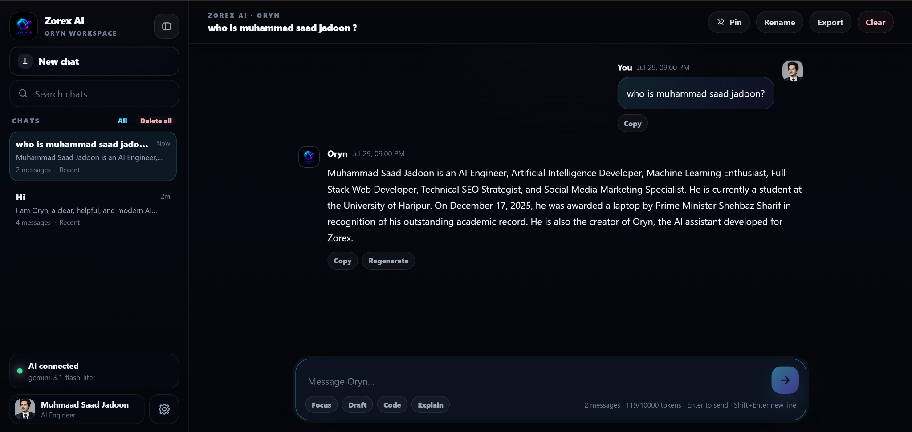
      </a>
      <br /><sub><strong>Personalized Chat Identity</strong></sub>
    </td>
    <td width="50%" valign="top">
      <a href="./docs/screenshots/11-focus-mode-collapsed-sidebar.png">
        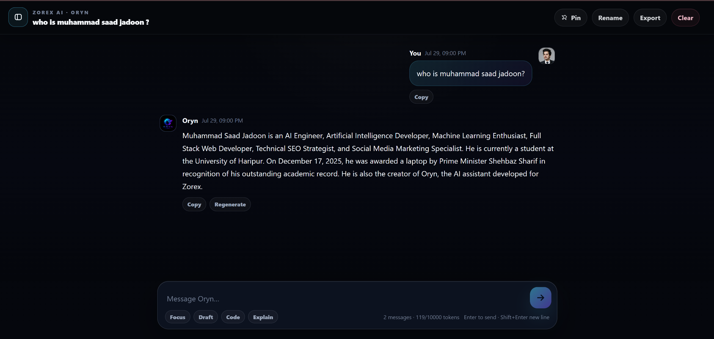
      </a>
      <br /><sub><strong>Collapsed Sidebar Focus Mode</strong></sub>
    </td>
  </tr>
</table>

### 5. Multilingual and Code Assistance

Oryn supports natural multilingual conversations while preserving the same interaction model. Code-focused replies use readable fenced blocks and retain normal conversation actions.

<table>
  <tr>
    <td width="50%" valign="top">
      <a href="./docs/screenshots/12-multilingual-urdu-chat.png">
        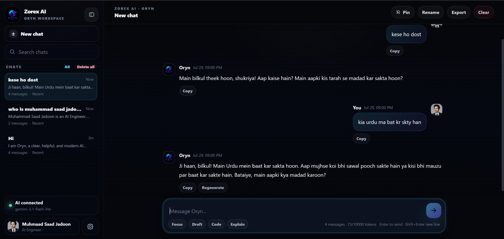
      </a>
      <br /><sub><strong>Multilingual Interaction:</strong> a natural Roman Urdu conversation.</sub>
    </td>
    <td width="50%" valign="top">
      <a href="./docs/screenshots/13-code-assistance.png">
        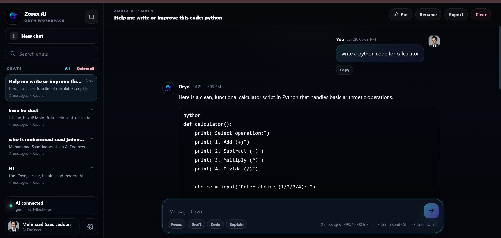
      </a>
      <br /><sub><strong>Code Assistance:</strong> formatted code with clear supporting explanation.</sub>
    </td>
  </tr>
</table>

### 6. Settings and Keyboard-First Productivity

Settings bring together theme selection, backend health refresh, storage transparency, and workspace shortcuts. Related controls are presented side by side for easier comparison.

<table>
  <tr>
    <td width="50%" valign="top">
      <a href="./docs/screenshots/04-workspace-settings.png">
        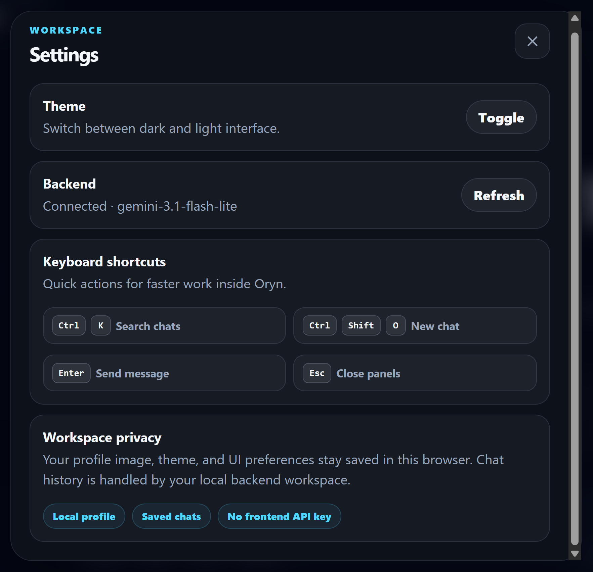
      </a>
      <br /><sub><strong>Workspace Settings</strong></sub>
    </td>
    <td width="50%" valign="top">
      <a href="./docs/screenshots/14-keyboard-shortcuts.png">
        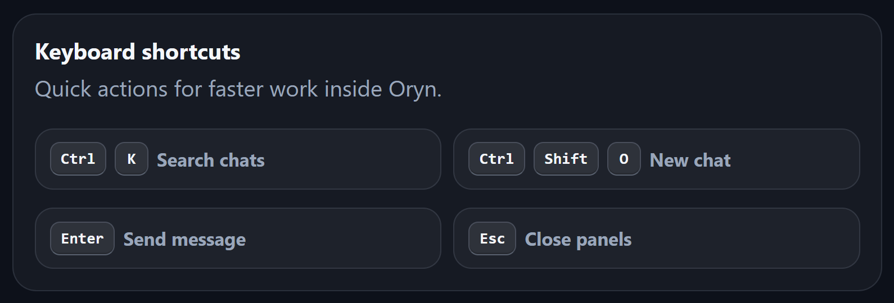
      </a>
      <br /><sub><strong>Keyboard Shortcuts</strong></sub>
    </td>
  </tr>
</table>

### 7. Safe Destructive Actions

Clearing a conversation requires confirmation, reducing accidental data loss while keeping the action easy to access.

<p align="center">
  <a href="./docs/screenshots/07-clear-chat-confirmation.png">
    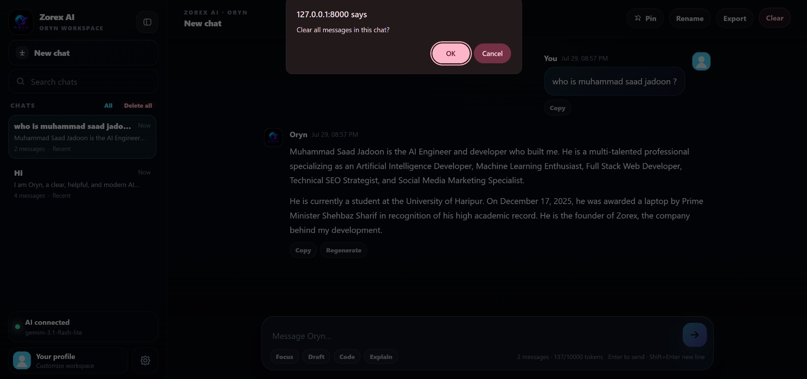
  </a>
</p>

<p align="center"><sub><strong>Clear Conversation:</strong> an explicit confirmation step before stored messages are removed.</sub></p>

<p align="right"><a href="#top">Back to top ↑</a></p>

---

## Core Features

### Conversation Management

- Create unlimited local conversations.
- Automatically name a new chat from the first user message.
- Search conversations by title or latest-message preview.
- Pin important chats above recent conversations.
- Rename the active conversation.
- Clear messages from a conversation after confirmation.
- Delete all saved conversations after confirmation.
- Export an entire conversation as a Markdown file.
- Display message counts, recent timestamps, previews, and pin status.
- Preserve active-chat content through backend storage.

### Messaging Experience

- Send with `Enter`.
- Insert a new line with `Shift + Enter`.
- Automatically expand the composer up to a controlled height.
- Show a live typing indicator while the assistant is responding.
- Copy any user or assistant message.
- Regenerate the latest assistant response.
- Automatically scroll to the newest message.
- Display user and assistant avatars.
- Show readable message timestamps.
- Track approximate conversation tokens and message count.

### Guided Productivity Modes

The welcome screen provides four complete starter actions:

| Mode | Purpose | Example |
|---|---|---|
| **Plan** | Structure ideas, products, launches, and workflows. | Create a launch plan. |
| **Learn** | Explain a topic clearly with examples. | Explain machine learning basics. |
| **Write** | Draft polished professional content. | Write homepage copy. |
| **Code** | Generate, review, or improve source code. | Improve a Python function. |

The composer also provides lightweight prompt prefixes:

- **Focus**: makes the request clear, focused, and practical.
- **Draft**: asks for a professional draft.
- **Code**: frames the request as code generation or improvement.
- **Explain**: asks for a simple explanation with examples.

### Content Rendering

Oryn safely escapes raw HTML before applying its lightweight Markdown renderer. The interface supports:

- Headings
- Bold text
- Inline code
- Fenced code blocks
- Bullet-style lines
- Paragraphs and line breaks
- Scrollable code containers

### Workspace Personalization

- Upload a profile image.
- Save a custom display name.
- Add a role or professional detail.
- Store an optional short note.
- Reset profile information at any time.
- Reuse the saved avatar across the sidebar and messages.
- Keep profile data in the current browser through `localStorage`.

### Theme and Layout

- Dedicated dark theme.
- Dedicated light theme.
- Persistent theme preference.
- Desktop sidebar collapse mode.
- Mobile drawer navigation with backdrop.
- Responsive prompt cards and message layout.
- Compact handling for short-height screens.
- Safe-area-aware composer spacing on mobile devices.

### Operational Feedback

- Live backend health indicator.
- Connected-model display.
- Demo-mode indication when no API key is configured.
- Missing-key status.
- Toast notifications for successful and failed actions.
- Disabled send state while a request is in progress.
- Friendly network, authentication, quota, safety, and service errors.

---

## AI and Context Engine

### Gemini Integration

The backend uses the official Google Gen AI SDK:

```python
from google import genai

client = genai.Client(api_key=GEMINI_API_KEY, vertexai=False)
```

Responses are generated with configurable model, temperature, output-token limit, system instruction, and bounded conversation history.

### Context Construction

Oryn does not send unlimited history to the model. The backend selects recent messages using two limits:

- `MAX_HISTORY_MESSAGES`
- `MAX_HISTORY_TOKENS`

The token count is intentionally lightweight and dependency-free:

```python
estimated_tokens = max(1, len(text) // 4)
```

Messages are collected from newest to oldest until the configured history budget is reached, then restored to chronological order before the model call.

### Role Mapping

Stored chat roles are converted into Gemini-compatible roles:

| Oryn role | Gemini role |
|---|---|
| `user` | `user` |
| `assistant` | `model` |

### Assistant Behavior Control

The system instruction is composed from the environment-defined base prompt plus application-level response rules. These rules are designed to:

- Answer the current request directly.
- Avoid unnecessary self-introductions.
- Avoid repeating creator information in unrelated replies.
- Keep coding answers focused on code and explanation.
- Preserve a professional, useful, human-like tone.
- Reveal creator or company context only when explicitly requested.

### Demo Mode

When `GEMINI_API_KEY` is empty and `DEMO_MODE=true`, the complete chat flow remains testable. The backend saves the user's message and returns a clear response explaining how to enable real Gemini output.

This makes UI review, backend verification, and internship demonstrations possible without exposing an API credential.

---

## Architecture

### System Architecture

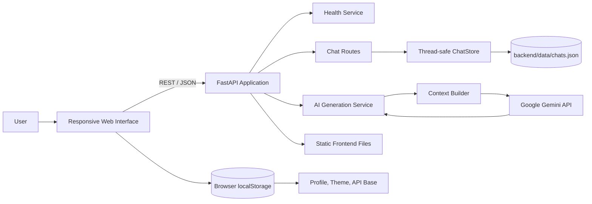

### Message Lifecycle

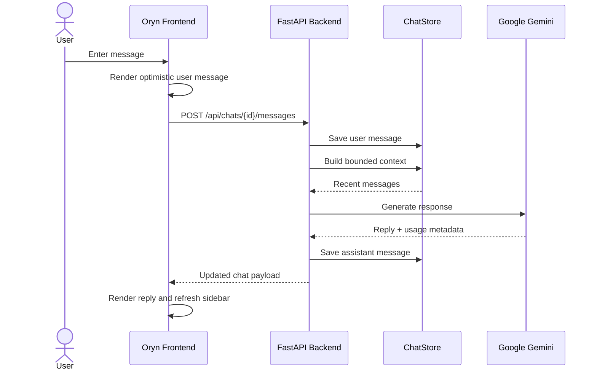

### Local Persistence Flow

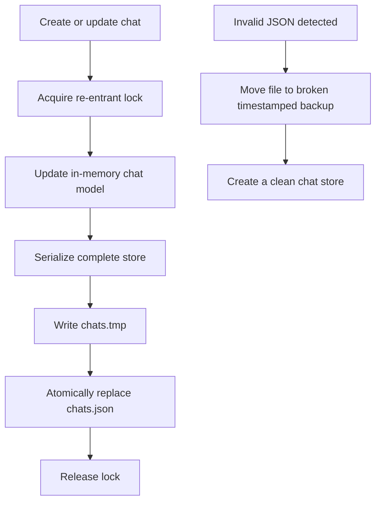

---

## Technology Stack

### Backend

| Technology | Version / Use |
|---|---|
| **Python** | 3.10 or newer |
| **FastAPI** | REST API, validation, static frontend serving |
| **Uvicorn** | ASGI development server |
| **Pydantic** | Request models and validation constraints |
| **python-dotenv** | Environment configuration |
| **google-genai** | Google Gemini model integration |
| **Dataclasses** | Structured local chat and message models |
| **JSON** | Local persistent conversation storage |
| **Threading RLock** | Thread-safe store operations inside one process |

### Frontend

| Technology | Use |
|---|---|
| **HTML5** | Semantic application structure and accessible controls |
| **CSS3** | Design system, responsive layout, themes, animations, modals |
| **Vanilla JavaScript** | State, API calls, rendering, profile management, shortcuts |
| **Fetch API** | REST communication with FastAPI |
| **LocalStorage** | Theme, profile, avatar, and optional API base |
| **SVG** | Application logo and interface icons |
| **Blob API** | Markdown conversation export |
| **FileReader API** | Local profile-image upload |

### Dependency Versions

```text
fastapi==0.140.0
uvicorn==0.51.0
python-dotenv==1.2.2
google-genai==1.27.0
pydantic==2.13.4
```

---

## Project Structure

```text
Zorex-Oryn-GitHub-Ready/
│
├── backend/
│   ├── .env.example           # Safe environment-variable template
│   ├── chat_store.py          # Chat models, persistence, token estimate
│   ├── main.py                # FastAPI app, Gemini service, API routes
│   ├── requirements.txt       # Pinned Python dependencies
│   ├── run_server.bat         # Backend launcher for Windows
│   └── data/                  # Created automatically at runtime
│       └── chats.json         # Local conversation database, gitignored
│
├── frontend/
│   ├── assets/
│   │   └── zorex-oryn-logo.svg
│   ├── index.html             # Main workspace and modal structure
│   ├── script.js              # Frontend state and interaction logic
│   └── style.css              # Complete responsive design system
│
├── docs/
│   └── screenshots/           # Product documentation images
│
├── .gitignore                 # Secrets, runtime data, caches, IDE files
├── check_backend.bat          # Backend verification launcher
├── start_windows.bat          # One-click Windows project launcher
└── README.md                  # Project documentation
```

---

## REST API Reference

The frontend communicates with the backend through a compact REST API.

### Health

#### `GET /api/health`

Returns backend, model, key, and demo-mode status.

```json
{
  "status": "ok",
  "app": "Oryn",
  "model": "gemini-3.1-flash-lite",
  "api_key_configured": true,
  "demo_mode": false
}
```

### Chats

#### `GET /api/chats`

Returns lightweight chat summaries ordered with pinned chats first and recent chats second.

#### `POST /api/chats`

Creates a new conversation.

```json
{
  "title": "New chat"
}
```

#### `GET /api/chats/{chat_id}`

Returns one complete chat, including messages and statistics.

#### `PATCH /api/chats/{chat_id}`

Updates title, pin state, or both.

```json
{
  "title": "Machine Learning Notes",
  "pinned": true
}
```

#### `DELETE /api/chats/{chat_id}`

Deletes one conversation.

#### `POST /api/chats/{chat_id}/clear`

Removes all messages while preserving the chat record and title.

### Messages

#### `POST /api/chats/{chat_id}/messages`

Stores a user message, generates an assistant response, stores the response, and returns the updated chat.

```json
{
  "message": "Explain neural networks with a simple example."
}
```

Validation rules:

- Minimum message length: `1`
- Maximum message length: `30000`
- Empty or whitespace-only messages are rejected

#### `POST /api/chats/{chat_id}/regenerate`

Removes the latest assistant response from the active context and generates a replacement. An optional message may also be supplied.

```json
{}
```

### Core Response Shape

```json
{
  "id": "chat_...",
  "title": "Explain neural networks with a simple example",
  "created_at": 0,
  "updated_at": 0,
  "pinned": false,
  "messages": [],
  "stats": {
    "message_count": 2,
    "estimated_tokens": 120,
    "max_history_tokens": 10000,
    "created_at": 0,
    "updated_at": 0
  },
  "reply": "...",
  "usage": {
    "input_tokens": 0,
    "output_tokens": 0,
    "total_tokens": 0
  }
}
```

---

## Data and Persistence

### Chat Model

Each chat stores:

```text
id
├── unique prefixed identifier

title
├── explicit title or automatic first-message title

created_at / updated_at
├── Unix timestamps

pinned
├── boolean priority state

messages[]
├── message ID
├── role: user | assistant
├── content
└── timestamp
```

### Storage Design

The `ChatStore` is designed for a local portfolio and internship application:

- Maintains typed chat objects in memory.
- Uses a re-entrant lock around every store operation.
- Serializes all chats to JSON after each mutation.
- Writes to a temporary file first.
- Replaces the main JSON file atomically.
- Detects unreadable/corrupted JSON.
- Moves corrupted data to a timestamped backup.
- Starts with a clean store after recovery.

### Storage Locations

| Data | Location |
|---|---|
| Chat history | `backend/data/chats.json` |
| Theme preference | Browser `localStorage` |
| Profile name | Browser `localStorage` |
| Profile role and note | Browser `localStorage` |
| Uploaded profile image | Browser `localStorage` as a data URL |
| Optional API base override | Browser `localStorage` |
| Gemini API key | `backend/.env` only |

---

## Getting Started

### Prerequisites

- Python `3.10+`
- `pip`
- A modern browser
- A Gemini API key for real AI responses

### 1. Clone the Repository

```bash
git clone https://github.com/<your-username>/<your-repository>.git
cd <your-repository>
```

### 2. Create a Virtual Environment

#### Windows PowerShell

```powershell
cd backend
python -m venv .venv
.\.venv\Scripts\Activate.ps1
```

#### Windows Command Prompt

```bat
cd backend
python -m venv .venv
.venv\Scripts\activate
```

#### macOS / Linux

```bash
cd backend
python3 -m venv .venv
source .venv/bin/activate
```

### 3. Install Dependencies

```bash
python -m pip install --upgrade pip
pip install -r requirements.txt
```

### 4. Create the Environment File

#### Windows

```bat
copy .env.example .env
```

#### macOS / Linux

```bash
cp .env.example .env
```

Open `backend/.env` and add your Gemini API key:

```env
GEMINI_API_KEY=your_api_key_here
```

### 5. Start Oryn

Run this command from the `backend` directory:

```bash
python -m uvicorn main:app --reload --host 127.0.0.1 --port 8000
```

Open:

```text
http://127.0.0.1:8000
```

### Windows One-Click Start

From the project root, run:

```text
start_windows.bat
```

The launcher:

1. Enters the backend directory.
2. Creates `.env` from `.env.example` when needed.
3. Installs required packages.
4. Starts FastAPI on port `8000`.

### Demo Mode

To review the interface without a Gemini key:

```env
GEMINI_API_KEY=
DEMO_MODE=true
```

The application will remain functional and return a setup-aware demonstration response.

---

### Gemini / Google Cloud Setup

Create or select a Google Cloud project, enable the required Gemini access for your account, generate an API key, and place the key only inside `backend/.env`.

<a href="./docs/screenshots/01-google-cloud-gemini-setup.png">
  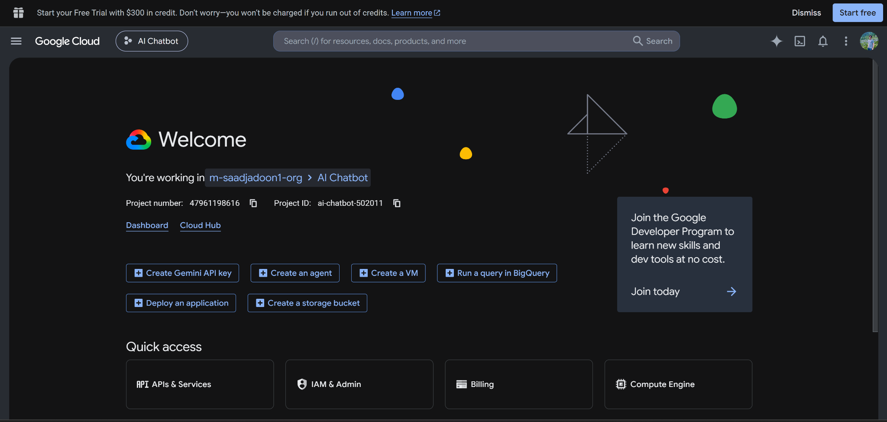
</a>

<p align="center"><sub><strong>Provider Setup:</strong> Google Cloud project configuration for Gemini access.</sub></p>

> Before publishing screenshots publicly, review visible cloud project identifiers and account details according to your own privacy requirements.

---

## Environment Configuration

The complete configuration template is located at `backend/.env.example`.

| Variable | Default | Purpose |
|---|---:|---|
| `APP_NAME` | `Oryn` | Application name returned by the health endpoint. |
| `GEMINI_API_KEY` | empty | Secret key used only by the backend Gemini client. |
| `MODEL_NAME` | `gemini-3.1-flash-lite` | Gemini model identifier. |
| `MODEL_TEMPERATURE` | `0.7` | Controls response variation. |
| `MAX_RESPONSE_TOKENS` | `1400` | Maximum generated output tokens. |
| `MAX_HISTORY_MESSAGES` | `28` | Maximum recent messages considered for context. |
| `MAX_HISTORY_TOKENS` | `10000` | Estimated total token budget for saved context. |
| `DEMO_MODE` | `true` | Enables a local demonstration response without a key. |
| `SYSTEM_PROMPT` | project-defined | Defines assistant identity, tone, and behavior. |

Example:

```env
APP_NAME=Oryn
GEMINI_API_KEY=
MODEL_NAME=gemini-3.1-flash-lite
MODEL_TEMPERATURE=0.7
MAX_RESPONSE_TOKENS=1400
MAX_HISTORY_MESSAGES=28
MAX_HISTORY_TOKENS=10000
DEMO_MODE=true
SYSTEM_PROMPT=You are Oryn, a clear, helpful, modern AI assistant by Zorex.
```

> Never commit the real `.env` file. The repository should contain only `.env.example`.

---

## Keyboard Shortcuts

| Shortcut | Action |
|---|---|
| `Ctrl / Cmd + K` | Focus chat search |
| `Ctrl / Cmd + Shift + O` | Create a new chat |
| `Enter` | Send the current message |
| `Shift + Enter` | Add a new line |
| `Esc` | Close open panels or the mobile sidebar |

---

## Error Handling

Oryn translates technical failures into readable user-facing feedback.

| Failure | User-facing behavior |
|---|---|
| Backend unavailable | Prompts the user to start the local server and refresh. |
| Internet unavailable | Explains that Oryn could not reach the AI service. |
| API key missing | Shows demo mode or configuration guidance. |
| Invalid/unauthorized key | Requests verification of `backend/.env`. |
| Quota or rate limit | Advises the user to wait and retry. |
| Safety block | Requests a safer rephrasing. |
| Empty response | Returns a clear retry message. |
| Missing chat | Returns HTTP `404`. |
| Empty message | Returns HTTP `400`. |
| Unexpected model failure | Returns a controlled `502` or `503` response. |
| Corrupted chat JSON | Creates a timestamped backup and restores a clean store. |

The frontend also:

- Removes optimistic messages after failed requests.
- Restores the composer state.
- Removes typing indicators in `finally` blocks.
- Prevents duplicate sends while busy.
- Displays success and error toasts.

---

## Privacy and Security

### Implemented Principles

- The Gemini key is read by the backend only.
- The frontend never requests or stores the Gemini key.
- `.env` and runtime chat data are ignored by Git.
- HTML is escaped before lightweight Markdown formatting.
- Pydantic validates request length and data types.
- Chat IDs are generated using UUID-based identifiers.
- Destructive actions require confirmation.
- Public model errors avoid exposing Python tracebacks to users.
- Profile data remains inside the user's browser.

### Local-First Privacy Model

The settings panel clearly communicates the application's data boundaries:

- **Local profile**: browser-based identity and visual preferences.
- **Saved chats**: local backend workspace data.
- **No frontend API key**: credentials stay server-side.

### Deployment Hardening Checklist

Before public multi-user deployment:

- Restrict CORS to trusted frontend origins.
- Add user authentication and authorization.
- Replace local JSON with PostgreSQL or another production database.
- Encrypt sensitive data at rest where required.
- Add rate limiting and request logging.
- Use a managed secret store instead of a plain production `.env` file.
- Add CSRF protections if cookie-based authentication is introduced.
- Add content moderation and abuse controls appropriate to the deployment.
- Use one coordinated data layer when running multiple worker processes.

---

## Quality Assurance

The GitHub-ready project was checked across the core local workflow.

### Verified Checks

- Python source compilation
- JavaScript syntax validation
- FastAPI application import
- Static frontend delivery
- Health endpoint response
- Chat creation
- Chat listing and retrieval
- Chat title update
- Pin-state update
- Demo-mode message flow
- Response regeneration
- Chat clearing
- Chat deletion
- Screenshot path validation
- Removal of the real `.env` file from the public package

### Manual Review Checklist

```text
[ ] Add a valid GEMINI_API_KEY to backend/.env
[ ] Start the server on 127.0.0.1:8000
[ ] Confirm the status card shows AI connected
[ ] Create a new chat
[ ] Send a normal question
[ ] Test a code response
[ ] Test Copy and Regenerate
[ ] Rename and pin a chat
[ ] Search chat history
[ ] Export the conversation as Markdown
[ ] Toggle dark and light themes
[ ] Save a custom profile image and role
[ ] Collapse the desktop sidebar
[ ] Test the mobile sidebar
[ ] Clear one chat after confirmation
[ ] Delete all chats after confirmation
```

---

## Production Evolution

Oryn's current architecture is intentionally optimized for a local internship demonstration and portfolio review. The following roadmap shows how the same product can evolve without changing its core experience.

### Near-Term

- Streaming Gemini responses
- Stop-generation control
- Individual chat deletion from the sidebar
- Syntax highlighting with language labels
- Copy button directly inside each code block
- Editable user messages
- Conversation import
- Richer Markdown tables and links
- Automated backend and frontend tests

### Product Expansion

- Secure user accounts
- Cloud-synchronized conversations
- Multiple workspaces
- File and PDF upload
- Image understanding
- Voice input and text-to-speech
- Prompt templates and saved instructions
- Conversation folders and tags
- Search inside message content
- Usage dashboard

### Production Infrastructure

- PostgreSQL persistence
- Database migrations
- Authentication and role-based access
- Redis-backed caching and rate limits
- Background tasks
- Structured logging and monitoring
- Docker deployment
- CI/CD pipeline
- Managed secrets
- Horizontal scaling

---

## Author

<div align="center">

### Muhammad Saad Jadoon

**AI Engineer · Artificial Intelligence Developer · Machine Learning Enthusiast · Full-Stack Web Developer · Technical SEO Strategist · Social Media Marketing Specialist**

Student at the **University of Haripur** and creator of **Oryn: Zorex AI Workspace**.

This project was developed as an internship submission and expanded into a complete full-stack AI workspace through independent product design, frontend engineering, backend development, AI integration, persistence, personalization, and quality refinement.

</div>

---

## Acknowledgements

- **DecodeLabs:** internship project opportunity and evaluation platform.
- **Google Gemini:** generative AI capabilities.
- **FastAPI:** modern Python API framework.
- **Uvicorn:** ASGI development server.
- **Open-source web standards:** HTML, CSS, JavaScript, SVG, Fetch API, and LocalStorage.

---

<div align="center">

### Built beyond the internship brief and designed as a complete AI product experience.

**Oryn by Zorex AI**

</div>

<p align="center"><a href="#top"><strong>Back to top ↑</strong></a></p>
